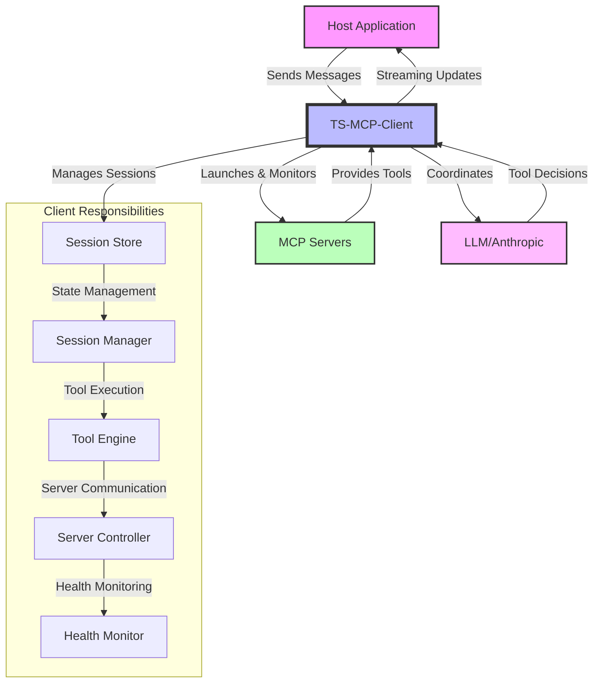
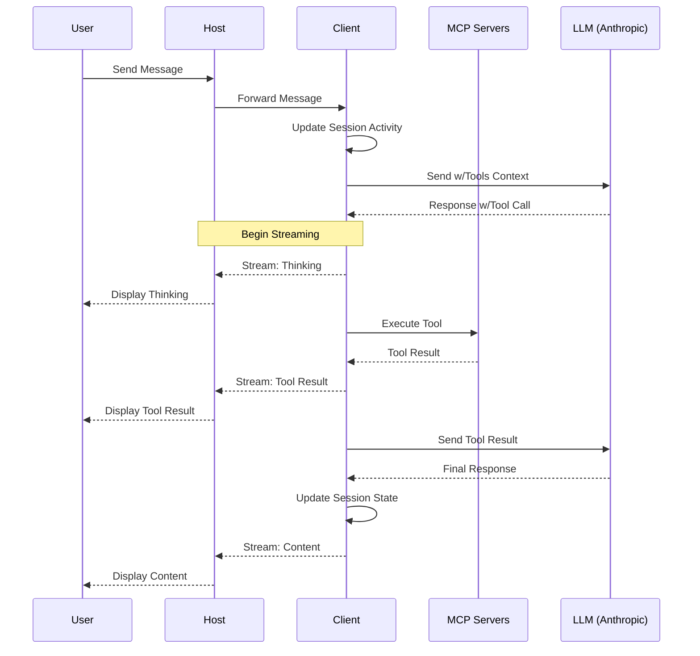

# TypeScript MCP Client

A TypeScript implementation of a Model Context Protocol (MCP) client that manages LLM chat interactions, server lifecycle, and tool invocations through MCP servers.

## Overview

The TS-MCP-Client serves as the core orchestration layer in the Model Context Protocol architecture, managing all session state, server lifecycle, and LLM interactions. It acts as the bridge between a host application (like a web interface) and the underlying MCP servers that provide tool capabilities.

### System Architecture



## Component Responsibilities

### Host Application

The host application (your application) is responsible for:

- Providing the user interface (UI)
- Rendering chat messages and tool outputs
- Displaying real-time streaming updates
- Showing loading and error states
- Handling user input and interaction
- Forwarding messages to the client
- Maintaining minimal UI state (loading flags, display preferences)
- Providing debugging interface (optional)
- Showing available tools in the UI (optional)

### TS-MCP-Client (This Library)

This client library manages:

- All session state and lifecycle
- Session persistence and recovery
- Session activity tracking and expiry
- All LLM interactions with Anthropic Claude
- Server lifecycle through the MCP SDK (launch, health, shutdown)
- Tool discovery and execution via the SDK
- Tool call limits enforcement
- Conversation history maintenance
- Streaming updates of operations
- Error recovery and retries
- Server capabilities registry
- MCP protocol communication
- Configuration validation and loading
- Tool capabilities caching

### MCP Servers

External MCP servers are responsible for:

- Exposing tool capabilities through standard JSON-RPC 2.0 endpoints
- Executing tool requests according to MCP protocol
- Providing health status through protocol handshake
- Returning tool results or errors in compliant format
- Maintaining their own state and cleanup
- Handling resource management and access control
- Implementing server-specific security measures

### LLM (Anthropic Claude)

The LLM is responsible for:

- Processing messages with context
- Making decisions about tool usage
- Formatting tool call requests
- Interpreting tool results
- Maintaining conversation coherence
- Providing natural language responses
- Adhering to system prompts and constraints

## Quick Start

```bash
npm install @rinardnick/client_mcp
```

### Basic Usage

```typescript
import { SessionManager, loadConfig } from '@rinardnick/client_mcp';

// 1. Load configuration
const config = {
  type: 'claude',
  api_key: process.env.ANTHROPIC_API_KEY,
  model: 'claude-3-5-sonnet-20241022',
  system_prompt: 'You are a helpful assistant with access to tools.',
  servers: {
    // Example file system server configuration
    filesystem: {
      command: 'npx',
      args: ['-y', '@modelcontextprotocol/server-filesystem', '/workspace'],
      env: {},
    },
  },
};

// 2. Initialize session
const sessionManager = new SessionManager();
const session = await sessionManager.initializeSession(config);

// 3. Send a message
const response = await sessionManager.sendMessage(
  session.id,
  'What files are in the current directory?'
);

console.log(response.content);
```

### Streaming Responses

```typescript
// Stream responses for real-time updates
const stream = sessionManager.sendMessageStream(
  session.id,
  'What files are in the current directory?'
);

for await (const chunk of stream) {
  switch (chunk.type) {
    case 'thinking':
      console.log('Thinking:', chunk.content);
      break;
    case 'tool_start':
      console.log('Tool starting:', chunk.content);
      break;
    case 'tool_result':
      console.log('Tool result:', chunk.content);
      break;
    case 'content':
      console.log('Content:', chunk.content);
      break;
    case 'error':
      console.error('Error:', chunk.error);
      break;
    case 'done':
      console.log('Stream complete');
      break;
  }
}
```

### Express Integration

The client includes built-in Express router support:

```typescript
import express from 'express';
import { createChatRouter } from '@rinardnick/client_mcp';

const app = express();
const router = createChatRouter(); // Creates and configures a router

app.use('/api/chat', router); // Mount the router at /api/chat

app.listen(3000, () => {
  console.log('Server running on port 3000');
});
```

## API Reference

### Session Management

<details>
<summary>Initialize Session</summary>

```typescript
const sessionManager = new SessionManager();
const session = await sessionManager.initializeSession(config: LLMConfig);
```

The `LLMConfig` interface:

```typescript
interface LLMConfig {
  type: string; // LLM type (e.g., 'claude')
  api_key: string; // API key for the LLM
  model: string; // Model identifier
  system_prompt: string; // System prompt for the session
  servers?: {
    // Optional server configurations
    [key: string]: {
      command: string; // Server launch command
      args: string[]; // Command arguments
      env?: Record<string, string>; // Environment variables (optional)
    };
  };
}
```

</details>

<details>
<summary>Send Messages</summary>

```typescript
// Regular message sending
const response = await sessionManager.sendMessage(
  sessionId: string,
  message: string
): Promise<ChatMessage>;

// Streaming message sending
const stream = sessionManager.sendMessageStream(
  sessionId: string,
  message: string
): AsyncGenerator<{
  type: string; // 'thinking', 'tool_start', 'tool_result', 'content', 'error', or 'done'
  content?: string;
  error?: string;
}>;
```

The `ChatMessage` interface:

```typescript
interface ChatMessage {
  role: 'user' | 'assistant' | 'system';
  content: string;
  hasToolCall?: boolean;
  toolCall?: {
    name: string;
    parameters: Record<string, unknown>;
  };
  isToolResult?: boolean;
}
```

</details>

<details>
<summary>Retrieve Session</summary>

```typescript
// Get an existing session by ID
const session = sessionManager.getSession(sessionId: string): ChatSession;

// Update session activity timestamp
sessionManager.updateSessionActivity(sessionId: string): void;
```

</details>

### Configuration

<details>
<summary>Configuration File Structure</summary>

```json
{
  "llm": {
    "type": "claude",
    "api_key": "YOUR_API_KEY_HERE",
    "model": "claude-3-5-sonnet-20241022",
    "system_prompt": "You are a helpful assistant."
  },
  "max_tool_calls": 2,
  "servers": {
    "filesystem": {
      "command": "npx",
      "args": ["-y", "@modelcontextprotocol/server-filesystem", "/workspace"],
      "env": {}
    },
    "terminal": {
      "command": "npx",
      "args": [
        "@rinardnick/mcp-terminal",
        "--allowed-commands",
        "[go,python3,uv,npm,npx,git,ls,cd,touch,mv,pwd,mkdir]"
      ],
      "env": {}
    }
  }
}
```

Loading a configuration file:

```typescript
import { loadConfig } from '@rinardnick/client_mcp';

const config = await loadConfig('config.json');
```

</details>

## Implementation Guide for Host Applications

### How to Integrate with Host Applications

<details>
<summary>Basic Integration Pattern</summary>

```typescript
// 1. Initialize session when the user starts a chat
const sessionManager = new SessionManager();
const session = await sessionManager.initializeSession(config);
const sessionId = session.id;

// 2. Store sessionId on the client side (localStorage, sessionStorage, etc.)
// ...

// 3. Send user messages
async function sendUserMessage(message: string) {
  // Show loading state in UI
  ui.setLoading(true);

  try {
    // For non-streaming responses:
    const response = await sessionManager.sendMessage(sessionId, message);
    ui.displayMessage(response);

    // OR for streaming responses:
    const stream = sessionManager.sendMessageStream(sessionId, message);

    for await (const chunk of stream) {
      switch (chunk.type) {
        case 'thinking':
          ui.displayThinking(chunk.content);
          break;
        case 'tool_start':
          ui.displayToolStart(chunk.content);
          break;
        case 'tool_result':
          ui.displayToolResult(chunk.content);
          break;
        case 'content':
          ui.displayContent(chunk.content);
          break;
        case 'error':
          ui.displayError(chunk.error);
          break;
        case 'done':
          ui.completeMessage();
          break;
      }
    }
  } catch (error) {
    ui.displayError(error.message);
  } finally {
    ui.setLoading(false);
  }
}
```

</details>

<details>
<summary>Sequence Diagram for Message Flow</summary>



This sequence shows:

1. User sends a message through the host interface
2. Host forwards message to the client
3. Client updates session activity and sends to LLM
4. LLM decides to use a tool and returns a tool call
5. Client executes the tool on the appropriate server
6. Client sends tool result back to LLM for final response
7. Client streams updates to host throughout process
8. Host displays updates in real-time to user

</details>

### Error Handling Recommendations

<details>
<summary>Common Error Types and Handling</summary>

```typescript
try {
  const session = await sessionManager.initializeSession(config);
} catch (error) {
  if (error instanceof LLMError) {
    // Handle LLM-specific errors (API key, rate limits, etc.)
    ui.displayError('LLM Error: ' + error.message);
  } else if (error instanceof ConfigurationError) {
    // Handle configuration issues
    ui.displayError('Configuration Error: ' + error.message);
  } else {
    // Handle general errors
    ui.displayError('Unexpected Error: ' + error.message);
  }
}

// For streaming messages, handle errors in the stream:
try {
  const stream = sessionManager.sendMessageStream(sessionId, message);
  for await (const chunk of stream) {
    // Process chunks...
    if (chunk.type === 'error') {
      ui.displayError(chunk.error);
      break;
    }
  }
} catch (error) {
  // Handle stream initialization errors
  ui.displayError('Stream Error: ' + error.message);
}
```

Common errors to handle:

- Invalid API keys
- Configuration errors
- Server launch failures
- Tool execution errors
- Connection issues
- Session not found
- Rate limiting

</details>

### Best Practices for Host Applications

<details>
<summary>UI/UX Recommendations</summary>

1. **Real-time Feedback**

   - Display "thinking" state when LLM is processing
   - Show tool execution status
   - Indicate when tools are running

2. **Error Handling**

   - Provide clear error messages
   - Offer retry options
   - Show recovery suggestions

3. **Message Flow**

   - Keep conversation context clear
   - Distinguish between user and assistant messages
   - Highlight tool usage and results

4. **Tool Visualization**

   - Show which tools are available
   - Indicate when tools are being used
   - Display tool results in a structured way

5. **Session Management**
   - Store session ID securely
   - Handle session expiry gracefully
   - Provide session reset options
   </details>

<details>
<summary>Performance Considerations</summary>

1. **Streaming Updates**

   - Use streaming for better user experience
   - Process chunks efficiently
   - Handle connection drops

2. **Caching**

   - Cache session information
   - Store recent message history
   - Reuse session for continued conversations

3. **Error Recovery**
   - Implement retry mechanisms
   - Handle reconnection scenarios
   - Provide fallback options
   </details>

## Security Considerations

<details>
<summary>Security Best Practices</summary>

1. **API Key Management**

   - Never expose API keys in client-side code
   - Use environment variables server-side
   - Implement proper key rotation

2. **Session Security**

   - Validate session ownership
   - Implement session timeouts
   - Use proper authentication

3. **Server Security**

   - Restrict server capabilities
   - Use allowlists for commands
   - Implement resource limits

4. **Data Handling**
   - Avoid storing sensitive information in sessions
   - Implement proper data sanitization
   - Handle user data according to privacy regulations
   </details>

## Example Host Implementation

<details>
<summary>React Component Example</summary>

```tsx
import React, { useState, useEffect, useRef } from 'react';
import { SessionManager, loadConfig } from '@rinardnick/client_mcp';

// Create a singleton instance
const sessionManager = new SessionManager();

const Chat = () => {
  const [config, setConfig] = useState(null);
  const [sessionId, setSessionId] = useState(null);
  const [messages, setMessages] = useState([]);
  const [input, setInput] = useState('');
  const [loading, setLoading] = useState(false);
  const [streamingData, setStreamingData] = useState({
    thinking: '',
    toolStart: '',
    toolResult: '',
    content: '',
    error: '',
  });

  // Initialize on component mount
  useEffect(() => {
    const initSession = async () => {
      try {
        // Load config (implement your method)
        const cfg = await fetchConfig();
        setConfig(cfg);

        // Create a new session
        const session = await sessionManager.initializeSession(cfg);
        setSessionId(session.id);
      } catch (error) {
        console.error('Failed to initialize session:', error);
      }
    };

    initSession();
  }, []);

  const sendMessage = async e => {
    e.preventDefault();

    if (!input.trim() || !sessionId) return;

    const userMessage = input;
    setInput('');

    // Add user message to UI
    setMessages(prev => [...prev, { role: 'user', content: userMessage }]);

    // Reset streaming data
    setStreamingData({
      thinking: '',
      toolStart: '',
      toolResult: '',
      content: '',
      error: '',
    });

    setLoading(true);

    try {
      // Start streaming response
      const stream = sessionManager.sendMessageStream(sessionId, userMessage);

      for await (const chunk of stream) {
        switch (chunk.type) {
          case 'thinking':
            setStreamingData(prev => ({ ...prev, thinking: chunk.content }));
            break;
          case 'tool_start':
            setStreamingData(prev => ({ ...prev, toolStart: chunk.content }));
            break;
          case 'tool_result':
            setStreamingData(prev => ({ ...prev, toolResult: chunk.content }));
            break;
          case 'content':
            setStreamingData(prev => ({ ...prev, content: chunk.content }));
            break;
          case 'error':
            setStreamingData(prev => ({ ...prev, error: chunk.error }));
            break;
          case 'done':
            // Add final message to UI
            if (streamingData.content) {
              setMessages(prev => [
                ...prev,
                {
                  role: 'assistant',
                  content: streamingData.content,
                },
              ]);
            }
            break;
        }
      }
    } catch (error) {
      console.error('Error streaming message:', error);
      setStreamingData(prev => ({
        ...prev,
        error: `Error: ${error.message}`,
      }));
    } finally {
      setLoading(false);
    }
  };

  return (
    <div className="chat-container">
      <div className="messages">
        {messages.map((msg, i) => (
          <div key={i} className={`message ${msg.role}`}>
            {msg.content}
          </div>
        ))}

        {/* Show streaming content */}
        {streamingData.thinking && (
          <div className="thinking">Thinking: {streamingData.thinking}</div>
        )}

        {streamingData.toolStart && (
          <div className="tool-start">
            Running tool: {streamingData.toolStart}
          </div>
        )}

        {streamingData.toolResult && (
          <div className="tool-result">
            Tool result: {streamingData.toolResult}
          </div>
        )}

        {streamingData.content && loading && (
          <div className="assistant streaming">{streamingData.content}</div>
        )}

        {streamingData.error && (
          <div className="error">Error: {streamingData.error}</div>
        )}
      </div>

      <form onSubmit={sendMessage}>
        <input
          value={input}
          onChange={e => setInput(e.target.value)}
          placeholder="Send a message..."
          disabled={loading || !sessionId}
        />
        <button type="submit" disabled={loading || !sessionId}>
          Send
        </button>
      </form>
    </div>
  );
};

export default Chat;
```

</details>

## License

This project is licensed under the ISC License.

## Support

For issues and feature requests, please use the GitHub issue tracker.
