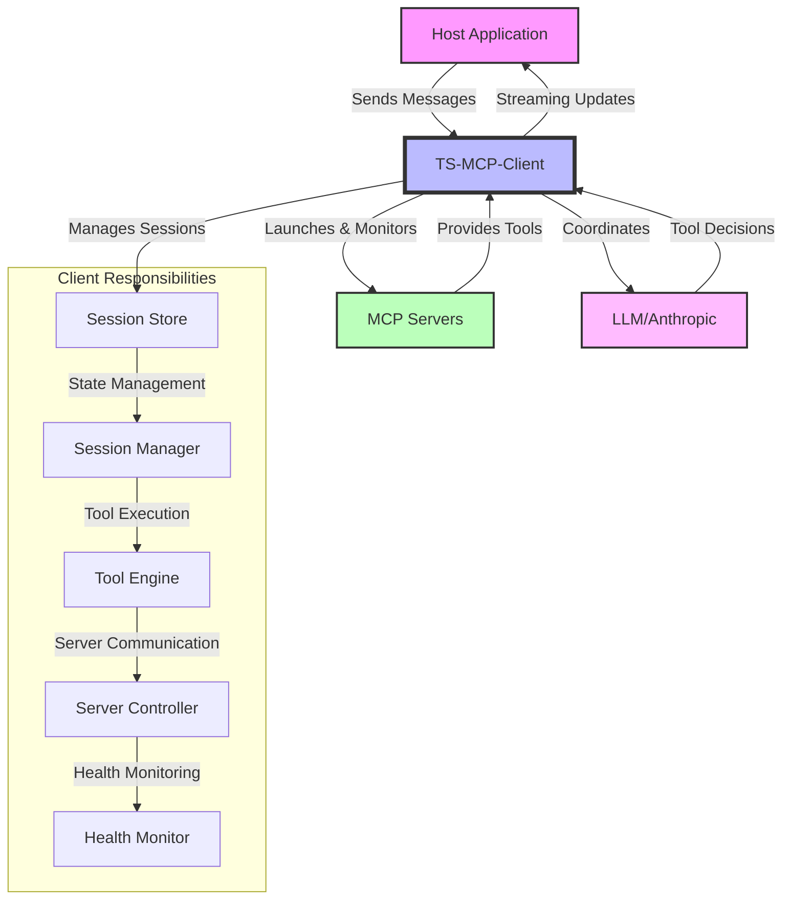

# TypeScript MCP Client

A TypeScript implementation of a Model Context Protocol (MCP) client that manages LLM chat interactions, server lifecycle, and tool invocations through MCP servers.

## Overview

The TS-MCP-Client serves as the core orchestration layer in the Model Context Protocol architecture, managing all session state, server lifecycle, and LLM interactions. It acts as the bridge between a host application (like a web interface) and the underlying MCP servers that provide tool capabilities.

### System Architecture



### Key Responsibilities

<details>
<summary>🔄 Session & State Management</summary>

- Manages all session state and lifecycle
- Handles session persistence and recovery
- Tracks session activity and expiry
- Maintains conversation history
</details>

<details>
<summary>🤖 LLM Integration</summary>

- Coordinates all LLM interactions
- Implements tool detection and execution
- Enforces tool call limits
- Provides streaming updates of operations
</details>

<details>
<summary>🛠️ Server Management</summary>

- Manages server lifecycle (launch, health, shutdown)
- Maintains server capabilities registry
- Implements MCP protocol for tool interactions
- Caches tool capabilities for reuse
</details>

<details>
<summary>🔍 Error Handling & Recovery</summary>

- Handles error recovery and retries
- Provides comprehensive error tracking
- Implements automatic recovery mechanisms
- Ensures graceful degradation
</details>

## Quick Start

```bash
npm install @rinardnick/ts-mcp-client
```

```typescript
import { SessionManager, loadConfig } from '@rinardnick/ts-mcp-client';

// 1. Load configuration
const config = await loadConfig('config.json');

// 2. Initialize session
const sessionManager = new SessionManager();
const session = await sessionManager.initializeSession(config);

// 3. Start chatting!
const response = await sessionManager.sendMessage(
  session.id,
  'What files are in the current directory?'
);
```

## API Reference

### Session Management

<details>
<summary>Initialize Session</summary>

```typescript
const sessionManager = new SessionManager();
const session = await sessionManager.initializeSession(config: LLMConfig);
```

The `LLMConfig` interface:

```typescript
interface LLMConfig {
  type: string; // LLM type (e.g., 'claude')
  api_key: string; // API key for the LLM
  model: string; // Model identifier
  system_prompt: string; // System prompt for the session
  servers?: {
    // Optional server configurations
    [key: string]: {
      command: string; // Server launch command
      args: string[]; // Command arguments
      env: Record<string, string>; // Environment variables
    };
  };
}
```

</details>

<details>
<summary>Send Messages</summary>

```typescript
// Regular message sending
const response = await sessionManager.sendMessage(
  sessionId: string,
  message: string
): Promise<ChatMessage>;

// Streaming message sending
const stream = sessionManager.sendMessageStream(
  sessionId: string,
  message: string
): AsyncGenerator<{
  type: string;
  content?: string;
  error?: string;
}>;
```

</details>

### Configuration

<details>
<summary>Configuration File Structure</summary>

```json
{
  "llm": {
    "type": "claude",
    "api_key": "YOUR_API_KEY_HERE",
    "model": "claude-3-5-sonnet-20241022",
    "system_prompt": "You are a helpful assistant."
  },
  "max_tool_calls": 3,
  "servers": {
    "filesystem": {
      "command": "npx",
      "args": ["-y", "@modelcontextprotocol/server-filesystem", "/workspace"],
      "env": {}
    },
    "terminal": {
      "command": "npx",
      "args": [
        "@rinardnick/mcp-terminal",
        "--allowed-commands",
        "[go,python3,uv,npm,npx,git,ls,cd,touch,mv,pwd,mkdir]"
      ],
      "env": {}
    }
  }
}
```

</details>

## Usage Examples

<details>
<summary>Basic Usage</summary>

```typescript
import { SessionManager, loadConfig } from '@rinardnick/ts-mcp-client';

// Initialize
const config = await loadConfig('config.json');
const sessionManager = new SessionManager();
const session = await sessionManager.initializeSession(config);

// Send a message
const response = await sessionManager.sendMessage(
  session.id,
  'What files are in the current directory?'
);
```

</details>

<details>
<summary>Streaming Example</summary>

```typescript
// Stream responses
const stream = sessionManager.sendMessageStream(
  session.id,
  'What files are in the current directory?'
);

for await (const chunk of stream) {
  switch (chunk.type) {
    case 'content':
      console.log('Content:', chunk.content);
      break;
    case 'tool_start':
      console.log('Tool starting:', chunk.content);
      break;
    case 'tool_result':
      console.log('Tool result:', chunk.content);
      break;
    case 'error':
      console.error('Error:', chunk.error);
      break;
    case 'done':
      console.log('Stream complete');
      break;
  }
}
```

Stream response types:

- `thinking`: LLM's intermediate thoughts/planning
- `tool_start`: When a tool is about to be executed
- `tool_result`: The result from a tool execution
- `content`: The final formatted response
- `error`: Any error messages
- `done`: Stream completion marker
</details>

## Implementation Notes

### 🔄 Session Lifecycle Management

<details>
<summary>Session States & Transitions</summary>

```typescript
// 1. Session Initialization
const session = await sessionManager.initializeSession({
  type: 'claude',
  api_key: process.env.ANTHROPIC_API_KEY,
  model: 'claude-3-sonnet-20240229',
  system_prompt: 'You are a helpful assistant.',
  servers: {
    filesystem: {
      command: 'npx',
      args: ['-y', '@modelcontextprotocol/server-filesystem', '/workspace'],
      env: {},
    },
  },
});

// 2. Session Management
const existingSession = sessionManager.getSession(sessionId);
console.log({
  id: existingSession.id,
  toolCallCount: existingSession.toolCallCount,
  maxToolCalls: existingSession.maxToolCalls,
});
```

Key Features:

- Unique session ID generation
- Tool call limit tracking (default: 2 calls per session)
- Server capabilities caching per session
- Message history maintenance
</details>

### 🛠️ Server Management

<details>
<summary>Server Lifecycle</summary>

```typescript
// Server Configuration
const serverConfig = {
  command: 'npx',
  args: ['-y', '@modelcontextprotocol/server-filesystem', '/workspace'],
  env: {
    NODE_ENV: 'production'
  }
};

// Server Health Checks
- Launch timeout: 5 seconds
- Health check retries: 3
- Health check interval: 1 second
- Health check timeout: 5 seconds
```

Key Features:

- Automatic server launch and initialization
- Health monitoring with retries
- Error handling for server failures
- Server capability discovery
</details>

### 🔀 Stream Processing

<details>
<summary>Stream Handling</summary>

```typescript
// Stream response handling
const stream = sessionManager.sendMessageStream(sessionId, message);

for await (const chunk of stream) {
  switch (chunk.type) {
    case 'content':
      // Regular content from LLM
      console.log('Content:', chunk.content);
      break;
    case 'error':
      // Error handling
      console.error('Error:', chunk.error);
      break;
    case 'done':
      // Stream completion
      console.log('Stream complete');
      break;
  }
}
```

Supported chunk types:

- `content`: LLM response content
- `error`: Error messages
- `done`: Stream completion marker
</details>

### 🔒 Security Implementation

<details>
<summary>Security Features</summary>

```typescript
// 1. API Key Management
const config = {
  type: 'claude',
  api_key: process.env.ANTHROPIC_API_KEY, // Never hardcode
  model: 'claude-3-sonnet-20240229',
  system_prompt: 'You are a helpful assistant.',
};

// 2. Server Process Isolation
const serverConfig = {
  command: 'npx',
  args: ['@modelcontextprotocol/server-filesystem', '/restricted/path'],
  env: {
    NODE_ENV: 'production',
  },
};
```

Implemented Security Features:

- Secure API key handling
- Server process isolation
- Error boundary implementation
- Input validation for tool calls
</details>

### 🔍 Error Handling

<details>
<summary>Error Management</summary>

```typescript
// Error Types
- LLMError: LLM-related errors
- ServerError: Base server error
- ServerLaunchError: Server startup failures
- ServerHealthError: Health check failures
- ServerExitError: Unexpected server exits

// Error Handling Example
try {
  const response = await sessionManager.sendMessage(sessionId, message);
} catch (error) {
  if (error instanceof LLMError) {
    // Handle LLM-specific errors
  } else if (error instanceof ServerError) {
    // Handle server-related errors
  }
}
```

Error Handling Features:

- Typed error hierarchy
- Detailed error messages
- Server health monitoring
- Automatic cleanup on failures
</details>

## Best Practices

### 🔐 Configuration Management

- Always validate configurations before initialization
- Store sensitive information (API keys) securely
- Use environment variables for dynamic configuration

### 📡 Session Management

- Initialize one session per user/conversation
- Clean up sessions when they're no longer needed
- Monitor tool call limits

### ⚠️ Error Handling

- Implement proper error handling for all async operations
- Log errors appropriately
- Provide user-friendly error messages

### 🔄 Resource Management

- Clean up server processes when done
- Monitor server health
- Implement proper error recovery

## Contributing

Contributions are welcome! Please read our contributing guidelines and submit pull requests to our GitHub repository.

## License

This project is licensed under the GNU Affero General Public License version 3 (AGPL-3.0) with Commons Clause.

### AGPL-3.0

The GNU Affero General Public License is a free, copyleft license that requires:

- Source code must be made available when the software is provided over a network
- All modifications must be released under the same license
- Clear attribution and license notices must be kept

### Commons Clause

The Commons Clause adds restrictions on top of AGPL-3.0, specifically:
"The Software is provided to you by the Licensor under the License, as defined below, subject to the following condition: Without limiting other conditions in the License, the grant of rights under the License will not include, and the License does not grant to you, the right to Sell the Software."

Where "Sell" means:

- Selling, licensing, or distributing the Software for a fee
- Using the Software to provide commercial services
- Using the Software as a part of a commercial product or service

### Permitted Uses

- Research and development
- Personal projects
- Non-commercial applications
- Educational purposes

### Prohibited Uses

- Commercial applications
- Selling services that include the software
- Including in commercial products
- Offering as a hosted/SaaS solution

For the complete license text, see:

- [GNU AGPL-3.0](https://www.gnu.org/licenses/agpl-3.0.en.html)
- [Commons Clause](https://commonsclause.com/)

## Support

For issues and feature requests, please use the GitHub issue tracker.

## Appendix

### Common Usage Patterns

<details>
<summary>Tool Call Handling</summary>

```typescript
// The client automatically handles tool calls from the LLM
// Tool calls are detected using the format: <tool>tool-name {"param": "value"}</tool>

// Example of a tool call response from LLM
{
  role: 'assistant',
  content: 'Let me check the files.\n<tool>list-files {"path": "/tmp"}</tool>',
  hasToolCall: true,
  toolCall: {
    name: 'list-files',
    parameters: { path: '/tmp' }
  }
}

// Tool result is automatically added to conversation
{
  role: 'assistant',
  content: '{"files": ["file1.txt", "file2.txt"]}',
  isToolResult: true
}
```

Key Points:

- Tool calls are limited to 2 per session by default
- Tool results are automatically included in conversation history
- The LLM receives tool results in the next message context
</details>

<details>
<summary>Message Flow</summary>

```typescript
// 1. User sends message
const response = await sessionManager.sendMessage(
  sessionId,
  'List files in /tmp'
);

// 2. Message gets added to session history
session.messages.push({
  role: 'user',
  content: message,
});

// 3. If LLM response contains tool call
if (response.hasToolCall) {
  // Tool is automatically executed
  // Result is added to conversation
  // LLM receives follow-up with tool result
}

// 4. Final response includes tool results
console.log(response.content); // "I found these files: file1.txt, file2.txt"
```

</details>

### Error Handling Examples

<details>
<summary>Session Errors</summary>

```typescript
try {
  const session = await sessionManager.initializeSession(config);
} catch (error) {
  if (error instanceof LLMError) {
    // Handle LLM initialization errors
    // - Invalid API key
    // - Model configuration issues
  }
  if (error instanceof ServerError) {
    // Handle server initialization errors
    // - Failed to launch server
    // - Server process not found
    // - Capability discovery failed
  }
}
```

Common Session Errors:

- Server initialization failures
- Invalid configurations
- Tool execution failures
- LLM API errors
</details>

<details>
<summary>Server Health Monitoring</summary>

```typescript
// Server health checks are automatic
// Default settings:
const healthCheckConfig = {
  launchTimeout: 5000,    // 5 seconds
  healthCheckTimeout: 5000,
  healthCheckRetries: 3,
  healthCheckInterval: 1000
};

// Health check process:
1. Wait for server ready message
2. Verify process is responsive
3. Retry up to 3 times if needed
4. Cleanup on failure
```

Server Error Types:

- `ServerLaunchError`: Failed to start server
- `ServerHealthError`: Health check failed
- `ServerExitError`: Server exited unexpectedly
</details>

<details>
<summary>Tool Execution Errors</summary>

```typescript
try {
  const response = await sessionManager.sendMessage(sessionId, message);
} catch (error) {
  if (error instanceof LLMError) {
    if (error.message.includes('Failed to execute tool')) {
      // Handle tool execution failure
      // - Tool not found
      // - Invalid parameters
      // - Server communication error
    }
  }
}
```

Tool Error Handling:

- Automatic cleanup of failed tool executions
- Tool results are validated before processing
- Tool call limits are enforced
</details>
