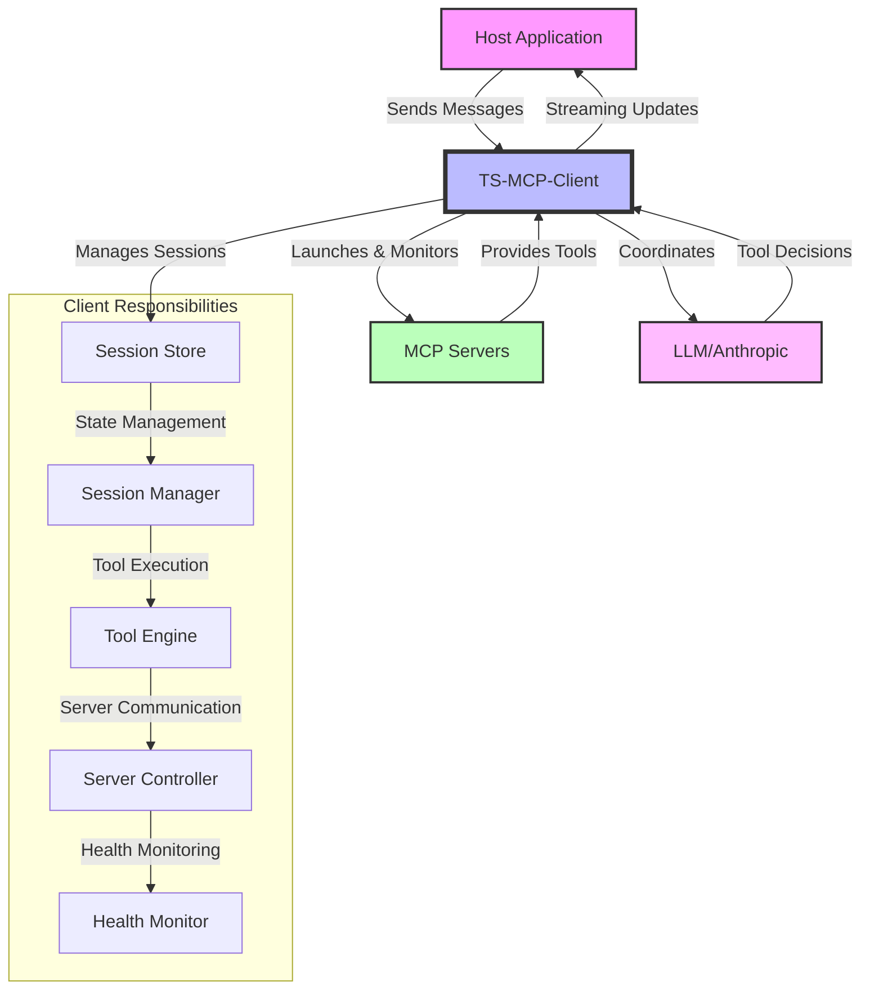

# TypeScript MCP Client

A TypeScript implementation of a Model Context Protocol (MCP) client that manages LLM chat interactions, server lifecycle, and tool invocations through MCP servers.

## Overview

The TS-MCP-Client serves as the core orchestration layer in the Model Context Protocol architecture, managing all session state, server lifecycle, and LLM interactions. It acts as the bridge between a host application (like a web interface) and the underlying MCP servers that provide tool capabilities.

### System Architecture



### Key Responsibilities

<details>
<summary>🔄 Session & State Management</summary>

- Manages all session state and lifecycle
- Handles session persistence and recovery
- Tracks session activity and expiry
- Maintains conversation history
</details>

<details>
<summary>🤖 LLM Integration</summary>

- Coordinates all LLM interactions
- Implements tool detection and execution
- Enforces tool call limits
- Provides streaming updates of operations
</details>

<details>
<summary>🛠️ Server Management</summary>

- Manages server lifecycle (launch, health, shutdown)
- Maintains server capabilities registry
- Implements MCP protocol for tool interactions
- Caches tool capabilities for reuse
</details>

<details>
<summary>🔍 Error Handling & Recovery</summary>

- Handles error recovery and retries
- Provides comprehensive error tracking
- Implements automatic recovery mechanisms
- Ensures graceful degradation
</details>

## Quick Start

```bash
npm install @rinardnick/ts-mcp-client
```

```typescript
import { SessionManager, loadConfig } from '@rinardnick/ts-mcp-client';

// 1. Load configuration
const config = await loadConfig('config.json');

// 2. Initialize session
const sessionManager = new SessionManager();
const session = await sessionManager.initializeSession(config);

// 3. Start chatting!
const response = await sessionManager.sendMessage(
  session.id,
  'What files are in the current directory?'
);
```

## API Reference

### Session Management

<details>
<summary>Initialize Session</summary>

```typescript
const sessionManager = new SessionManager();
const session = await sessionManager.initializeSession(config: LLMConfig);
```

The `LLMConfig` interface:

```typescript
interface LLMConfig {
  type: string; // LLM type (e.g., 'claude')
  api_key: string; // API key for the LLM
  model: string; // Model identifier
  system_prompt: string; // System prompt for the session
  servers?: {
    // Optional server configurations
    [key: string]: {
      command: string; // Server launch command
      args: string[]; // Command arguments
      env: Record<string, string>; // Environment variables
    };
  };
}
```

</details>

<details>
<summary>Send Messages</summary>

```typescript
// Regular message sending
const response = await sessionManager.sendMessage(
  sessionId: string,
  message: string
): Promise<ChatMessage>;

// Streaming message sending
const stream = sessionManager.sendMessageStream(
  sessionId: string,
  message: string
): AsyncGenerator<{
  type: string;
  content?: string;
  error?: string;
}>;
```

</details>

### Configuration

<details>
<summary>Configuration File Structure</summary>

```json
{
  "llm": {
    "type": "claude",
    "api_key": "YOUR_API_KEY_HERE",
    "model": "claude-3-5-sonnet-20241022",
    "system_prompt": "You are a helpful assistant."
  },
  "max_tool_calls": 3,
  "servers": {
    "filesystem": {
      "command": "npx",
      "args": ["-y", "@modelcontextprotocol/server-filesystem", "/workspace"],
      "env": {}
    },
    "terminal": {
      "command": "npx",
      "args": [
        "@rinardnick/mcp-terminal",
        "--allowed-commands",
        "[go,python3,uv,npm,npx,git,ls,cd,touch,mv,pwd,mkdir]"
      ],
      "env": {}
    }
  }
}
```

</details>

## Usage Examples

<details>
<summary>Basic Usage</summary>

```typescript
import { SessionManager, loadConfig } from '@rinardnick/ts-mcp-client';

// Initialize
const config = await loadConfig('config.json');
const sessionManager = new SessionManager();
const session = await sessionManager.initializeSession(config);

// Send a message
const response = await sessionManager.sendMessage(
  session.id,
  'What files are in the current directory?'
);
```

</details>

<details>
<summary>Streaming Example</summary>

```typescript
// Stream responses
const stream = sessionManager.sendMessageStream(
  session.id,
  'What files are in the current directory?'
);

for await (const chunk of stream) {
  switch (chunk.type) {
    case 'content':
      console.log('Content:', chunk.content);
      break;
    case 'tool_start':
      console.log('Tool starting:', chunk.content);
      break;
    case 'tool_result':
      console.log('Tool result:', chunk.content);
      break;
    case 'error':
      console.error('Error:', chunk.error);
      break;
    case 'done':
      console.log('Stream complete');
      break;
  }
}
```

Stream response types:

- `thinking`: LLM's intermediate thoughts/planning
- `tool_start`: When a tool is about to be executed
- `tool_result`: The result from a tool execution
- `content`: The final formatted response
- `error`: Any error messages
- `done`: Stream completion marker
</details>

## Implementation Notes

### 🔄 Session Lifecycle Management

<details>
<summary>Session States & Transitions</summary>

```typescript
// 1. Session Initialization
const session = await sessionManager.initializeSession({
  type: 'claude',
  api_key: process.env.ANTHROPIC_API_KEY,
  model: 'claude-3-sonnet-20240229',
  system_prompt: 'You are a helpful assistant.',
  servers: {
    // Server configurations
  },
});

// 2. Session Recovery
const existingSession = sessionManager.getSession(sessionId);
if (existingSession.lastActivityAt < Date.now() - 30 * 60 * 1000) {
  // Session expired, reinitialize
  await sessionManager.initializeSession(config);
}

// 3. Session Cleanup
// Implement in your application shutdown
process.on('SIGTERM', async () => {
  await sessionManager.cleanup();
});
```

- Sessions automatically expire after 30 minutes of inactivity
- Server processes are terminated when sessions are cleaned up
- Tool capabilities are cached per session
</details>

### 🛠️ Tool Integration

<details>
<summary>Custom Tool Implementation</summary>

```typescript
// 1. Define Tool Schema
const customTool = {
  name: 'custom-tool',
  description: 'Performs a custom operation',
  parameters: {
    properties: {
      input: {
        type: 'string',
        description: 'Input for the custom operation',
      },
    },
    required: ['input'],
  },
};

// 2. Implement Tool Handler
const handleCustomTool = async (params: any) => {
  // Tool implementation
  return { result: `Processed: ${params.input}` };
};

// 3. Register with MCP Server
const server = new MCPServer({
  tools: [customTool],
  handlers: {
    'custom-tool': handleCustomTool,
  },
});
```

- Tools must follow the MCP protocol specification
- Parameters should be strictly typed
- Include comprehensive error handling
</details>

### 🔀 Stream Processing

<details>
<summary>Advanced Stream Handling</summary>

```typescript
// 1. Custom Stream Processing
const processStream = async (sessionId: string, message: string) => {
  const stream = sessionManager.sendMessageStream(sessionId, message);
  let toolResult = null;

  for await (const chunk of stream) {
    switch (chunk.type) {
      case 'thinking':
        // Handle intermediate thoughts
        break;
      case 'tool_start':
        // Track tool execution start
        break;
      case 'tool_result':
        toolResult = chunk.content;
        // Process tool results
        break;
      case 'content':
        if (toolResult) {
          // Combine tool results with content
        }
        // Process final content
        break;
    }
  }
};

// 2. Error Recovery in Streams
try {
  for await (const chunk of stream) {
    if (chunk.type === 'error') {
      // Implement retry logic
      await handleStreamError(chunk.error);
      continue;
    }
    // Process chunk
  }
} catch (error) {
  // Handle stream interruption
  await recoverSession(sessionId);
}
```

- Implement backoff strategies for retries
- Cache intermediate results for recovery
- Handle stream interruptions gracefully
</details>

### 🔒 Security Considerations

<details>
<summary>Security Best Practices</summary>

```typescript
// 1. API Key Management
const config = {
  type: 'claude',
  api_key: process.env.ANTHROPIC_API_KEY, // Never hardcode
  // ...
};

// 2. Server Process Isolation
const serverConfig = {
  command: 'npx',
  args: [
    '@modelcontextprotocol/server-filesystem',
    '/restricted/path', // Restrict access
  ],
  env: {
    NODE_ENV: 'production',
    // Limit environment variables
  },
};

// 3. Tool Access Control
const validateToolAccess = (tool: string, user: User) => {
  const allowedTools = getAllowedTools(user.role);
  return allowedTools.includes(tool);
};
```

- Implement rate limiting for tool calls
- Validate all tool inputs
- Monitor server resource usage
- Implement audit logging
</details>

### 📊 Performance Optimization

<details>
<summary>Performance Tips</summary>

```typescript
// 1. Tool Result Caching
const cache = new Map<string, any>();
const getCachedResult = (toolName: string, params: any) => {
  const key = `${toolName}:${JSON.stringify(params)}`;
  return cache.get(key);
};

// 2. Batch Processing
const batchMessages = async (messages: string[]) => {
  const sessions = new Map<string, string[]>();
  // Group messages by session
  // Process in batches
};

// 3. Resource Management
const optimizeResources = {
  maxSessions: 100,
  toolTimeout: 5000,
  maxConcurrent: 10,
};
```

- Implement connection pooling
- Use appropriate timeout values
- Monitor memory usage
- Implement circuit breakers
</details>

### 🔍 Debugging & Monitoring

<details>
<summary>Debugging Tools</summary>

```typescript
// 1. Session Debugging
const debugSession = (sessionId: string) => {
  const session = sessionManager.getSession(sessionId);
  console.log({
    toolCalls: session.toolCallCount,
    lastActivity: session.lastActivityAt,
    messageCount: session.messages.length,
  });
};

// 2. Tool Execution Monitoring
const monitorTool = async (name: string, params: any) => {
  const startTime = Date.now();
  try {
    const result = await executeTool(name, params);
    metrics.recordToolExecution(name, Date.now() - startTime);
    return result;
  } catch (error) {
    metrics.recordToolError(name, error);
    throw error;
  }
};
```

- Implement comprehensive logging
- Add performance metrics
- Monitor server health
- Track tool usage patterns
</details>

## Best Practices

### 🔐 Configuration Management

- Always validate configurations before initialization
- Store sensitive information (API keys) securely
- Use environment variables for dynamic configuration

### 📡 Session Management

- Initialize one session per user/conversation
- Clean up sessions when they're no longer needed
- Monitor tool call limits

### ⚠️ Error Handling

- Implement proper error handling for all async operations
- Log errors appropriately
- Provide user-friendly error messages

### 🔄 Resource Management

- Clean up server processes when done
- Monitor server health
- Implement proper error recovery

## Contributing

Contributions are welcome! Please read our contributing guidelines and submit pull requests to our GitHub repository.

## License

This project is licensed under the GNU Affero General Public License version 3 (AGPL-3.0) with Commons Clause.

### AGPL-3.0

The GNU Affero General Public License is a free, copyleft license that requires:

- Source code must be made available when the software is provided over a network
- All modifications must be released under the same license
- Clear attribution and license notices must be kept

### Commons Clause

The Commons Clause adds restrictions on top of AGPL-3.0, specifically:
"The Software is provided to you by the Licensor under the License, as defined below, subject to the following condition: Without limiting other conditions in the License, the grant of rights under the License will not include, and the License does not grant to you, the right to Sell the Software."

Where "Sell" means:

- Selling, licensing, or distributing the Software for a fee
- Using the Software to provide commercial services
- Using the Software as a part of a commercial product or service

### Permitted Uses

- Research and development
- Personal projects
- Non-commercial applications
- Educational purposes

### Prohibited Uses

- Commercial applications
- Selling services that include the software
- Including in commercial products
- Offering as a hosted/SaaS solution

For the complete license text, see:

- [GNU AGPL-3.0](https://www.gnu.org/licenses/agpl-3.0.en.html)
- [Commons Clause](https://commonsclause.com/)

## Support

For issues and feature requests, please use the GitHub issue tracker.
