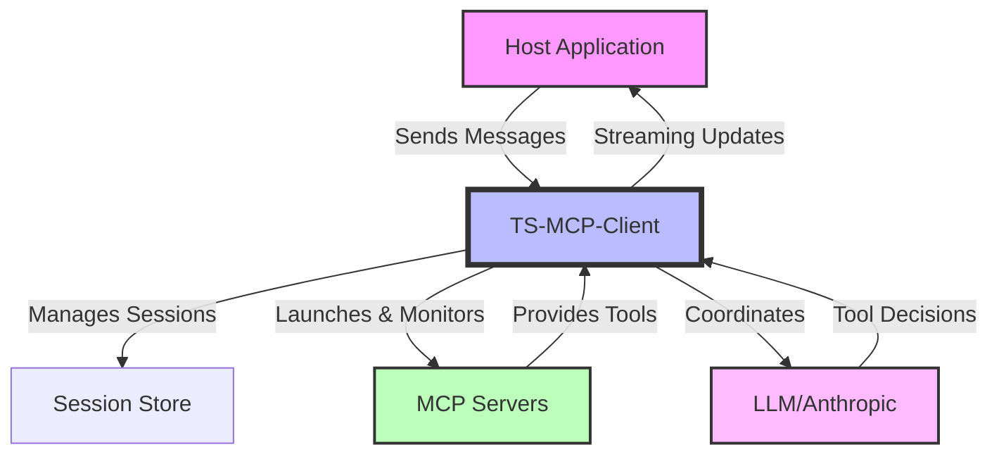
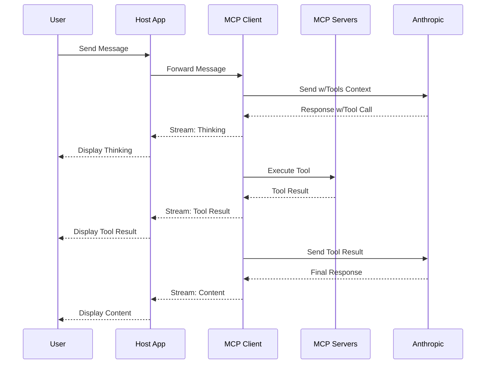

# TypeScript MCP Client

A TypeScript implementation of the Model Context Protocol (MCP) client that manages LLM chat interactions, server lifecycle, and tool invocations.

## Overview

The TS-MCP-Client orchestrates session state, server lifecycle, and LLM interactions in a Model Context Protocol (MCP) architecture. It bridges your application and the MCP servers that provide tool capabilities for LLMs like Claude.



## Component Responsibilities

- **Host Application (Your Application)**  
  Handles UI, rendering, user input, and displaying streamed outputs from the client.

- **TS-MCP-Client (This Library)**  
  Manages session state, server lifecycle, tool execution, LLM interactions, and streaming updates.

- **MCP Servers**  
  Expose tool capabilities through standardized endpoints and execute tool requests.

- **LLM (Anthropic Claude)**  
  Processes messages, makes tool usage decisions, and provides responses.

## Getting Started

```bash
npm install @rinardnick/client_mcp
```

### Features

- **Structured Tool Call Support** - Works with Claude's latest API format for tool calls
- **Continuous Tool Conversation** - Maintains conversation flow after tool execution
- **Enhanced Token Management** - Accurate token counting, cost estimation, and context optimization
- **Claude 3.7 Thinking Support** - Enable Claude's thinking process for better reasoning
- **Tool Call Limits** - Control tool usage in conversations
- **Session Management** - Manage chat sessions with persistence
- **Server Lifecycle Management** - Automatic launch and monitoring of MCP servers
- **Context Window Optimization** - Smart truncation of conversation history when limits approach

## Core Usage

### Initialize a Session

```typescript
import { SessionManager, loadConfig } from '@rinardnick/client_mcp';

// Load or create configuration
const config = {
  type: 'claude',
  api_key: process.env.ANTHROPIC_API_KEY,
  model: 'claude-3-5-sonnet-20241022',
  system_prompt: 'You are a helpful assistant with access to tools.',

  // Optional configurations
  max_tool_calls: 5, // Limit tool calls per conversation
  thinking: {
    enabled: true, // For Claude 3.7+ models
    budget_tokens: 6000, // Optional thinking token budget
  },
  token_optimization: {
    enabled: true, // Enable token optimization
    auto_truncate: true, // Automatically truncate when approaching limits
    preserve_system_messages: true, // Always keep system messages
    preserve_recent_messages: 5, // Keep 5 most recent messages
    truncation_strategy: 'oldest-first', // How to truncate conversation
  },

  // Server configurations
  servers: {
    filesystem: {
      command: 'npx',
      args: ['-y', '@modelcontextprotocol/server-filesystem', '/workspace'],
      env: {},
    },
  },
};

// Initialize session manager and session
const sessionManager = new SessionManager();
const session = await sessionManager.initializeSession(config);
const sessionId = session.id;
```

### Using Shared Servers

For improved resource utilization, you can enable shared servers across multiple sessions:

```typescript
// Initialize session manager with shared servers enabled
const sessionManager = new SessionManager({ useSharedServers: true });

// Create multiple sessions that will share server instances
const session1 = await sessionManager.initializeSession(config);
const session2 = await sessionManager.initializeSession(config);
const session3 = await sessionManager.initializeSession(config);

// All sessions will use the same server instances for identical server configurations
// This reduces resource usage and improves startup time for subsequent sessions
```

When shared servers are enabled:

- Server instances are pooled and reused across sessions
- Servers are reference-counted and only terminated when no longer needed by any session
- Server cleanup happens automatically when sessions are cleaned up

### Send Messages with Streaming

```typescript
// Stream responses for real-time updates
const stream = sessionManager.sendMessageStream(
  sessionId,
  'What files are in the current directory?'
);

// Process the stream chunks
for await (const chunk of stream) {
  switch (chunk.type) {
    case 'thinking':
      // Claude's thinking process (3.7+ models)
      console.log('Thinking:', chunk.content);
      break;

    case 'tool_start':
      // Tool is about to execute
      console.log('Starting tool:', chunk.content);
      break;

    case 'tool_result':
      // Results from tool execution
      console.log('Tool result:', chunk.content);
      break;

    case 'content':
      // Regular message content - continues after tool execution
      console.log('Content:', chunk.content);
      break;

    case 'error':
      // Error during processing
      console.error('Error:', chunk.error);
      break;

    case 'done':
      // Stream is complete
      console.log('Stream complete');
      break;
  }
}
```

### Tool Continuation Support

The client automatically handles continued conversation after tool execution:

1. When a tool is called, the event stream emits a `tool_start` event
2. After tool execution, a `tool_result` event is emitted with the results
3. The conversation automatically continues with the LLM incorporating the tool results
4. Additional `content` events are emitted with the LLM's response to the tool results

This ensures seamless conversation flow even when tools are used during the interaction.

### Token Management and Context Optimization

```typescript
// Track detailed token usage
const tokenMetrics = sessionManager.getSessionTokenUsage(sessionId);
console.log(`Token usage breakdown:
  - User tokens: ${tokenMetrics.userTokens}
  - Assistant tokens: ${tokenMetrics.assistantTokens}
  - System tokens: ${tokenMetrics.systemTokens}
  - Tool tokens: ${tokenMetrics.toolTokens}
  - Total: ${tokenMetrics.totalTokens}/${tokenMetrics.maxContextTokens} (${tokenMetrics.percentUsed}%)
  - Recommendation: ${tokenMetrics.recommendation}
`);

// Get cost estimates
const costEstimate = sessionManager.getTokenCostEstimate(sessionId);
console.log(`Cost breakdown:
  - Input cost: $${costEstimate.inputCost.toFixed(4)}
  - Output cost: $${costEstimate.outputCost.toFixed(4)}
  - Total cost: $${costEstimate.totalCost.toFixed(4)}
`);

// Configure context optimization settings
sessionManager.setContextSettings(sessionId, {
  autoTruncate: true, // Enable automatic truncation
  preserveSystemMessages: true, // Always keep system messages
  preserveRecentMessages: 6, // Keep the 6 most recent messages
  truncationStrategy: 'oldest-first', // Remove oldest messages first
});

// Manually trigger context optimization when needed
if (tokenMetrics.percentUsed > 80) {
  console.log('Context window filling up, optimizing...');
  const optimizedMetrics = sessionManager.optimizeContext(sessionId);
  console.log(
    `Reduced to ${optimizedMetrics.totalTokens} tokens (${optimizedMetrics.percentUsed}%)`
  );
}
```

### Token Optimization Features

The client includes several token optimization features to efficiently manage context windows:

#### Token Counting and Monitoring

```typescript
// Get token usage metrics for a session
const tokenMetrics = sessionManager.getSessionTokenUsage(sessionId);
console.log(`Total tokens: ${tokenMetrics.totalTokens}`);
console.log(`Context window usage: ${tokenMetrics.percentUsed}%`);

// Get cost estimate for a session
const costEstimate = sessionManager.getTokenCostEstimate(sessionId);
console.log(`Estimated cost: $${costEstimate.cost}`);
```

#### Context Optimization

The client supports multiple strategies for optimizing context when approaching limits:

```typescript
// Configure context optimization settings
sessionManager.setContextSettings(sessionId, {
  maxTokenLimit: 100000, // Override model's default limit
  autoTruncate: true, // Automatically optimize when approaching limits
  preserveSystemMessages: true, // Always keep system messages
  preserveRecentMessages: 4, // Keep the most recent messages
  truncationStrategy: 'selective', // 'oldest-first', 'selective', or 'summarize'
});

// Manually trigger context optimization
const optimizedMetrics = sessionManager.optimizeContext(sessionId);
```

##### Truncation Strategies

1. **Oldest-First**: Removes the oldest messages first, preserving system messages and recent conversation.
2. **Selective**: Uses relevance scoring to remove less important messages first, preserving conversation coherence.
3. **Summarize**: Replaces groups of messages with concise summaries generated by the LLM, preserving key information while reducing token usage.

##### Conversation Summarization

The summarization strategy uses the LLM to create concise summaries of message groups:

```typescript
// Configure summarization settings
sessionManager.setContextSettings(sessionId, {
  truncationStrategy: 'summarize',
  summarizationBatchSize: 5, // Number of messages to summarize together
  minCompressionRatio: 2.0, // Minimum compression ratio to keep summaries
});

// Get summarization metrics
const summaryMetrics = sessionManager.getSummarizationStatus(sessionId);
console.log(`Total summaries: ${summaryMetrics.totalSummaries}`);
console.log(`Tokens saved: ${summaryMetrics.totalTokensSaved}`);
console.log(`Average compression: ${summaryMetrics.averageCompressionRatio}x`);
```

Benefits of summarization:

- Preserves key information while reducing token usage
- Maintains conversation coherence better than simple truncation
- Achieves higher compression ratios for long conversations
- Automatically tracks summarization efficiency

##### Dynamic Summarization Triggering

The client can automatically trigger summarization based on various conditions:

```typescript
// Configure dynamic summarization settings
sessionManager.setContextSettings(sessionId, {
  truncationStrategy: 'summarize',
  dynamicSummarizationEnabled: true,
  tokenThresholdForSummarization: 70, // Trigger at 70% context usage
  timeBetweenSummarizations: 60, // Minutes between summarizations
  detectTopicChanges: true, // Trigger on topic changes
  adaptiveSummarizationAggressiveness: true, // Adjust based on context pressure
});
```

Benefits of dynamic summarization:

- Automatically maintains optimal context window usage
- Prevents context window overflow before it becomes critical
- Adapts summarization aggressiveness based on context pressure
- Identifies natural breaking points like topic changes for summarization
- Balances token efficiency with conversation quality

## Context Optimization Features

### Adaptive Context Strategy

The library includes an adaptive context optimization strategy that automatically selects the most effective optimization method based on conversation characteristics and past performance.

```typescript
// Configure adaptive context strategy
sessionManager.setContextSettings({
  adaptiveStrategyEnabled: true, // Enable adaptive strategy selection
  strategySelectionThreshold: 3, // Minimum performance data points before relying on past performance
});
```

Benefits of adaptive context strategy:

- **Intelligent Strategy Selection**: Automatically chooses the best strategy based on conversation type
- **Performance Learning**: Tracks and learns from the effectiveness of different strategies
- **Conversation Analysis**: Identifies conversation characteristics like question density and topic changes
- **Optimal Token Usage**: Maximizes context quality while minimizing token usage

The adaptive strategy selects from the following optimization methods:

- **Oldest-First**: Simple and efficient for basic Q&A conversations
- **Relevance-Based**: Preserves important messages for technical discussions
- **Summarization**: Condenses creative content while preserving key information
- **Clustering**: Maintains topic coherence for conversations with multiple subjects

### Message Clustering

The library includes a message clustering feature that intelligently groups related messages by topic, allowing for more coherent context optimization. When the context window gets too full, the system can remove entire topic clusters that are less important, rather than arbitrary messages.

```typescript
// Configure message clustering
sessionManager.setContextSettings({
  truncationStrategy: 'cluster', // Use cluster-based truncation
  autoTruncate: true, // Automatically truncate when context is full
  preserveSystemMessages: true, // Always keep system messages
  preserveRecentMessages: 2, // Always keep the 2 most recent messages
});
```

Benefits of message clustering:

- **Topic Coherence**: Maintains entire conversation topics together
- **Intelligent Pruning**: Removes less important topics first based on recency, questions, and size
- **Improved Context Quality**: Preserves the most relevant information for the LLM
- **Better User Experience**: Prevents the LLM from losing track of important topics

### Dynamic Summarization Triggering

The library supports dynamic summarization triggering based on various conditions:

```typescript
// Configure dynamic summarization
sessionManager.setContextSettings({
  truncationStrategy: 'summarize',
  dynamicSummarizationEnabled: true,
  tokenThresholdForSummarization: 70, // Trigger at 70% context usage
  timeBetweenSummarizations: 60, // Minutes between summarizations
  detectTopicChanges: true, // Trigger on topic changes
  adaptiveSummarizationAggressiveness: true, // Adjust based on context pressure
});
```

Benefits of dynamic summarization:

- Maintains optimal context window usage
- Prevents context overflow by proactively summarizing
- Adapts summarization aggressiveness based on context pressure
- Identifies topic changes as natural points for summarization
- Balances token efficiency with conversation quality

## Message Flow Sequence

This diagram illustrates how messages flow through the system, including tool execution:



## Express Integration

```typescript
import express from 'express';
import { createChatRouter } from '@rinardnick/client_mcp';

const app = express();
const router = createChatRouter(); // Creates a router with session and message endpoints

app.use('/api/chat', router);

app.listen(3000, () => {
  console.log('Server running on port 3000');
});
```

## Host Application Integration

### React Integration Example

```tsx
import React, { useState, useEffect } from 'react';
import { SessionManager } from '@rinardnick/client_mcp';

// Create a singleton instance
const sessionManager = new SessionManager();

const Chat = () => {
  const [sessionId, setSessionId] = useState(null);
  const [messages, setMessages] = useState([]);
  const [input, setInput] = useState('');
  const [loading, setLoading] = useState(false);
  const [streamData, setStreamData] = useState({
    thinking: '',
    toolInfo: '',
    content: '',
    error: '',
  });

  // Initialize on component mount
  useEffect(() => {
    const initSession = async () => {
      // Load config (your implementation)
      const config = await loadConfig();

      // Create a new session
      const session = await sessionManager.initializeSession(config);
      setSessionId(session.id);
    };

    initSession();
  }, []);

  const sendMessage = async e => {
    e.preventDefault();
    if (!input.trim() || !sessionId) return;

    // Add user message to UI
    setMessages(prev => [...prev, { role: 'user', content: input }]);
    setInput('');
    setStreamData({ thinking: '', toolInfo: '', content: '', error: '' });
    setLoading(true);

    try {
      // Start streaming response
      const stream = sessionManager.sendMessageStream(sessionId, input);

      for await (const chunk of stream) {
        switch (chunk.type) {
          case 'thinking':
            setStreamData(prev => ({ ...prev, thinking: chunk.content }));
            break;
          case 'tool_start':
            setStreamData(prev => ({
              ...prev,
              toolInfo: `Running: ${chunk.content}`,
            }));
            break;
          case 'tool_result':
            setStreamData(prev => ({
              ...prev,
              toolInfo: `Result: ${chunk.content}`,
            }));
            break;
          case 'content':
            setStreamData(prev => ({ ...prev, content: chunk.content }));
            break;
          case 'error':
            setStreamData(prev => ({ ...prev, error: chunk.error }));
            break;
          case 'done':
            // Add final message to UI
            if (streamData.content) {
              setMessages(prev => [
                ...prev,
                { role: 'assistant', content: streamData.content },
              ]);
            }
            break;
        }
      }
    } catch (error) {
      setStreamData(prev => ({ ...prev, error: error.message }));
    } finally {
      setLoading(false);
    }
  };

  return (
    <div className="chat-container">
      <div className="messages">
        {messages.map((msg, i) => (
          <div key={i} className={`message ${msg.role}`}>
            {msg.content}
          </div>
        ))}

        {/* Show streaming content */}
        {streamData.thinking && (
          <div className="thinking">Thinking: {streamData.thinking}</div>
        )}
        {streamData.toolInfo && (
          <div className="tool-info">{streamData.toolInfo}</div>
        )}
        {streamData.content && loading && (
          <div className="streaming">{streamData.content}</div>
        )}
        {streamData.error && (
          <div className="error">Error: {streamData.error}</div>
        )}
      </div>

      <form onSubmit={sendMessage}>
        <input
          value={input}
          onChange={e => setInput(e.target.value)}
          placeholder="Send a message..."
          disabled={loading || !sessionId}
        />
        <button type="submit" disabled={loading || !sessionId}>
          Send
        </button>
      </form>
    </div>
  );
};
```

## Error Handling Best Practices

```typescript
try {
  const session = await sessionManager.initializeSession(config);
} catch (error) {
  // Handle different error types
  if (error instanceof LLMError) {
    // LLM-specific errors (API key, rate limits)
    console.error('LLM Error:', error.message);
  } else if (error instanceof ConfigurationError) {
    // Configuration issues
    console.error('Config Error:', error.message);
  } else {
    // General errors
    console.error('Error:', error.message);
  }
}
```

## Security Best Practices

1. **API Key Management**

   - Never expose API keys in client-side code
   - Use environment variables or secure vaults

2. **Server Security**

   - Restrict server capabilities (e.g., filesystem access)
   - Use allowlists for commands
   - Implement resource limits

3. **Session Security**
   - Validate session ownership
   - Implement proper session timeouts

## Configuration Reference

```typescript
interface LLMConfig {
  type: string; // LLM type (e.g., 'claude')
  api_key: string; // API key for the LLM
  model: string; // Model identifier
  system_prompt: string; // System prompt for the session

  max_tool_calls?: number; // Maximum tool calls per session

  thinking?: {
    enabled?: boolean; // Enable thinking for Claude 3.7+
    budget_tokens?: number; // Token budget for thinking
  };

  token_optimization?: {
    enabled?: boolean; // Enable token optimization
    auto_truncate?: boolean; // Automatically truncate when context window fills
    preserve_system_messages?: boolean; // Keep system messages during truncation
    preserve_recent_messages?: number; // Number of recent messages to preserve
    truncation_strategy?: 'oldest-first' | 'selective' | 'summarize'; // How to truncate
  };

  servers?: {
    [key: string]: {
      command: string; // Server launch command
      args: string[]; // Command arguments
      env?: Record<string, string>; // Environment variables
    };
  };
}

interface SessionManagerOptions {
  useSharedServers?: boolean; // Enable server sharing across sessions
}
```

## License

This project is licensed under the ISC License.
