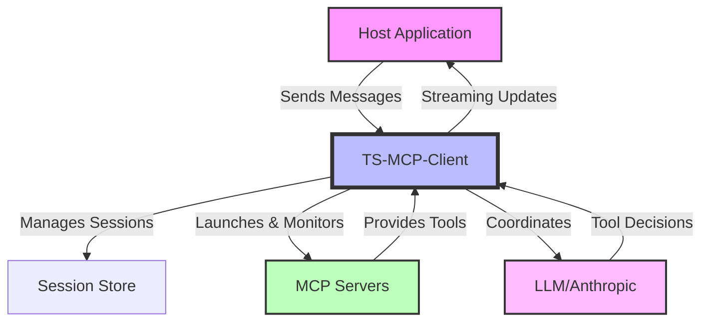
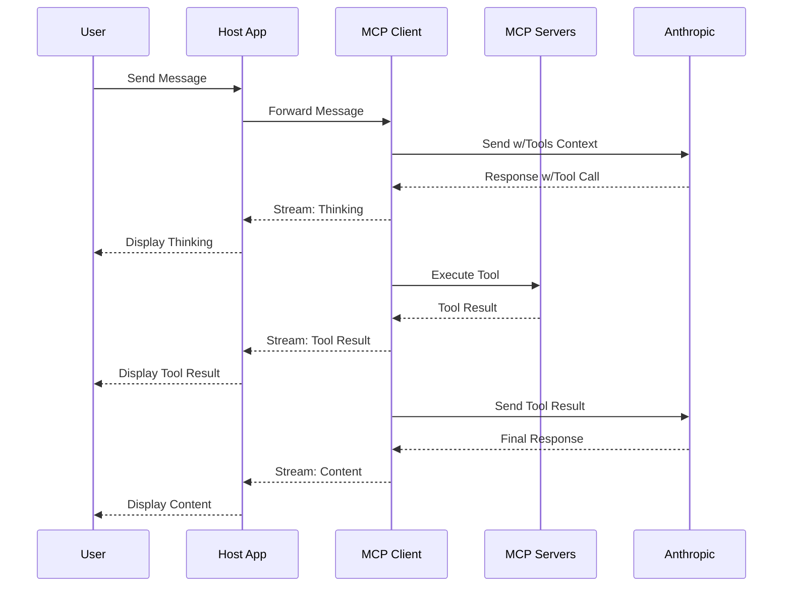

# TypeScript MCP Client

A TypeScript implementation of the Model Context Protocol (MCP) client that manages LLM chat interactions, server lifecycle, and tool invocations.

## Overview

The TS-MCP-Client orchestrates session state, server lifecycle, and LLM interactions in a Model Context Protocol (MCP) architecture. It bridges your application and the MCP servers that provide tool capabilities for LLMs like Claude.



## Component Responsibilities

- **Host Application (Your Application)**  
  Handles UI, rendering, user input, and displaying streamed outputs from the client.

- **TS-MCP-Client (This Library)**  
  Manages session state, server lifecycle, tool execution, LLM interactions, and streaming updates.

- **MCP Servers**  
  Expose tool capabilities through standardized endpoints and execute tool requests.

- **LLM (Anthropic Claude)**  
  Processes messages, makes tool usage decisions, and provides responses.

## Getting Started

```bash
npm install @rinardnick/client_mcp
```

### Features

- **Structured Tool Call Support** - Works with Claude's latest API format for tool calls
- **Continuous Tool Conversation** - Maintains conversation flow after tool execution
- **Enhanced Token Management** - Accurate token counting, cost estimation, and context optimization
- **Claude 3.7 Thinking Support** - Enable Claude's thinking process for better reasoning
- **Tool Call Limits** - Control tool usage in conversations
- **Session Management** - Manage chat sessions with persistence
- **Server Lifecycle Management** - Automatic launch and monitoring of MCP servers
- **Context Window Optimization** - Smart truncation of conversation history when limits approach

## Core Usage

### Initialize a Session

```typescript
import { SessionManager, loadConfig } from '@rinardnick/client_mcp';

// Load or create configuration
const config = {
  type: 'claude',
  api_key: process.env.ANTHROPIC_API_KEY,
  model: 'claude-3-5-sonnet-20241022',
  system_prompt: 'You are a helpful assistant with access to tools.',

  // Optional configurations
  max_tool_calls: 5, // Limit tool calls per conversation
  thinking: {
    enabled: true, // For Claude 3.7+ models
    budget_tokens: 6000, // Optional thinking token budget
  },
  token_optimization: {
    enabled: true, // Enable token optimization
    auto_truncate: true, // Automatically truncate when approaching limits
    preserve_system_messages: true, // Always keep system messages
    preserve_recent_messages: 5, // Keep 5 most recent messages
    truncation_strategy: 'oldest-first', // How to truncate conversation
  },

  // Server configurations
  servers: {
    filesystem: {
      command: 'npx',
      args: ['-y', '@modelcontextprotocol/server-filesystem', '/workspace'],
      env: {},
    },
  },
};

// Initialize session manager and session
const sessionManager = new SessionManager();
const session = await sessionManager.initializeSession(config);
const sessionId = session.id;
```

### Multi-Provider Configuration

The client supports using multiple LLM providers in your configuration:

```typescript
// Multi-provider configuration
const multiProviderConfig = {
  // Provider configurations
  providers: {
    anthropic: {
      api_key: process.env.ANTHROPIC_API_KEY,
      default_model: 'claude-3-5-sonnet-20241022',
      system_prompt: 'You are a helpful assistant with access to tools.',
      thinking: {
        enabled: true,
        budget_tokens: 6000,
      },
    },
    openai: {
      api_key: process.env.OPENAI_API_KEY,
      default_model: 'gpt-4',
      system_prompt: 'You are a helpful assistant with access to tools.',
    },
  },

  // Default provider to use
  default_provider: 'anthropic',

  // Fallback providers if primary fails
  provider_fallbacks: {
    anthropic: ['openai'],
    openai: ['anthropic'],
  },

  // Global configurations
  max_tool_calls: 5,

  // Server configurations (same as basic config)
  servers: {
    filesystem: {
      command: 'npx',
      args: ['-y', '@modelcontextprotocol/server-filesystem', '/workspace'],
      env: {},
    },
  },
};

// Initialize with multi-provider config
const sessionManager = new SessionManager();
const session = await sessionManager.initializeSession(multiProviderConfig);
```

With multi-provider configuration, you can:

- Configure multiple LLM providers with different models
- Set provider-specific configurations
- Define fallback providers for resilience
- Switch between providers during a session

### Using Shared Servers

For improved resource utilization, you can enable shared servers across multiple sessions:

```typescript
// Initialize session manager with shared servers enabled
const sessionManager = new SessionManager({ useSharedServers: true });

// Create multiple sessions that will share server instances
const session1 = await sessionManager.initializeSession(config);
const session2 = await sessionManager.initializeSession(config);
const session3 = await sessionManager.initializeSession(config);

// All sessions will use the same server instances for identical server configurations
// This reduces resource usage and improves startup time for subsequent sessions
```

When shared servers are enabled:

- Server instances are pooled and reused across sessions
- Servers are reference-counted and only terminated when no longer needed by any session
- Server cleanup happens automatically when sessions are cleaned up

### Send Messages with Streaming

```typescript
// Stream responses for real-time updates
const stream = sessionManager.sendMessageStream(
  sessionId,
  'What files are in the current directory?'
);

// Process the stream chunks
for await (const chunk of stream) {
  switch (chunk.type) {
    case 'thinking':
      // Claude's thinking process (3.7+ models)
      console.log('Thinking:', chunk.content);
      break;

    case 'tool_start':
      // Tool is about to execute
      console.log('Starting tool:', chunk.content);
      break;

    case 'tool_result':
      // Results from tool execution
      console.log('Tool result:', chunk.content);
      break;

    case 'content':
      // Regular message content - continues after tool execution
      console.log('Content:', chunk.content);
      break;

    case 'error':
      // Error during processing
      console.error('Error:', chunk.error);
      break;

    case 'done':
      // Stream is complete
      console.log('Stream complete');
      break;
  }
}
```

### Tool Continuation Support

The client automatically handles continued conversation after tool execution:

1. When a tool is called, the event stream emits a `tool_start` event
2. After tool execution, a `tool_result` event is emitted with the results
3. The conversation automatically continues with the LLM incorporating the tool results
4. Additional `content` events are emitted with the LLM's response to the tool results

This ensures seamless conversation flow even when tools are used during the interaction.

## Tool Execution Guide

The TS-MCP-Client provides a powerful system for registering, executing, and managing tools that LLMs can use. This section guides you through the complete tool execution workflow.

### Registering Tools

Tools are registered when initializing a session, following a standard schema that works across all supported LLM providers:

```typescript
// Create tool definitions
const tools = [
  {
    name: 'get_weather',
    description: 'Get the current weather for a location',
    inputSchema: {
      type: 'object',
      properties: {
        location: {
          type: 'string',
          description: 'The city and state, e.g. San Francisco, CA',
        },
        unit: {
          type: 'string',
          enum: ['celsius', 'fahrenheit'],
          description: 'Temperature unit',
        },
      },
      required: ['location'],
    },
  },
];

// Initialize a session with tools
const sessionManager = new SessionManager();
const session = await sessionManager.initializeSession({
  type: 'claude',
  api_key: process.env.ANTHROPIC_API_KEY,
  model: 'claude-3-5-sonnet-20241022',
  system_prompt: 'You are a helpful assistant with access to tools.',

  // Register tools with the session
  tools: tools,

  // Optional: Configure tool behavior
  max_tool_calls: 5, // Limit tool calls per conversation
  tool_timeout: 30000, // Timeout for tool execution (ms)
});
```

### Tool Execution Process

When an LLM decides to use a tool, the following sequence occurs:

1. **LLM Decision**: The LLM determines a tool is needed and makes a tool call
2. **Tool Call Event**: The client emits a `tool_start` event with details about the tool request
3. **Tool Execution**: The client executes the tool with the provided parameters
4. **Result Handling**: Results from the tool are captured and formatted
5. **Result Event**: The client emits a `tool_result` event with the execution results
6. **Conversation Continuation**: The results are sent back to the LLM, which incorporates them into its response
7. **Response Streaming**: The LLM's continued response is streamed as `content` events

All of this happens automatically when streaming responses:

```typescript
const stream = sessionManager.sendMessageStream(
  sessionId,
  'What is the weather in New York?'
);

for await (const chunk of stream) {
  switch (chunk.type) {
    case 'tool_start':
      console.log('Tool call:', chunk.content);
      // Example: Tool call: get_weather with params {"location":"New York"}
      break;

    case 'tool_result':
      console.log('Tool result:', chunk.content);
      // Example: Tool result: {"temperature":72,"conditions":"sunny"}
      break;

    case 'content':
      console.log('Response:', chunk.content);
      // Example: Response: The weather in New York is currently sunny with a temperature of 72°F.
      break;
  }
}
```

### Error Handling in Tool Execution

The client provides robust error handling for tool execution:

```typescript
try {
  const stream = sessionManager.sendMessageStream(
    sessionId,
    'What is the weather in Berlin?'
  );

  for await (const chunk of stream) {
    if (chunk.type === 'tool_error') {
      console.error('Tool error:', chunk.error);
      // Tool errors don't terminate the conversation
      // The LLM will receive the error and can respond accordingly
    }
  }
} catch (error) {
  // This catches critical errors that prevent completing the request
  console.error('Critical error:', error);
}
```

### Controlling Tool Behavior

You can control tool behavior at both the session level and per-message:

```typescript
// Session-level tool configuration (during initialization)
const session = await sessionManager.initializeSession({
  type: 'claude',
  api_key: process.env.ANTHROPIC_API_KEY,
  model: 'claude-3-5-sonnet-20241022',

  tools: tools,
  max_tool_calls: 5, // Default limit for the session
  tool_timeout: 30000, // Default timeout (ms)
});

// Message-level tool configuration (overrides session defaults)
await sessionManager.sendMessage(
  sessionId,
  'Give me weather for multiple cities',
  {
    max_tool_calls: 10, // Allow more tool calls for this message
    tool_timeout: 60000, // Longer timeout for this message
    disable_tools: false, // Explicitly enable tools (default)
  }
);

// Temporarily disable tools for a specific message
await sessionManager.sendMessage(
  sessionId,
  'Just answer this question without using tools: what is 2+2?',
  {
    disable_tools: true, // Prevent tool usage for this message
  }
);
```

### Provider-Specific Considerations

Different LLM providers have varying capabilities and formats for tool calls:

#### Anthropic Claude

Claude uses a structured format with `tool_use` and `tool_result` message parts:

```typescript
// Claude 3.x supports native tool use
// The client handles all formatting automatically
```

#### OpenAI

OpenAI uses `tool_calls` with function calling:

```typescript
// For OpenAI models with function calling
// The tool schema is automatically converted to OpenAI's function calling format
```

#### Grok

Grok uses a text-based approach to tools:

```typescript
// Grok has its own tool calling format
// The client handles the conversion automatically
```

The TS-MCP-Client normalizes these differences, providing a consistent developer experience regardless of the underlying LLM provider.

### Troubleshooting Tool Execution

Common issues and solutions:

1. **Tool Not Called**:

   - Ensure your tool description is clear and specific
   - Check that the system prompt mentions tools are available

2. **Invalid Tool Parameters**:

   - Validate your input schema is correct and clear
   - Enable verbose logging to see the exact parameters sent

3. **Tool Timeout**:

   - Increase the tool timeout if your tool requires more time
   - Optimize your tool implementation for faster execution

4. **Debug Tool Execution**:
   - Enable verbose logging for detailed tool execution information
   ```typescript
   sessionManager.setLogLevel('debug');
   ```

### Token Management

```javascript
// Get token usage metrics for a session
const tokenMetrics = await sessionManager.getTokenMetrics(sessionId);
console.log(`Total tokens: ${tokenMetrics.totalTokens}`);
console.log(`- Prompt tokens: ${tokenMetrics.promptTokens}`);
console.log(`- Completion tokens: ${tokenMetrics.completionTokens}`);
console.log(`- Tool tokens: ${tokenMetrics.toolTokens}`);

// Get estimated cost
const cost = await sessionManager.getTokenCost(sessionId);
console.log(`Estimated cost: $${cost.totalCost.toFixed(4)}`);
```

### Token Optimization Features

The client includes several token optimization features to efficiently manage context windows:

#### Token Counting and Monitoring

```typescript
// Get token usage metrics for a session
const tokenMetrics = sessionManager.getSessionTokenUsage(sessionId);
console.log(`Total tokens: ${tokenMetrics.totalTokens}`);
console.log(`Context window usage: ${tokenMetrics.percentUsed}%`);

// Get cost estimate for a session
const costEstimate = sessionManager.getTokenCostEstimate(sessionId);
console.log(`Estimated cost: $${costEstimate.cost}`);
```

#### Context Optimization

The client supports multiple strategies for optimizing context when approaching limits:

```typescript
// Configure context optimization settings
sessionManager.setContextSettings(sessionId, {
  maxTokenLimit: 100000, // Override model's default limit
  autoTruncate: true, // Automatically optimize when approaching limits
  preserveSystemMessages: true, // Always keep system messages
  preserveRecentMessages: 4, // Keep the most recent messages
  truncationStrategy: 'selective', // 'oldest-first', 'selective', or 'summarize'
});

// Manually trigger context optimization
const optimizedMetrics = sessionManager.optimizeContext(sessionId);
```

##### Truncation Strategies

1. **Oldest-First**: Removes the oldest messages first, preserving system messages and recent conversation.
2. **Selective**: Uses relevance scoring to remove less important messages first, preserving conversation coherence.
3. **Summarize**: Replaces groups of messages with concise summaries generated by the LLM, preserving key information while reducing token usage.

##### Conversation Summarization

The summarization strategy uses the LLM to create concise summaries of message groups:

```typescript
// Configure summarization settings
sessionManager.setContextSettings(sessionId, {
  truncationStrategy: 'summarize',
  summarizationBatchSize: 5, // Number of messages to summarize together
  minCompressionRatio: 2.0, // Minimum compression ratio to keep summaries
});

// Get summarization metrics
const summaryMetrics = sessionManager.getSummarizationStatus(sessionId);
console.log(`Total summaries: ${summaryMetrics.totalSummaries}`);
console.log(`Tokens saved: ${summaryMetrics.totalTokensSaved}`);
console.log(`Average compression: ${summaryMetrics.averageCompressionRatio}x`);
```

Benefits of summarization:

- Preserves key information while reducing token usage
- Maintains conversation coherence better than simple truncation
- Achieves higher compression ratios for long conversations
- Automatically tracks summarization efficiency

##### Dynamic Summarization Triggering

The client can automatically trigger summarization based on various conditions:

```typescript
// Configure dynamic summarization settings
sessionManager.setContextSettings(sessionId, {
  truncationStrategy: 'summarize',
  dynamicSummarizationEnabled: true,
  tokenThresholdForSummarization: 70, // Trigger at 70% context usage
  timeBetweenSummarizations: 60, // Minutes between summarizations
  detectTopicChanges: true, // Trigger on topic changes
  adaptiveSummarizationAggressiveness: true, // Adjust based on context pressure
});
```

Benefits of dynamic summarization:

- Automatically maintains optimal context window usage
- Prevents context window overflow before it becomes critical
- Adapts summarization aggressiveness based on context pressure
- Identifies natural breaking points like topic changes for summarization
- Balances token efficiency with conversation quality

### Context Window Adaptation

The client includes a `ContextWindowAdapter` for efficiently managing context when switching between models with different context window sizes:

```typescript
import { ContextWindowAdapter } from '@rinardnick/client_mcp';

// Create an adapter instance
const contextAdapter = new ContextWindowAdapter();

// Identify which messages would exceed a model's context limit
const analysis = contextAdapter.identifyExcessMessages(
  messages,
  'gpt-3.5-turbo'
);
console.log(`Exceeds limit: ${analysis.exceedsLimit}`);
console.log(`Excess tokens: ${analysis.excessTokens}`);
console.log(
  `Messages that could be removed: ${analysis.excessMessages.length}`
);

// Adapt context from one model to another
const adaptedMessages = contextAdapter.adaptContextToModel(
  messages,
  'claude-3-opus-20240229', // Source model with large context
  'gpt-4o', // Target model with smaller context
  {
    strategy: 'hybrid', // 'recency', 'importance', or 'hybrid'
    addContextSummary: true, // Add a summary message explaining adaptation
    preserveContinuity: true, // Keep question-answer pairs together
  }
);

// Use adaptive recovery to prevent over-pruning
const recoveryResult = contextAdapter.adaptWithRecovery(
  messages,
  'claude-3-haiku-20240307', // Source model
  'gpt-3.5-turbo', // Target model
  {
    minUtilization: 0.7, // Minimum context utilization target
    targetUtilization: 0.9, // Maximum context utilization target
  }
);
console.log(`Recovery applied: ${recoveryResult.recoveryApplied}`);
console.log(`Original tokens: ${recoveryResult.originalTokenCount}`);
console.log(`Final tokens: ${recoveryResult.finalTokenCount}`);

// Use budget allocation for fine-grained control
const budgetResult = contextAdapter.adaptWithBudgets(
  messages,
  'claude-3-opus-20240229', // Source model
  'gpt-3.5-turbo', // Target model
  {
    systemMessageBudget: 0.1, // 10% for system messages
    recentMessageBudget: 0.6, // 60% for recent messages
    remainingBudget: 0.3, // 30% for important older messages
  }
);
console.log(
  `Budget utilization: ${JSON.stringify(budgetResult.budgetUtilization)}`
);
```

Features of the Context Window Adapter:

- **Smart Context Adaptation**: Intelligently adapts conversation history when switching between models with different context limits
- **Multiple Adaptation Strategies**:
  - **Recency**: Prioritizes most recent messages while preserving system context
  - **Importance**: Uses importance scoring to keep the most valuable messages
  - **Hybrid**: Combines recency and importance scoring for optimal adaptation
- **Conversation Continuity**: Maintains question-answer pairs to preserve coherence
- **Adaptive Recovery**: Prevents over-pruning by intelligently recovering important messages
- **Token Budget Allocation**: Provides fine-grained control over how tokens are distributed
- **Context Summaries**: Adds clear summaries when conversation context is adapted

Benefits:

- Seamless transitions between models with different context sizes
- Optimal context utilization across provider switches
- Preservation of conversation quality during model transitions
- Flexible adaptation strategies for different conversation types
- Detailed control over token allocation during transitions

## Context Optimization Features

### Adaptive Context Strategy

The client includes an adaptive context optimization strategy that automatically selects the most effective optimization method based on conversation characteristics and past performance:

```typescript
// Enable adaptive context strategy
sessionManager.setContextSettings(sessionId, {
  adaptiveStrategyEnabled: true, // Enable adaptive strategy selection
  strategySelectionThreshold: 3, // Minimum performance data points before relying on past performance
});
```

Benefits:

- Intelligent strategy selection based on conversation type
- Performance learning that improves over time
- Conversation analysis to identify optimal approaches
- Optimal token usage while maintaining conversation quality

Available optimization methods:

- Oldest-First: Simple removal of oldest messages first
- Relevance-Based: Removes less relevant messages based on scoring
- Summarization: Replaces message groups with concise summaries
- Clustering: Groups related messages and optimizes by cluster

### Cost Optimization Mode

The client includes a cost optimization mode that aggressively reduces token usage for cost-sensitive applications:

```typescript
// Enable cost optimization mode
sessionManager.setContextSettings(sessionId, {
  costOptimizationMode: true, // Enable cost optimization
  costOptimizationLevel: 'balanced', // 'minimal', 'balanced', or 'aggressive'
  preserveQuestionsInCostMode: true, // Preserve questions even in cost optimization
  maxPreservedTokensInCostMode: 2000, // Maximum tokens to preserve in cost mode
});

// Get cost savings report
const savingsReport = sessionManager.getCostSavingsReport(sessionId);
console.log(`Tokens saved: ${savingsReport.tokensSaved}`);
console.log(`Cost saved: $${savingsReport.costSaved.toFixed(4)}`);
console.log(`Percent saved: ${savingsReport.percentSaved.toFixed(1)}%`);
```

Benefits:

- Significant token reduction for cost-sensitive applications
- Multiple optimization levels to balance quality and cost
- Automatic preservation of critical conversation elements
- Detailed cost savings tracking and reporting
- Optimized for different conversation types and use cases

## Message Flow Sequence

This diagram illustrates how messages flow through the system, including tool execution:



## Express Integration

```typescript
import express from 'express';
import { createChatRouter } from '@rinardnick/client_mcp';

const app = express();
const router = createChatRouter(); // Creates a router with session and message endpoints

app.use('/api/chat', router);

app.listen(3000, () => {
  console.log('Server running on port 3000');
});
```

## Host Application Integration

### React Integration Example

```tsx
import React, { useState, useEffect } from 'react';
import { SessionManager } from '@rinardnick/client_mcp';

// Create a singleton instance
const sessionManager = new SessionManager();

const Chat = () => {
  const [sessionId, setSessionId] = useState(null);
  const [messages, setMessages] = useState([]);
  const [input, setInput] = useState('');
  const [loading, setLoading] = useState(false);
  const [streamData, setStreamData] = useState({
    thinking: '',
    toolInfo: '',
    content: '',
    error: '',
  });

  // Initialize on component mount
  useEffect(() => {
    const initSession = async () => {
      // Load config (your implementation)
      const config = await loadConfig();

      // Create a new session
      const session = await sessionManager.initializeSession(config);
      setSessionId(session.id);
    };

    initSession();
  }, []);

  const sendMessage = async e => {
    e.preventDefault();
    if (!input.trim() || !sessionId) return;

    // Add user message to UI
    setMessages(prev => [...prev, { role: 'user', content: input }]);
    setInput('');
    setStreamData({ thinking: '', toolInfo: '', content: '', error: '' });
    setLoading(true);

    try {
      // Start streaming response
      const stream = sessionManager.sendMessageStream(sessionId, input);

      for await (const chunk of stream) {
        switch (chunk.type) {
          case 'thinking':
            setStreamData(prev => ({ ...prev, thinking: chunk.content }));
            break;
          case 'tool_start':
            setStreamData(prev => ({
              ...prev,
              toolInfo: `Running: ${chunk.content}`,
            }));
            break;
          case 'tool_result':
            setStreamData(prev => ({
              ...prev,
              toolInfo: `Result: ${chunk.content}`,
            }));
            break;
          case 'content':
            setStreamData(prev => ({ ...prev, content: chunk.content }));
            break;
          case 'error':
            setStreamData(prev => ({ ...prev, error: chunk.error }));
            break;
          case 'done':
            // Add final message to UI
            if (streamData.content) {
              setMessages(prev => [
                ...prev,
                { role: 'assistant', content: streamData.content },
              ]);
            }
            break;
        }
      }
    } catch (error) {
      setStreamData(prev => ({ ...prev, error: error.message }));
    } finally {
      setLoading(false);
    }
  };

  return (
    <div className="chat-container">
      <div className="messages">
        {messages.map((msg, i) => (
          <div key={i} className={`message ${msg.role}`}>
            {msg.content}
          </div>
        ))}

        {/* Show streaming content */}
        {streamData.thinking && (
          <div className="thinking">Thinking: {streamData.thinking}</div>
        )}
        {streamData.toolInfo && (
          <div className="tool-info">{streamData.toolInfo}</div>
        )}
        {streamData.content && loading && (
          <div className="streaming">{streamData.content}</div>
        )}
        {streamData.error && (
          <div className="error">Error: {streamData.error}</div>
        )}
      </div>

      <form onSubmit={sendMessage}>
        <input
          value={input}
          onChange={e => setInput(e.target.value)}
          placeholder="Send a message..."
          disabled={loading || !sessionId}
        />
        <button type="submit" disabled={loading || !sessionId}>
          Send
        </button>
      </form>
    </div>
  );
};
```

## Error Handling Best Practices

```typescript
try {
  const session = await sessionManager.initializeSession(config);
} catch (error) {
  // Handle different error types
  if (error instanceof LLMError) {
    // LLM-specific errors (API key, rate limits)
    console.error('LLM Error:', error.message);
  } else if (error instanceof ConfigurationError) {
    // Configuration issues
    console.error('Config Error:', error.message);
  } else {
    // General errors
    console.error('Error:', error.message);
  }
}
```

## Security Best Practices

1. **API Key Management**

   - Never expose API keys in client-side code
   - Use environment variables or secure vaults

2. **Server Security**

   - Restrict server capabilities (e.g., filesystem access)
   - Use allowlists for commands
   - Implement resource limits

3. **Session Security**
   - Validate session ownership
   - Implement proper session timeouts

## Configuration Reference

```typescript
interface LLMConfig {
  type: string; // LLM type (e.g., 'claude', 'openai', 'grok')
  api_key: string; // API key for the LLM
  model: string; // Model identifier
  system_prompt: string; // System prompt for the session

  max_tool_calls?: number; // Maximum tool calls per session
  tool_timeout?: number; // Timeout for tool execution (ms)

  // Tool definitions
  tools?: Array<{
    name: string;
    description: string;
    inputSchema: {
      type: string;
      properties: Record<string, any>;
      required?: string[];
    };
  }>;

  thinking?: {
    enabled?: boolean; // Enable thinking for Claude 3.7+
    budget_tokens?: number; // Token budget for thinking
  };

  token_optimization?: {
    enabled?: boolean; // Enable token optimization
    auto_truncate?: boolean; // Automatically truncate when context window fills
    preserve_system_messages?: boolean; // Keep system messages during truncation
    preserve_recent_messages?: number; // Number of recent messages to preserve
    truncation_strategy?: 'oldest-first' | 'selective' | 'summarize'; // How to truncate
  };

  servers?: {
    [key: string]: {
      command: string; // Server launch command
      args: string[]; // Command arguments
      env?: Record<string, string>; // Environment variables
    };
  };
}

// Multi-provider configuration
interface MultiProviderConfig {
  // Provider configurations
  providers: Record<string, ProviderConfig>;

  // Default provider to use
  default_provider: string;

  // Optional fallback providers
  provider_fallbacks?: Record<string, string[]>;

  // Global configuration (applies to all providers)
  max_tool_calls?: number;
  tool_timeout?: number;
  tools?: Array<any>; // Same structure as in LLMConfig

  servers?: {
    [key: string]: {
      command: string;
      args: string[];
      env?: Record<string, string>;
    };
  };
}

interface ProviderConfig {
  api_key: string;
  model: string;
  system_prompt: string;

  // Provider-specific settings
  thinking?: {
    enabled?: boolean;
    budget_tokens?: number;
  };

  token_optimization?: {
    enabled?: boolean;
    auto_truncate?: boolean;
    preserve_system_messages?: boolean;
    preserve_recent_messages?: number;
    truncation_strategy?: string;
  };
}

interface SessionManagerOptions {
  useSharedServers?: boolean; // Enable server sharing across sessions
}
```

## License

This project is licensed under the ISC License.

## Multi-Provider Support

The client supports multiple LLM providers and allows switching between them during an active session.

### Multi-Provider Configuration

You can configure multiple providers in a single configuration file, with fallback providers for resilience:

```javascript
// Multi-provider configuration example
const multiProviderConfig = {
  // Define multiple providers in a single configuration
  providers: {
    anthropic: {
      api_key: process.env.ANTHROPIC_API_KEY,
      model: 'claude-3-opus-20240229',
      system_prompt: 'You are a helpful assistant.',
    },
    openai: {
      api_key: process.env.OPENAI_API_KEY,
      model: 'gpt-4o',
      system_prompt: 'You are a helpful assistant.',
    },
    grok: {
      api_key: process.env.GROK_API_KEY,
      model: 'grok-1',
      system_prompt: 'You are a helpful assistant.',
    },
  },

  // Set the default provider to use
  default_provider: 'anthropic',

  // Define fallback chains
  provider_fallbacks: {
    anthropic: ['openai', 'grok'],
    openai: ['anthropic', 'grok'],
  },
};

// Initialize with the multi-provider configuration
const session = await sessionManager.initializeSession(multiProviderConfig);
```

When using fallback providers, the system will automatically try the next provider in the chain if the current one fails:

```javascript
// The fallback providers will be used automatically when a provider fails
try {
  // This will try Anthropic first (default provider)
  await sessionManager.sendMessage(sessionId, 'Hello, how can you help me?');
} catch (error) {
  // If all providers in the fallback chain fail, this will be thrown
  console.error('All providers failed:', error);
}
```

### Provider-Specific Tool Message Formatting

Different LLM providers have varying requirements for message formatting, especially for tool calls. This library handles these differences automatically through provider-specific message formatters:

#### Anthropic (Claude)

Claude uses a specific format for tool usage with separate message parts for tool use and tool results:

```javascript
// Anthropic tool use format
{
  role: 'assistant',
  content: [
    {
      type: 'text',
      text: "I'll look up the weather for you."
    },
    {
      type: 'tool_use',
      id: 'tool_12345',
      name: 'get_weather',
      input: { location: 'New York' },
    }
  ]
}

// Anthropic tool result format
{
  role: 'user',
  content: [
    {
      type: 'tool_result',
      tool_use_id: 'tool_12345',
      content: '{"temperature": 72, "conditions": "sunny"}'
    }
  ]
}
```

#### OpenAI

OpenAI uses a different format with tool_calls and standalone tool messages:

```javascript
// OpenAI tool call format
{
  role: 'assistant',
  content: "I'll check the weather for you.",
  tool_calls: [
    {
      id: 'call_12345',
      type: 'function',
      function: {
        name: 'get_weather',
        arguments: '{"location":"New York"}'
      }
    }
  ]
}

// OpenAI tool result format
{
  role: 'tool',
  tool_call_id: 'call_12345',
  content: '{"temperature": 72, "conditions": "sunny"}'
}
```

#### Grok

Grok uses a simpler approach with conventional message formats:

```javascript
// Grok tool use (via normal messages)
{
  role: 'assistant',
  content: "I need to call the get_weather function with location='New York'"
}

// Grok tool result (via normal messages)
{
  role: 'user',
  content: '{"temperature": 72, "conditions": "sunny"}'
}
```

### Tool Execution Across Providers

The library automatically handles these format differences through a provider adapter system that:

1. Registers specialized message formatters for each provider
2. Automatically converts tool schemas to provider-specific formats
3. Formats tool calls according to each provider's requirements
4. Normalizes tool results back to a consistent format
5. Reformats conversation history when switching between providers

This enables you to:

1. Define tools once in a provider-agnostic format
2. Use the same tools seamlessly across all supported providers
3. Switch providers mid-conversation without losing tool context
4. Receive consistent event streams regardless of the underlying provider

The adapter system handles all the complexity of different provider tool formats, allowing you to focus on your application logic rather than provider-specific implementation details.

### Supported Providers

```typescript
// Initialize with different providers
const openaiConfig = {
  type: 'openai',
  api_key: process.env.OPENAI_API_KEY,
  model: 'gpt-4o',
  system_prompt: 'You are a helpful assistant with access to tools.',
};

const anthropicConfig = {
  type: 'anthropic',
  api_key: process.env.ANTHROPIC_API_KEY,
  model: 'claude-3-5-sonnet-20241022',
  system_prompt: 'You are a helpful assistant with access to tools.',
};

const grokConfig = {
  type: 'grok',
  api_key: process.env.GROK_API_KEY,
  model: 'grok-1',
  system_prompt: 'You are a helpful assistant with access to tools.',
};

// Initialize sessions with different providers
const openaiSession = await sessionManager.initializeSession(openaiConfig);
const anthropicSession = await sessionManager.initializeSession(
  anthropicConfig
);
const grokSession = await sessionManager.initializeSession(grokConfig);
```

### Provider Management API

The client includes methods for managing different providers and models:

```typescript
// Get a list of all supported providers
const providers = sessionManager.getAvailableProviders();
console.log('Available providers:', providers);
// Example output: ['anthropic', 'openai', 'grok']

// Get all models for a specific provider
const anthropicModels = sessionManager.getProviderModels('anthropic');
console.log(
  'Anthropic models:',
  anthropicModels.map(m => m.id)
);
// Example output: ['claude-3-opus-20240229', 'claude-3-sonnet-20240229', 'claude-3-haiku-20240307']

// Get supported features for a specific model
const features = sessionManager.getSupportedFeatures(
  'anthropic',
  'claude-3-opus-20240229'
);
console.log('Claude features:', features);
// Example output:
// {
//   functionCalling: true,
//   imageInputs: true,
//   streaming: true,
//   jsonMode: false,
//   thinking: true,
//   systemMessages: true,
//   maxContextSize: 200000
// }

// Estimate costs for a specific model with the current session
const costEstimate = sessionManager.estimateCosts(
  sessionId,
  'openai',
  'gpt-4o'
);
console.log('Estimated cost:', costEstimate);
// Example output:
// {
//   inputTokens: 1000,
//   outputTokens: 500,
//   inputCost: 0.005,
//   outputCost: 0.0075,
//   totalCost: 0.0125
// }
```

### Switching Models During a Session

```typescript
// Switch from one provider/model to another during an active session
const updatedSession = await sessionManager.switchSessionModel(
  sessionId,
  'anthropic', // Target provider
  'claude-3-opus-20240229', // Target model
  {
    preserveHistory: true, // Convert and keep conversation history
    addTransitionMessage: true, // Add a message indicating the switch
  }
);

console.log(`Switched to ${updatedSession.type}/${updatedSession.modelId}`);
```

### Using Multiple Models Within One Provider

You can easily work with multiple models from the same provider, selecting the appropriate model for each task:

```typescript
// Get all available models for a provider to select from
const anthropicModels = sessionManager.getProviderModels('anthropic');
console.log(
  'Available Anthropic models:',
  anthropicModels.map(m => m.id)
);

// Choose a model based on task requirements
const longContextTask = 'Please analyze this entire document...';
const quickTask = "What's the capital of France?";

// Use the appropriate model for each task
await sessionManager.switchSessionModel(
  sessionId,
  'anthropic',
  'claude-3-opus-20240229', // High capability model for complex tasks
  { api_key: process.env.ANTHROPIC_API_KEY }
);
await sessionManager.sendMessage(sessionId, longContextTask);

// Switch to a faster/cheaper model for simple tasks
await sessionManager.switchSessionModel(
  sessionId,
  'anthropic',
  'claude-3-haiku-20240307', // Faster model for simple tasks
  { api_key: process.env.ANTHROPIC_API_KEY }
);
await sessionManager.sendMessage(sessionId, quickTask);

// Estimate cost differences between models for comparison
const opusCost = sessionManager.estimateCosts(
  sessionId,
  'anthropic',
  'claude-3-opus-20240229'
);
const haikuCost = sessionManager.estimateCosts(
  sessionId,
  'anthropic',
  'claude-3-haiku-20240307'
);
console.log(
  `Cost savings: $${(opusCost.totalCost - haikuCost.totalCost).toFixed(4)}`
);
```

### Provider Compatibility Checker

The client includes a compatibility checker to identify potential issues when switching between providers:

```typescript
import { ProviderCompatibilityChecker } from '@rinardnick/client_mcp';

// Create a compatibility checker
const compatibilityChecker = new ProviderCompatibilityChecker();

// Check compatibility between providers/models
const compatibility = compatibilityChecker.checkCompatibility(
  { type: 'anthropic', modelId: 'claude-3-opus-20240229' },
  { type: 'openai', modelId: 'gpt-4o' }
);

if (compatibility.issues.length > 0) {
  console.log(`Found ${compatibility.issues.length} compatibility issues:`);

  // Log issues by severity
  const criticalIssues = compatibility.issues.filter(
    i => i.severity === 'ERROR'
  );
  const warnings = compatibility.issues.filter(i => i.severity === 'WARNING');

  console.log(`Critical issues: ${criticalIssues.length}`);
  console.log(`Warnings: ${warnings.length}`);

  // Check specific issue types
  const contextIssue = compatibility.issues.find(
    i => i.type === 'CONTEXT_WINDOW'
  );
  const toolsIssue = compatibility.issues.find(i => i.type === 'TOOL_FORMAT');
  const visionIssue = compatibility.issues.find(
    i => i.type === 'VISION_SUPPORT'
  );

  if (contextIssue) {
    console.log(`Context window impact: ${contextIssue.detail}`);
  }
}

// Generate a migration plan
const migrationPlan = compatibilityChecker.getMigrationPlan(
  { type: 'anthropic', modelId: 'claude-3-opus-20240229' },
  { type: 'openai', modelId: 'gpt-4o' },
  {
    currentTokenCount: 15000,
    includeRecommendations: true,
  }
);

console.log(`Migration impact: ${migrationPlan.tokenImpact} tokens`);
console.log(
  `Potential loss areas: ${migrationPlan.potentialLossAreas.join(', ')}`
);
console.log(`Recommendations: ${migrationPlan.recommendations.join('\n')}`);
```

### Custom Compatibility Checks

You can register custom compatibility checks for specific provider combinations:

```typescript
// Register a custom compatibility check
compatibilityChecker.registerCompatibilityCheck(
  'anthropic',
  'openai',
  (sourceModel, targetModel) => {
    // Custom logic to check compatibility
    const issues = [];

    // Check for custom feature support
    if (sourceModel.supportsFeatureX && !targetModel.supportsFeatureX) {
      issues.push({
        type: 'CUSTOM_FEATURE',
        severity: 'WARNING',
        message: 'Target model does not support Feature X',
        detail: 'Some functionality may be lost during migration',
      });
    }

    return issues;
  }
);
```

## Tool Format Normalization

The client includes a tool adapter system that normalizes tool formats between different providers. This allows you to define tools once and use them with any supported provider:

```typescript
import { ToolAdapter, MCPTool } from '@rinardnick/client_mcp';

// Create a tool adapter
const toolAdapter = new ToolAdapter();

// Define a tool in canonical format
const weatherTool: MCPTool = {
  name: 'get_weather',
  description: 'Get the current weather for a location',
  inputSchema: {
    type: 'object',
    properties: {
      location: {
        type: 'string',
        description: 'The city and state, e.g. San Francisco, CA',
      },
      unit: {
        type: 'string',
        enum: ['celsius', 'fahrenheit'],
        description: 'Unit of temperature',
      },
    },
    required: ['location'],
  },
};

// Convert to different provider formats
const anthropicTool = toolAdapter.adaptToolForProvider(
  weatherTool,
  'anthropic'
);
const openaiTool = toolAdapter.adaptToolForProvider(weatherTool, 'openai');
const grokTool = toolAdapter.adaptToolForProvider(weatherTool, 'grok');
```

### Using Tools Across Providers

Tools work seamlessly across provider switches, with automatic format conversion:

```typescript
// Define tools in a standard format
const tools = [
  {
    name: 'get_weather',
    description: 'Get the current weather',
    inputSchema: {
      type: 'object',
      properties: {
        location: { type: 'string' },
        unit: { type: 'string', enum: ['celsius', 'fahrenheit'] },
      },
      required: ['location'],
    },
  },
];

// Initialize a session with Anthropic
const session = await sessionManager.initializeSession({
  type: 'anthropic',
  api_key: process.env.ANTHROPIC_API_KEY,
  model: 'claude-3-sonnet-20240229',
  system_prompt: 'You are a helpful assistant with access to tools.',
});

// Send a message that will use the tool
await sessionManager.sendMessage(session.id, "What's the weather in New York?");

// Switch to OpenAI - tools are automatically converted
await sessionManager.switchSessionModel(session.id, 'openai', 'gpt-4o', {
  api_key: process.env.OPENAI_API_KEY,
});

// Tool calls still work after switching providers
const response = await sessionManager.sendMessage(
  session.id,
  "What's the weather in San Francisco?"
);

// The system handles capability differences between providers
// If a provider doesn't support certain tool features, they're gracefully degraded
```

### Handling Capability Differences
