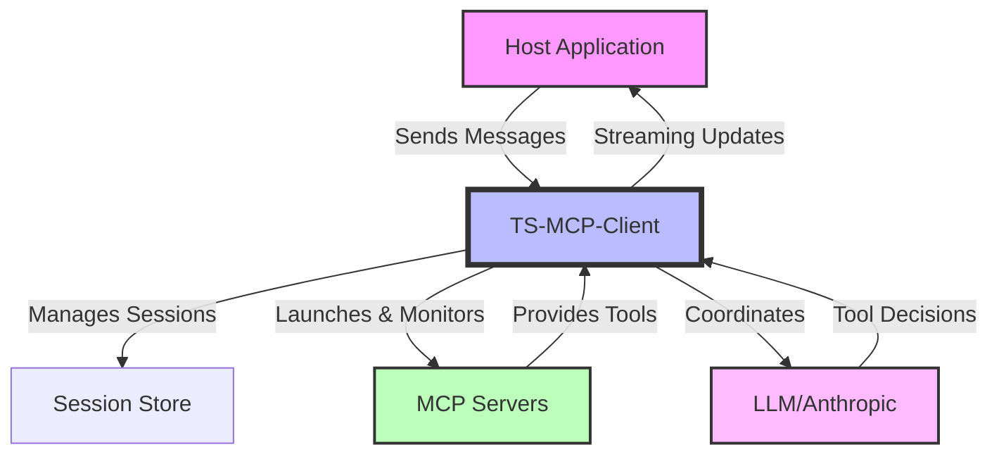
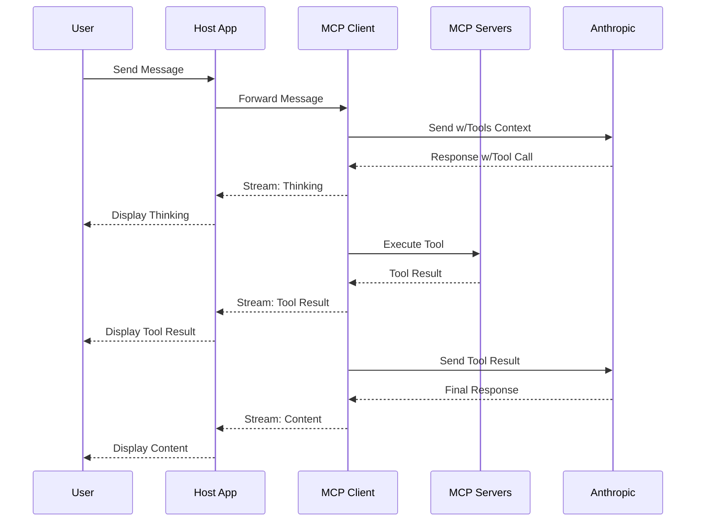

# TypeScript MCP Client

A TypeScript implementation of the Model Context Protocol (MCP) client that manages LLM chat interactions, server lifecycle, and tool invocations.

## Overview

The TS-MCP-Client orchestrates session state, server lifecycle, and LLM interactions in a Model Context Protocol (MCP) architecture. It bridges your application and the MCP servers that provide tool capabilities for LLMs like Claude.



## Component Responsibilities

- **Host Application (Your Application)**  
  Handles UI, rendering, user input, and displaying streamed outputs from the client.

- **TS-MCP-Client (This Library)**  
  Manages session state, server lifecycle, tool execution, LLM interactions, and streaming updates.

- **MCP Servers**  
  Expose tool capabilities through standardized endpoints and execute tool requests.

- **LLM (Anthropic Claude)**  
  Processes messages, makes tool usage decisions, and provides responses.

## Getting Started

```bash
npm install @rinardnick/client_mcp
```

### Features

- Structured Tool Call Support - Works with Claude's latest API format
- Token Usage Monitoring - Track conversation token usage
- Claude 3.7 Thinking Support - Enable Claude's thinking process for better reasoning
- Tool Call Limits - Control tool usage in conversations
- Session Management - Manage chat sessions with persistence
- Server Lifecycle Management - Automatic launch and monitoring of MCP servers

## Core Usage

### Initialize a Session

```typescript
import { SessionManager, loadConfig } from '@rinardnick/client_mcp';

// Load or create configuration
const config = {
  type: 'claude',
  api_key: process.env.ANTHROPIC_API_KEY,
  model: 'claude-3-5-sonnet-20241022',
  system_prompt: 'You are a helpful assistant with access to tools.',
  
  // Optional configurations
  max_tool_calls: 5,  // Limit tool calls per conversation
  thinking: {
    enabled: true,  // For Claude 3.7+ models
    budget_tokens: 6000  // Optional thinking token budget
  },
  
  // Server configurations
  servers: {
    filesystem: {
      command: 'npx',
      args: ['-y', '@modelcontextprotocol/server-filesystem', '/workspace'],
      env: {},
    },
  },
};

// Initialize session manager and session
const sessionManager = new SessionManager();
const session = await sessionManager.initializeSession(config);
const sessionId = session.id;
```

### Send Messages with Streaming

```typescript
// Stream responses for real-time updates
const stream = sessionManager.sendMessageStream(
  sessionId,
  'What files are in the current directory?'
);

// Process the stream chunks
for await (const chunk of stream) {
  switch (chunk.type) {
    case 'thinking':
      // Claude's thinking process (3.7+ models)
      console.log('Thinking:', chunk.content);
      break;
      
    case 'tool_start':
      // Tool is about to execute
      console.log('Starting tool:', chunk.content);
      break;
      
    case 'tool_result':
      // Results from tool execution
      console.log('Tool result:', chunk.content);
      break;
      
    case 'content':
      // Regular message content
      console.log('Content:', chunk.content);
      break;
      
    case 'error':
      // Error during processing
      console.error('Error:', chunk.error);
      break;
      
    case 'done':
      // Stream is complete
      console.log('Stream complete');
      break;
  }
}
```

### Track Token Usage

```typescript
// After interaction, check token usage
const tokenMetrics = sessionManager.getSessionTokenUsage(sessionId);
console.log(`Token usage: ${tokenMetrics.totalTokens}/${tokenMetrics.maxContextTokens} tokens (${tokenMetrics.percentUsed}%)`);
```

## Message Flow Sequence

This diagram illustrates how messages flow through the system, including tool execution:



## Express Integration

```typescript
import express from 'express';
import { createChatRouter } from '@rinardnick/client_mcp';

const app = express();
const router = createChatRouter(); // Creates a router with session and message endpoints

app.use('/api/chat', router);

app.listen(3000, () => {
  console.log('Server running on port 3000');
});
```

## Host Application Integration

### React Integration Example

```tsx
import React, { useState, useEffect } from 'react';
import { SessionManager } from '@rinardnick/client_mcp';

// Create a singleton instance
const sessionManager = new SessionManager();

const Chat = () => {
  const [sessionId, setSessionId] = useState(null);
  const [messages, setMessages] = useState([]);
  const [input, setInput] = useState('');
  const [loading, setLoading] = useState(false);
  const [streamData, setStreamData] = useState({
    thinking: '',
    toolInfo: '',
    content: '',
    error: '',
  });

  // Initialize on component mount
  useEffect(() => {
    const initSession = async () => {
      // Load config (your implementation)
      const config = await loadConfig();
      
      // Create a new session
      const session = await sessionManager.initializeSession(config);
      setSessionId(session.id);
    };

    initSession();
  }, []);

  const sendMessage = async (e) => {
    e.preventDefault();
    if (!input.trim() || !sessionId) return;

    // Add user message to UI
    setMessages(prev => [...prev, { role: 'user', content: input }]);
    setInput('');
    setStreamData({ thinking: '', toolInfo: '', content: '', error: '' });
    setLoading(true);

    try {
      // Start streaming response
      const stream = sessionManager.sendMessageStream(sessionId, input);

      for await (const chunk of stream) {
        switch (chunk.type) {
          case 'thinking':
            setStreamData(prev => ({ ...prev, thinking: chunk.content }));
            break;
          case 'tool_start':
            setStreamData(prev => ({ ...prev, toolInfo: `Running: ${chunk.content}` }));
            break;
          case 'tool_result':
            setStreamData(prev => ({ ...prev, toolInfo: `Result: ${chunk.content}` }));
            break;
          case 'content':
            setStreamData(prev => ({ ...prev, content: chunk.content }));
            break;
          case 'error':
            setStreamData(prev => ({ ...prev, error: chunk.error }));
            break;
          case 'done':
            // Add final message to UI
            if (streamData.content) {
              setMessages(prev => [
                ...prev,
                { role: 'assistant', content: streamData.content },
              ]);
            }
            break;
        }
      }
    } catch (error) {
      setStreamData(prev => ({ ...prev, error: error.message }));
    } finally {
      setLoading(false);
    }
  };

  return (
    <div className="chat-container">
      <div className="messages">
        {messages.map((msg, i) => (
          <div key={i} className={`message ${msg.role}`}>
            {msg.content}
          </div>
        ))}

        {/* Show streaming content */}
        {streamData.thinking && <div className="thinking">Thinking: {streamData.thinking}</div>}
        {streamData.toolInfo && <div className="tool-info">{streamData.toolInfo}</div>}
        {streamData.content && loading && <div className="streaming">{streamData.content}</div>}
        {streamData.error && <div className="error">Error: {streamData.error}</div>}
      </div>

      <form onSubmit={sendMessage}>
        <input
          value={input}
          onChange={e => setInput(e.target.value)}
          placeholder="Send a message..."
          disabled={loading || !sessionId}
        />
        <button type="submit" disabled={loading || !sessionId}>Send</button>
      </form>
    </div>
  );
};
```

## Error Handling Best Practices

```typescript
try {
  const session = await sessionManager.initializeSession(config);
} catch (error) {
  // Handle different error types
  if (error instanceof LLMError) {
    // LLM-specific errors (API key, rate limits)
    console.error('LLM Error:', error.message);
  } else if (error instanceof ConfigurationError) {
    // Configuration issues
    console.error('Config Error:', error.message);
  } else {
    // General errors
    console.error('Error:', error.message);
  }
}
```

## Security Best Practices

1. **API Key Management**
   - Never expose API keys in client-side code
   - Use environment variables or secure vaults

2. **Server Security**
   - Restrict server capabilities (e.g., filesystem access)
   - Use allowlists for commands
   - Implement resource limits

3. **Session Security**
   - Validate session ownership
   - Implement proper session timeouts

## Configuration Reference

```typescript
interface LLMConfig {
  type: string;              // LLM type (e.g., 'claude')
  api_key: string;           // API key for the LLM
  model: string;             // Model identifier
  system_prompt: string;     // System prompt for the session
  
  max_tool_calls?: number;   // Maximum tool calls per session
  thinking?: {
    enabled?: boolean;       // Enable thinking for Claude 3.7+
    budget_tokens?: number;  // Token budget for thinking
  };
  
  servers?: {
    [key: string]: {
      command: string;       // Server launch command
      args: string[];        // Command arguments
      env?: Record<string, string>; // Environment variables
    };
  };
}
```

## License

This project is licensed under the ISC License.