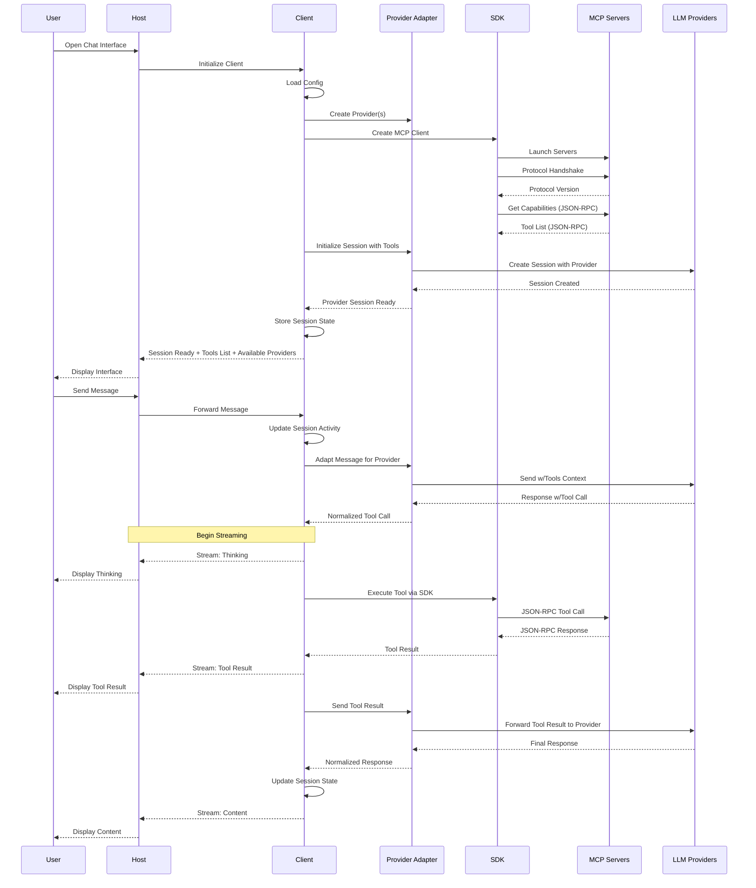
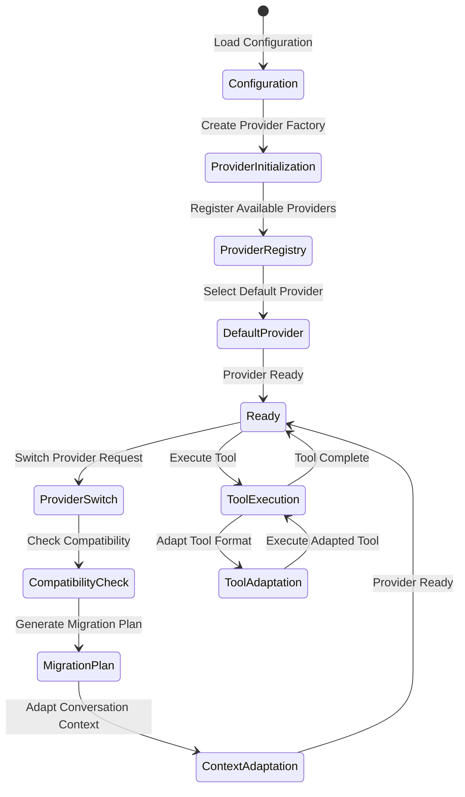
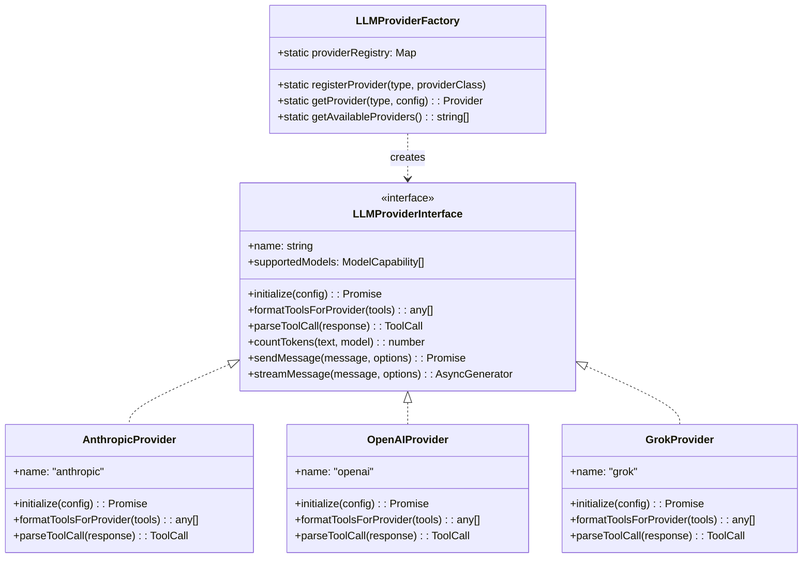
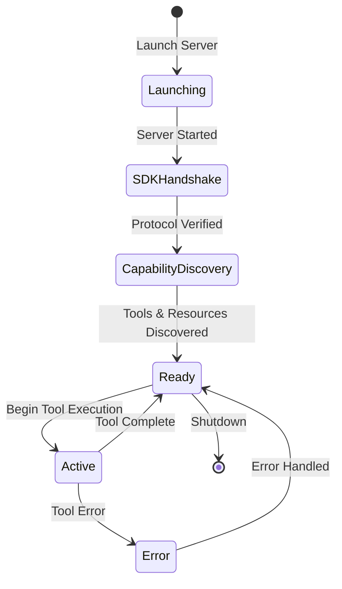
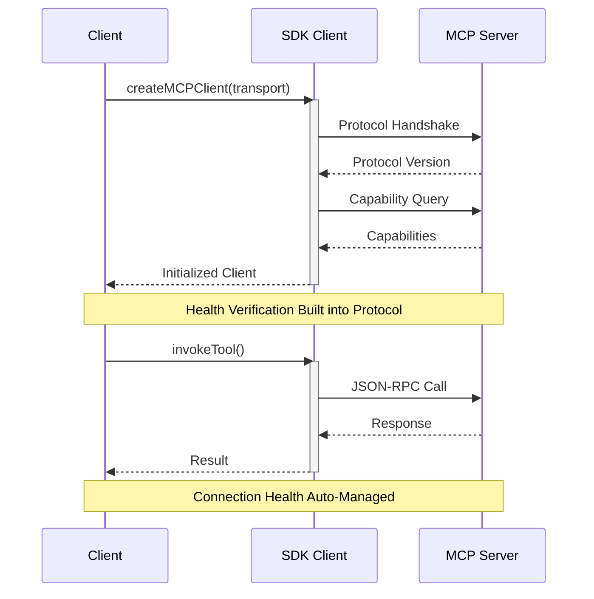
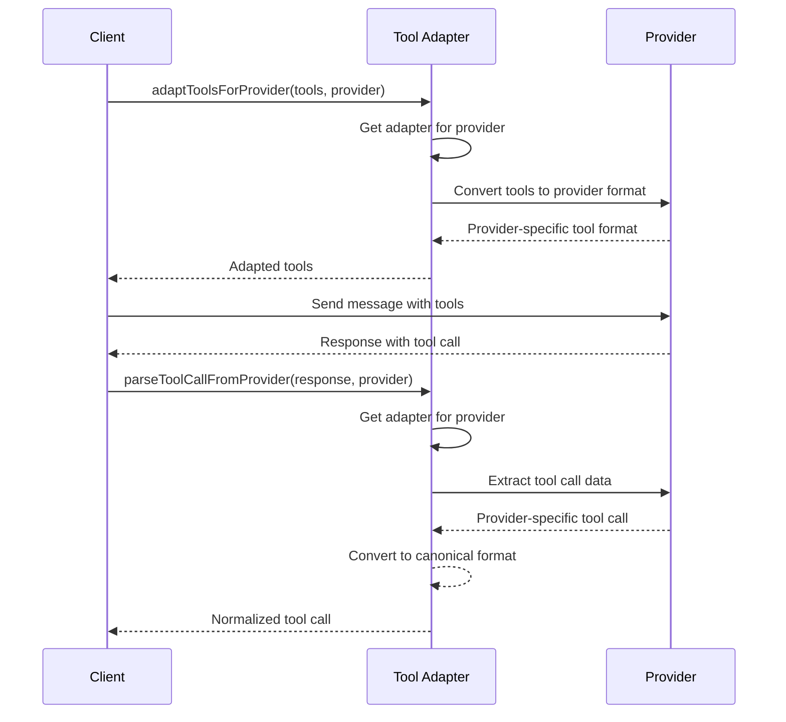
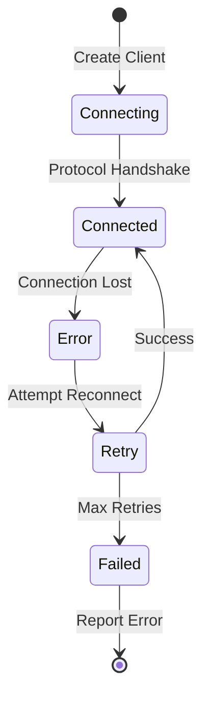
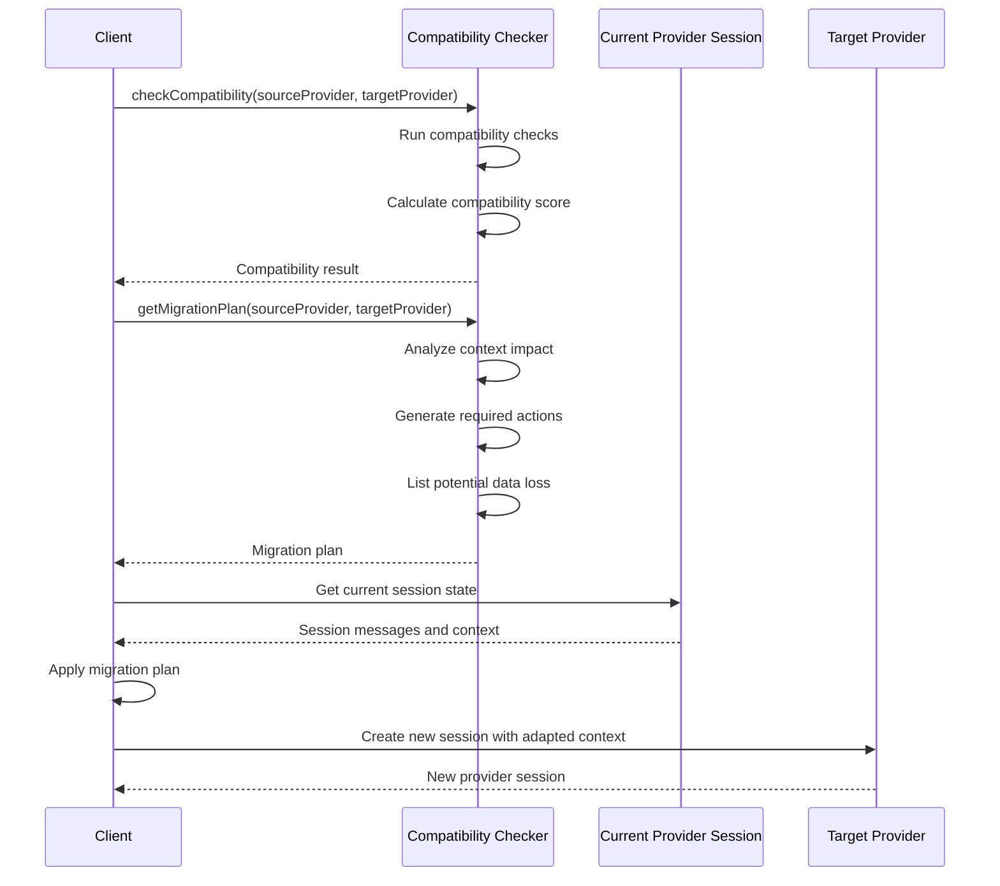

# MCP Client Data Flow

## Component Responsibilities

### User

- Initiates conversations through the chat interface
- Views real-time progress of tool executions and LLM responses
- Receives and interprets different types of messages (thinking, tool execution, results)
- Selects preferred LLM provider and model when supported

### Host (MCP Host)

- Provides web-based user interface
- Renders chat messages and tool outputs
- Displays real-time streaming updates
- Shows loading and error states
- Handles user input and interaction
- Forwards messages to client
- Maintains minimal UI state (loading flags, display preferences)
- Provides debugging interface for development
- Shows available tools in the UI
- Displays provider selection options

### Client (TS-MCP-Client)

- Manages all session state and lifecycle
- Handles session persistence and recovery
- Tracks session activity and expiry
- Coordinates all LLM interactions across multiple providers (Anthropic, OpenAI, Grok)
- Manages server lifecycle through SDK (launch, health, shutdown)
- Leverages SDK for tool discovery and execution
- Enforces tool call limits
- Maintains conversation history
- Provides streaming updates of operations
- Handles error recovery and retries using SDK mechanisms
- Maintains server capabilities registry through SDK
- Uses SDK for MCP protocol communication
- Manages configuration validation and loading
- Caches tool capabilities using SDK utilities
- Handles provider switching and compatibility
- Normalizes tool formats across different providers
- Adapts conversation context for different model capabilities
- Optimizes token usage through smart context management
- Detects provider compatibility issues
- Provides cost estimation and optimization

### MCP Servers

- Expose tool capabilities through standard JSON-RPC 2.0 endpoints
- Execute tool requests according to MCP protocol
- Provide health status through SDK protocol handshake
- Return tool results or errors in SDK-compliant format
- Maintain their own state and cleanup
- Handle resource management and access control
- Implement server-specific security measures

### LLM Providers (Anthropic, OpenAI, Grok)

- Process messages with context
- Make decisions about tool usage
- Format tool call requests
- Interpret tool results
- Maintain conversation coherence
- Provide natural language responses
- Adhere to system prompts and constraints
- Manage token limits and response formatting
- Expose provider-specific capabilities

## System Components Flow Diagram



## Provider Management Flow



## Multi-Provider Support



## Server Lifecycle Management

### Server Launch and Discovery Flow



### SDK Health Management Flow



## Tool Adaptation Flow



## Error Handling Flow

### SDK Error Types

```typescript
type MCPErrorCode =
  | -32700 // Parse error
  | -32600 // Invalid request
  | -32601 // Method not found
  | -32602 // Invalid params
  | -32603 // Internal error
  | -32000 // Server error
  | -32001 // Connection error
  | -32002; // Protocol error;

interface MCPError {
  code: MCPErrorCode;
  message: string;
  data?: unknown;
}

// Error handling in discovery
try {
  const client = await createMCPClient(transport);
} catch (error) {
  if (error.code === -32001) {
    // Handle connection errors
  } else if (error.code === -32002) {
    // Handle protocol errors
  }
}
```

### Error Recovery Flow



## Provider Compatibility



## Implementation Notes

### Multi-Provider Configuration

```typescript
// Multi-provider configuration
const config = {
  providers: {
    anthropic: {
      api_key: 'sk-ant-...',
      default_model: 'claude-3-opus-20240229',
      system_prompt: 'You are a helpful assistant...',
    },
    openai: {
      api_key: 'sk-...',
      default_model: 'gpt-4-turbo',
      system_prompt: 'You are a helpful assistant...',
    },
  },
  default_provider: 'anthropic',
  servers: {
    calculator: {
      command: 'node',
      args: ['calculator-server.js'],
    },
  },
};

// Create session with specific provider
const session = await createSession({
  provider: 'anthropic',
  model: 'claude-3-sonnet-20240229',
});

// Switch provider mid-conversation
await switchSessionProvider(sessionId, 'openai', 'gpt-4o');
```

### Tool Adaptation

```typescript
// Using the tool adapter
import { ToolAdapter } from '@rinardnick/client_mcp';

const toolAdapter = new ToolAdapter();

// Convert tools to provider-specific format
const anthropicTools = toolAdapter.adaptToolsForProvider(tools, 'anthropic');
const openaiTools = toolAdapter.adaptToolsForProvider(tools, 'openai');

// Parse tool calls from different providers
const toolCall = toolAdapter.parseToolCallFromProvider(response, providerName);
```

### Provider Compatibility

```typescript
// Check compatibility between providers
import { ProviderCompatibilityChecker } from '@rinardnick/client_mcp';

const checker = new ProviderCompatibilityChecker();

// Check if providers are compatible
const compatibility = checker.checkCompatibility(
  'anthropic',
  'claude-3-opus-20240229',
  'openai',
  'gpt-4o'
);

// Get migration plan when switching providers
const plan = checker.getMigrationPlan(
  'anthropic',
  'claude-3-opus-20240229',
  'openai',
  'gpt-4o',
  { currentContextSize: 15000 }
);
```

### Performance Considerations

1. **Provider Selection**

   - Choose providers based on capability requirements
   - Consider cost differences between providers
   - Use compatibility checker when switching providers

2. **Tool Adaptation**

   - Use the tool adapter for cross-provider compatibility
   - Implement provider-specific fallbacks for unsupported features
   - Cache adapted tools to improve performance

3. **Context Management**
   - Implement smart truncation when switching to models with smaller context windows
   - Use conversation summarization for longer conversations
   - Track token usage across different providers

```

```
