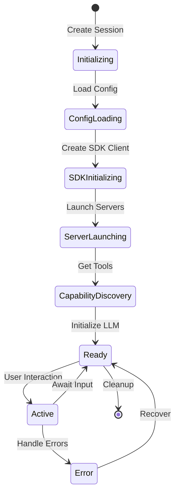
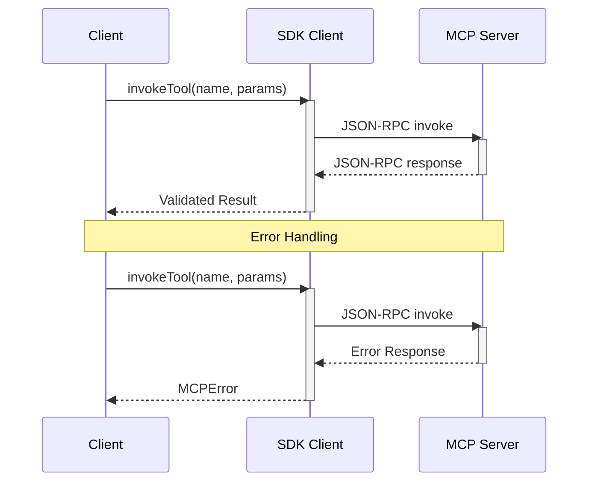
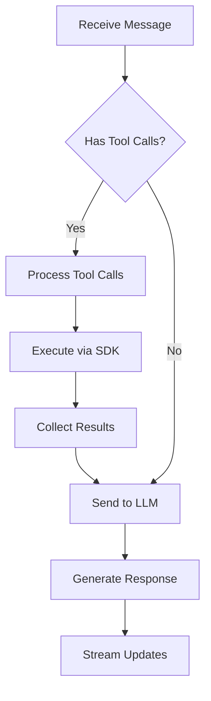
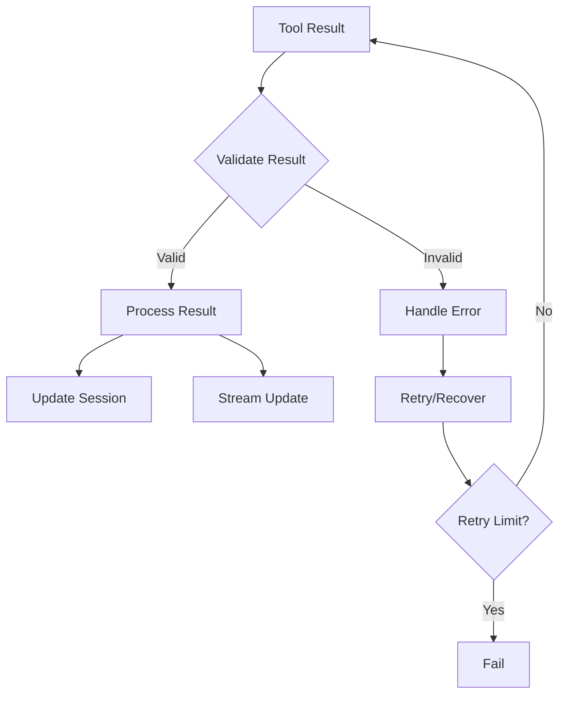
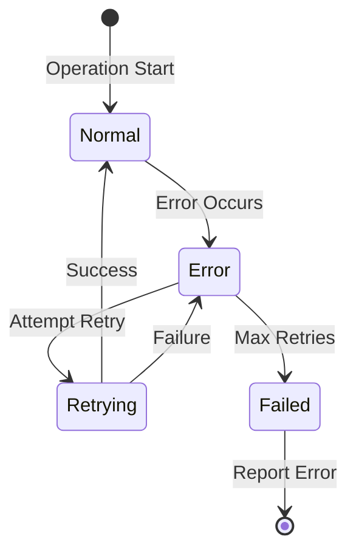
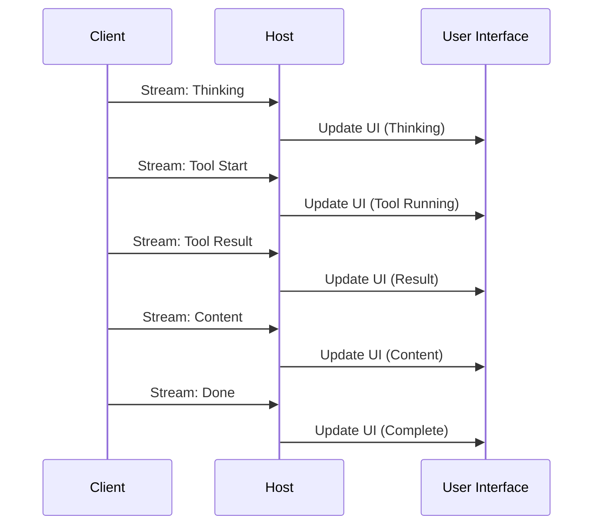
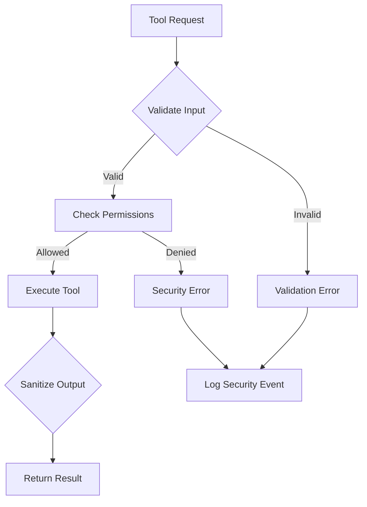

# MCP Client Data Flow

## Component Responsibilities

### User

- Initiates conversations through the chat interface
- Views real-time progress of tool executions and LLM responses
- Receives and interprets different types of messages (thinking, tool execution, results)

### Host (MCP Host)

- Provides web-based user interface
- Renders chat messages and tool outputs
- Displays real-time streaming updates
- Shows loading and error states
- Handles user input and interaction
- Forwards messages to client
- Maintains minimal UI state (loading flags, display preferences)
- Provides debugging interface for development
- Shows available tools in the UI

### Client (TS-MCP-Client)

- Manages all session state and lifecycle
- Handles session persistence and recovery
- Tracks session activity and expiry
- Coordinates all LLM interactions
- Manages server lifecycle through SDK (launch, health, shutdown)
- Leverages SDK for tool discovery and execution
- Enforces tool call limits
- Maintains conversation history
- Provides streaming updates of operations
- Handles error recovery and retries using SDK mechanisms
- Maintains server capabilities registry through SDK
- Uses SDK for MCP protocol communication
- Manages configuration validation and loading
- Caches tool capabilities using SDK utilities

### MCP Servers

- Expose tool capabilities through standard JSON-RPC 2.0 endpoints
- Execute tool requests according to MCP protocol
- Provide health status and capability discovery
- Return tool results or errors in SDK-compliant format
- Maintain their own state and cleanup
- Handle resource management and access control
- Implement server-specific security measures

### LLM (Anthropic)

- Processes messages with context
- Makes decisions about tool usage
- Formats tool call requests
- Interprets tool results
- Maintains conversation coherence
- Provides natural language responses
- Adheres to system prompts and constraints
- Manages token limits and response formatting

## System Components Flow Diagram


## Detailed Component Interactions

### Session Lifecycle



### Tool Execution Flow



## Detailed Data Flow

### 1. Initialization Flow

#### 1.1 Host → Client: Initialize

**Request:**

```json
{
  "configPath": "/path/to/config.json"
}
```

#### 1.2 Client: Load & Initialize

**Config File (config.json):**

```json
{
  "llm": {
    "type": "claude",
    "api_key": "YOUR_API_KEY_HERE",
    "system_prompt": "You are a helpful assistant.",
    "model": "claude-3-5-sonnet-20241022"
  },
  "max_tool_calls": 3,
  "servers": {
    "filesystem": {
      "command": "npx",
      "args": ["-y", "@modelcontextprotocol/server-filesystem", "/workspace"],
      "env": {}
    },
    "terminal": {
      "command": "npx",
      "args": [
        "@rinardnick/mcp-terminal",
        "--allowed-commands",
        "[go,python3,uv,npm,npx,git,ls,cd,touch,mv,pwd,mkdir]"
      ],
      "env": {}
    }
  }
}
```

**Session Initialization with Tools:**

```json
{
  "jsonrpc": "2.0",
  "method": "initialize",
  "params": {
    "capabilities": {
      "tools": true,
      "resources": true
    }
  },
  "id": 1
}
```

### 2. Message Flow

#### 2.1 Tool Invocation (JSON-RPC 2.0)

**Request:**

```json
{
  "jsonrpc": "2.0",
  "method": "invoke",
  "params": {
    "tool": "readFile",
    "arguments": {
      "path": "/tmp/test.txt"
    }
  },
  "id": 2
}
```

**Response:**

```json
{
  "jsonrpc": "2.0",
  "result": {
    "content": "File contents here..."
  },
  "id": 2
}
```

### 3. Session Management Flow

#### 3.1 Session State Management

**Session Interface:**

```typescript
interface Session {
  id: string;
  config: LLMConfig;
  createdAt: Date;
  lastActivityAt: Date;
  messages: Message[];
  mcpClient: MCPClient; // SDK client instance
  toolCallCount: number;
  maxToolCalls: number;
  capabilities: MCPCapabilities;
}

interface Message {
  role: 'user' | 'assistant' | 'system';
  content: string;
  toolCalls?: ToolCall[];
  toolResults?: ToolResult[];
}
```

**Session Lifecycle Management:**

```typescript
class SessionManager {
  async initializeSession(config: LLMConfig): Promise<Session> {
    // 1. Create SDK Client
    const transport = new StdioServerTransport();
    const mcpClient = await createMCPClient(transport);

    // 2. Initialize Servers
    await this.initializeServers(config.servers);

    // 3. Discover Capabilities
    const capabilities = await mcpClient.listCapabilities();

    // 4. Create Session
    return this.createSession(config, mcpClient, capabilities);
  }
}
```

#### 3.2 Message Processing Flow



### 4. Tool Execution Flow

#### 4.1 SDK Tool Invocation

```typescript
// High-level SDK usage
const result = await mcpClient.invokeTool('readFile', { path: '/tmp/test.txt' });

// Underlying JSON-RPC messages
-> {
  "jsonrpc": "2.0",
  "method": "invoke",
  "params": {
    "tool": "readFile",
    "arguments": { "path": "/tmp/test.txt" }
  },
  "id": 1
}
<- {
  "jsonrpc": "2.0",
  "result": {
    "content": "File contents..."
  },
  "id": 1
}
```

#### 4.2 Tool Result Processing



### 5. Error Handling Flow

#### 5.1 Error Types and Handling

```typescript
// SDK Error Types
type MCPErrorCode =
  | -32700 // Parse error
  | -32600 // Invalid request
  | -32601 // Method not found
  | -32602 // Invalid params
  | -32603 // Internal error
  | -32000 // Server error
  | -32001 // Timeout error
  | -32002; // Validation error;

interface MCPError {
  code: MCPErrorCode;
  message: string;
  data?: unknown;
}

// Error Handling Example
try {
  const result = await mcpClient.invokeTool('readFile', { path });
} catch (error) {
  if (error instanceof MCPError) {
    switch (error.code) {
      case -32700:
        // Handle parse error
        break;
      case -32600:
        // Handle invalid request
        break;
      // ... handle other cases
    }
  }
}
```

#### 5.2 Error Recovery Flow



### 6. Streaming Updates Flow

#### 6.1 Stream Event Types

```typescript
type StreamEventType =
  | 'thinking' // LLM processing
  | 'tool_start' // Tool execution starting
  | 'tool_result' // Tool execution complete
  | 'content' // Content update
  | 'error' // Error occurred
  | 'done'; // Stream complete

interface StreamEvent {
  type: StreamEventType;
  content?: string;
  error?: MCPError;
  metadata?: {
    toolName?: string;
    toolArgs?: Record<string, unknown>;
    duration?: number;
  };
}
```

#### 6.2 Stream Processing Flow



### 7. Security Considerations

#### 7.1 SDK Security Features

- Automatic input validation
- Secure transport handling
- Resource isolation
- Error sanitization

#### 7.2 Security Flow



## Implementation Notes

### SDK Best Practices

1. **Initialization**

   ```typescript
   // Always use SDK's built-in validation
   const client = await createMCPClient(transport, {
     validateInput: true,
     validateOutput: true,
   });
   ```

2. **Error Handling**

   ```typescript
   // Use SDK's error types for consistent handling
   try {
     await client.invokeTool(name, params);
   } catch (error) {
     if (error instanceof MCPTimeoutError) {
       // Handle timeout
     } else if (error instanceof MCPValidationError) {
       // Handle validation error
     }
   }
   ```

3. **Resource Management**
   ```typescript
   // Proper cleanup
   async function cleanup() {
     await client.disconnect();
     await transport.close();
   }
   ```

### Performance Considerations

1. **Caching**

   - SDK handles capability caching
   - Implement result caching where appropriate
   - Cache session state efficiently

2. **Concurrency**

   - SDK manages concurrent tool calls
   - Implement request queuing if needed
   - Monitor resource usage

3. **Memory Management**
   - Clean up SDK resources
   - Monitor session size
   - Implement session pruning

```

```
