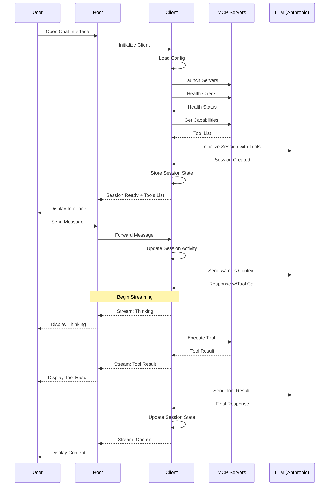

# MCP Client Data Flow

## Component Responsibilities

### User

- Initiates conversations through the chat interface
- Views real-time progress of tool executions and LLM responses
- Receives and interprets different types of messages (thinking, tool execution, results)

### Host (MCP Host)

- Provides web-based user interface
- Renders chat messages and tool outputs
- Displays real-time streaming updates
- Shows loading and error states
- Handles user input and interaction
- Forwards messages to client
- Maintains minimal UI state (loading flags, display preferences)
- Provides debugging interface for development
- Shows available tools in the UI

### Client (TS-MCP-Client)

- Manages all session state and lifecycle
- Handles session persistence and recovery
- Tracks session activity and expiry
- Coordinates all LLM interactions
- Manages server lifecycle (launch, health, shutdown)
- Implements tool detection and execution
- Enforces tool call limits
- Maintains conversation history
- Provides streaming updates of operations
- Handles error recovery and retries
- Maintains server capabilities registry
- Implements MCP protocol for tool interactions
- Manages configuration validation and loading
- Caches tool capabilities for reuse
- Provides capability refresh mechanisms

### MCP Servers

- Expose tool capabilities through standard endpoints
- Execute tool requests according to MCP protocol
- Provide health status and capability discovery
- Return tool results or errors
- Maintain their own state and cleanup
- Handle resource management and access control
- Implement server-specific security measures

### LLM (Anthropic)

- Processes messages with context
- Makes decisions about tool usage
- Formats tool call requests
- Interprets tool results
- Maintains conversation coherence
- Provides natural language responses
- Adheres to system prompts and constraints
- Manages token limits and response formatting

## System Components Flow Diagram



## Detailed Data Flow

### 1. Initialization Flow

#### 1.1 Host → Client: Initialize

**Request:**

```json
{
  "configPath": "/path/to/config.json"
}
```

#### 1.2 Client: Load & Initialize

**Config File (config.json):**

```json
{
  "llm": {
    "type": "claude",
    "api_key": "YOUR_API_KEY_HERE",
    "system_prompt": "You are a helpful assistant.",
    "model": "claude-3-5-sonnet-20241022"
  },
  "max_tool_calls": 3,
  "servers": {
    "filesystem": {
      "command": "npx",
      "args": ["-y", "@modelcontextprotocol/server-filesystem", "/workspace"],
      "env": {}
    },
    "terminal": {
      "command": "npx",
      "args": [
        "@rinardnick/mcp-terminal",
        "--allowed-commands",
        "[go,python3,uv,npm,npx,git,ls,cd,touch,mv,pwd,mkdir]"
      ],
      "env": {}
    }
  }
}
```

**Session Initialization with Tools:**

```json
{
  "model": "claude-3-5-sonnet-20241022",
  "max_tokens": 1024,
  "messages": [
    {
      "role": "system",
      "content": "You are a helpful assistant with access to the following tools:"
    }
  ],
  "tools": [
    {
      "type": "function",
      "function": {
        "name": "readFile",
        "description": "Reads a file from the filesystem",
        "parameters": {
          "type": "object",
          "properties": {
            "path": { "type": "string" }
          },
          "required": ["path"]
        }
      }
    }
  ]
}
```

#### 1.3 Client → MCP Servers: Launch & Health Check

**Health Check Request:**

```http
GET http://localhost:3001/health
```

**Health Check Response:**

```json
{
  "status": "healthy",
  "version": "1.0.0"
}
```

#### 1.4 Client → MCP Servers: Get Capabilities

**Capability Request:**

```http
GET http://localhost:3001/tools/list
```

**Capability Response:**

```json
{
  "tools": [
    {
      "name": "readFile",
      "description": "Reads the content of a file on the filesystem",
      "parameters": {
        "type": "object",
        "properties": {
          "path": { "type": "string" }
        },
        "required": ["path"]
      }
    }
  ]
}
```

### 2. Message Flow

#### 2.1 User → Host: Send Message

**Chat Interface Input:**

```json
{
  "message": "What files are in /tmp?"
}
```

#### 2.2 Host → Client: Forward Message

**API Request:**

```http
POST /api/chat/session/sess_abc123/message
Content-Type: application/json

{
  "message": "What files are in /tmp?"
}
```

#### 2.3 Client → LLM: Send Message with Tools

**LLM API Request:**

```json
{
  "model": "claude-3-sonnet-20240229",
  "max_tokens": 1024,
  "messages": [
    {
      "role": "system",
      "content": "You are a helpful assistant."
    },
    {
      "role": "user",
      "content": "What files are in /tmp?"
    }
  ],
  "tools": [
    {
      "type": "function",
      "function": {
        "name": "readFile",
        "description": "Reads the content of a file on the filesystem",
        "parameters": {
          "type": "object",
          "properties": {
            "path": { "type": "string" }
          },
          "required": ["path"]
        }
      }
    }
  ]
}
```

**LLM Response with Tool Call:**

```json
{
  "role": "assistant",
  "content": "I'll check the files in /tmp for you.",
  "tool_calls": [
    {
      "function": {
        "name": "readFile",
        "arguments": { "path": "/tmp" }
      }
    }
  ]
}
```

#### 2.4 Client → MCP Server: Execute Tool

**Tool Request:**

```http
POST http://localhost:3001/tools/invoke
Content-Type: application/json

{
  "tool": "readFile",
  "arguments": { "path": "/tmp" }
}
```

**Tool Response:**

```json
{
  "files": ["file1.txt", "file2.txt", "log.txt"]
}
```

#### 2.5 Client → LLM: Continue with Tool Result

**LLM API Request:**

```json
{
  "model": "claude-3-sonnet-20240229",
  "max_tokens": 1024,
  "messages": [
    // Previous messages...
    {
      "role": "assistant",
      "content": "I'll check the files in /tmp for you."
    },
    {
      "role": "assistant",
      "content": "{\"files\": [\"file1.txt\", \"file2.txt\", \"log.txt\"]}",
      "isToolResult": true
    }
  ],
  "tools": [
    /* ... same tools as before ... */
  ]
}
```

**LLM Final Response:**

```json
{
  "role": "assistant",
  "content": "I found the following files in /tmp:\n- file1.txt\n- file2.txt\n- log.txt"
}
```

#### 2.6 Client → Host: Stream Response

**Server-Sent Events Stream with Inner Dialogue:**

```http
Content-Type: text/event-stream

data: {"type": "thinking", "content": "I'll check the files in /tmp for you."}
data: {"type": "tool_start", "content": "Executing readFile tool with path: /tmp"}
data: {"type": "tool_result", "content": "Found files: file1.txt, file2.txt, log.txt"}
data: {"type": "thinking", "content": "Let me format these results for you."}
data: {"type": "content", "content": "I found the following files in /tmp:"}
data: {"type": "content", "content": "\n- file1.txt\n- file2.txt\n- log.txt"}
data: {"type": "done"}
```

The stream types are:

- `thinking`: LLM's intermediate thoughts/planning
- `tool_start`: When a tool is about to be executed
- `tool_result`: The result from a tool execution
- `content`: The final formatted response
- `error`: Any error messages
- `done`: Stream completion marker

### 3. Session Management Flow

#### 3.1 Client: Session State Management

**Internal Session State:**

```typescript
interface Session {
  id: string;
  config: LLMConfig;
  createdAt: Date;
  lastActivity: Date;
  messages: Message[];
  toolCallCount: number;
  maxToolCalls: number;
  capabilities: Tool[];
}
```

**Session Operations:**

- Create: Initialize new session with unique ID
- Update: Track activity timestamps
- Store: Persist session state
- Recover: Load session from storage
- Cleanup: Remove expired sessions
- Validate: Check session health/expiry

#### 3.2 Host: UI State Management

**UI State:**

```typescript
interface UIState {
  sessionId: string;
  isLoading: boolean;
  error: Error | null;
  messages: DisplayMessage[];
  availableTools: ToolInfo[];
}
```

**UI Operations:**

- Display messages
- Show loading states
- Handle errors
- Update tool display
- Manage user input

### 4. Tool Execution Flow

#### 4.1 Client → MCP Server: Execute Tool

**Tool Request:**

```http
POST http://localhost:3001/tools/invoke
Content-Type: application/json

{
  "tool": "readFile",
  "arguments": { "path": "/tmp" }
}
```

**Tool Response:**

```json
{
  "files": ["file1.txt", "file2.txt", "log.txt"]
}
```

### 5. Error Handling Flow

#### 5.1 Client Error Handling

**Error Types:**

- Session Errors (not found, expired)
- Tool Execution Errors
- LLM Communication Errors
- Server Health Errors
- Storage Errors

**Error Recovery:**

- Automatic session recovery
- Tool execution retries
- Server health checks
- Storage fallbacks

#### 5.2 Host Error Display

**Error Display Types:**

- Connection Status
- Tool Execution Status
- Message Delivery Status
- Session Status

**User Feedback:**

- Error messages
- Retry options
- Recovery status
- Debug information

```

```
