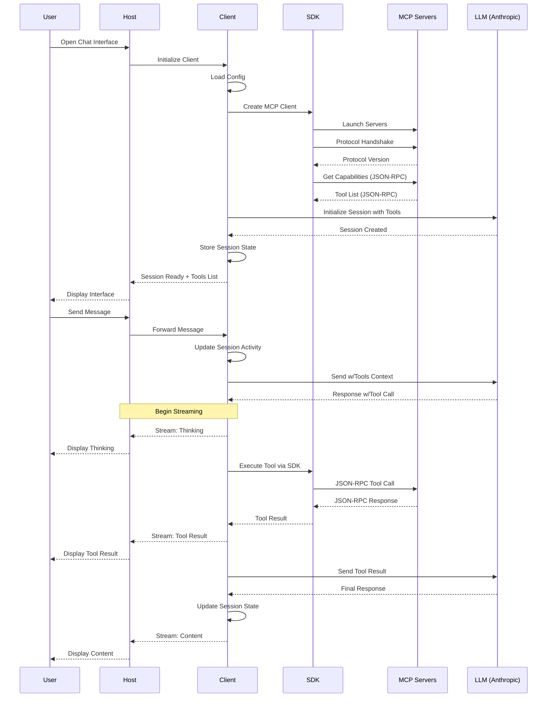
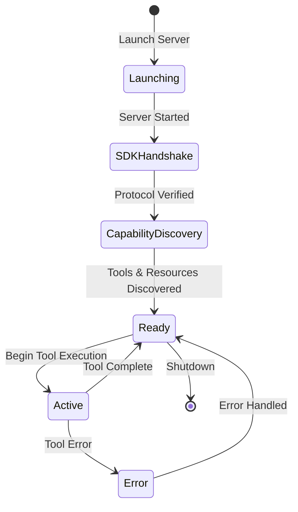
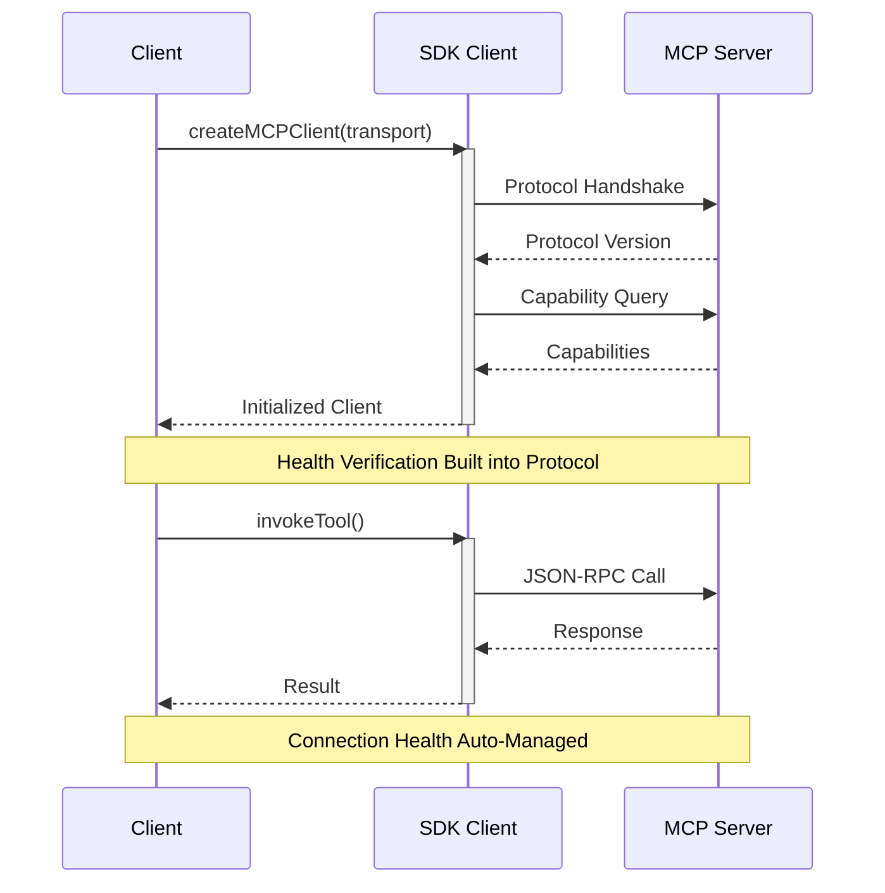
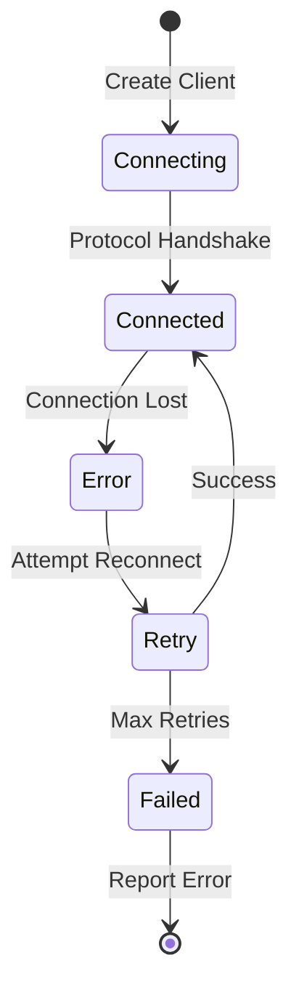

# MCP Client Data Flow

## Component Responsibilities

### User

- Initiates conversations through the chat interface
- Views real-time progress of tool executions and LLM responses
- Receives and interprets different types of messages (thinking, tool execution, results)

### Host (MCP Host)

- Provides web-based user interface
- Renders chat messages and tool outputs
- Displays real-time streaming updates
- Shows loading and error states
- Handles user input and interaction
- Forwards messages to client
- Maintains minimal UI state (loading flags, display preferences)
- Provides debugging interface for development
- Shows available tools in the UI

### Client (TS-MCP-Client)

- Manages all session state and lifecycle
- Handles session persistence and recovery
- Tracks session activity and expiry
- Coordinates all LLM interactions
- Manages server lifecycle through SDK (launch, health, shutdown)
- Leverages SDK for tool discovery and execution
- Enforces tool call limits
- Maintains conversation history
- Provides streaming updates of operations
- Handles error recovery and retries using SDK mechanisms
- Maintains server capabilities registry through SDK
- Uses SDK for MCP protocol communication
- Manages configuration validation and loading
- Caches tool capabilities using SDK utilities

### MCP Servers

- Expose tool capabilities through standard JSON-RPC 2.0 endpoints
- Execute tool requests according to MCP protocol
- Provide health status through SDK protocol handshake
- Return tool results or errors in SDK-compliant format
- Maintain their own state and cleanup
- Handle resource management and access control
- Implement server-specific security measures

### LLM (Anthropic)

- Processes messages with context
- Makes decisions about tool usage
- Formats tool call requests
- Interprets tool results
- Maintains conversation coherence
- Provides natural language responses
- Adheres to system prompts and constraints
- Manages token limits and response formatting

## System Components Flow Diagram



## Server Lifecycle Management

### Server Launch and Discovery Flow



### SDK Health Management Flow



## Error Handling Flow

### SDK Error Types

```typescript
type MCPErrorCode =
  | -32700 // Parse error
  | -32600 // Invalid request
  | -32601 // Method not found
  | -32602 // Invalid params
  | -32603 // Internal error
  | -32000 // Server error
  | -32001 // Connection error
  | -32002; // Protocol error;

interface MCPError {
  code: MCPErrorCode;
  message: string;
  data?: unknown;
}

// Error handling in discovery
try {
  const client = await createMCPClient(transport);
} catch (error) {
  if (error.code === -32001) {
    // Handle connection errors
  } else if (error.code === -32002) {
    // Handle protocol errors
  }
}
```

### Error Recovery Flow



## Implementation Notes

### SDK Best Practices

1. **Server Health Management**

   ```typescript
   // Health checks are built into SDK client initialization
   const transport = new StdioTransport(process);
   const client = await createMCPClient(transport);
   // If client creation succeeds, server is healthy
   ```

2. **Error Handling**

   ```typescript
   try {
     const client = await createMCPClient(transport);
   } catch (error) {
     if (error instanceof MCPConnectionError) {
       // Handle connection issues
     } else if (error instanceof MCPProtocolError) {
       // Handle protocol issues
     }
   }
   ```

3. **Resource Management**
   ```typescript
   // SDK handles connection lifecycle
   const client = await createMCPClient(transport);
   try {
     // Use client
   } finally {
     await client.disconnect();
   }
   ```

### Performance Considerations

1. **Connection Management**

   - SDK manages connection pooling
   - Handles reconnection attempts
   - Maintains connection health

2. **Protocol Efficiency**

   - Built-in protocol validation
   - Automatic capability caching
   - Optimized message handling

3. **Resource Cleanup**
   - Automatic resource cleanup
   - Connection pooling
   - Memory management

### Security Notes

1. **Protocol Security**

   - SDK validates all messages
   - Enforces protocol version
   - Handles secure handshake

2. **Resource Protection**
   - Automatic cleanup on errors
   - Proper error propagation
   - Safe resource handling

```

```
