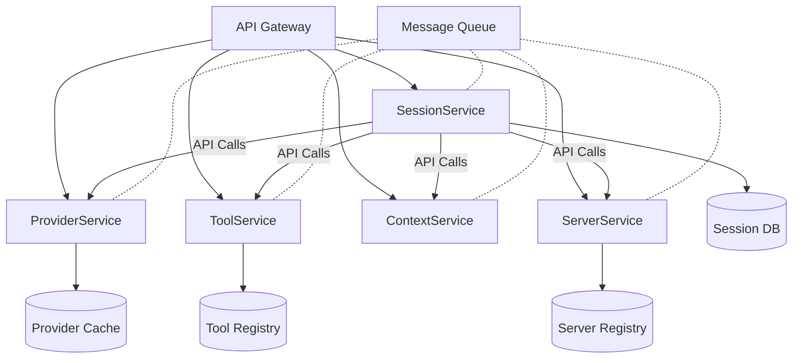
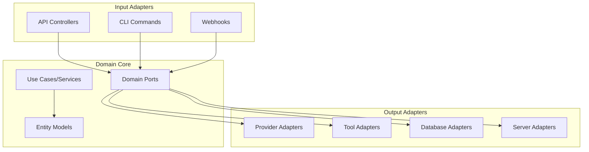
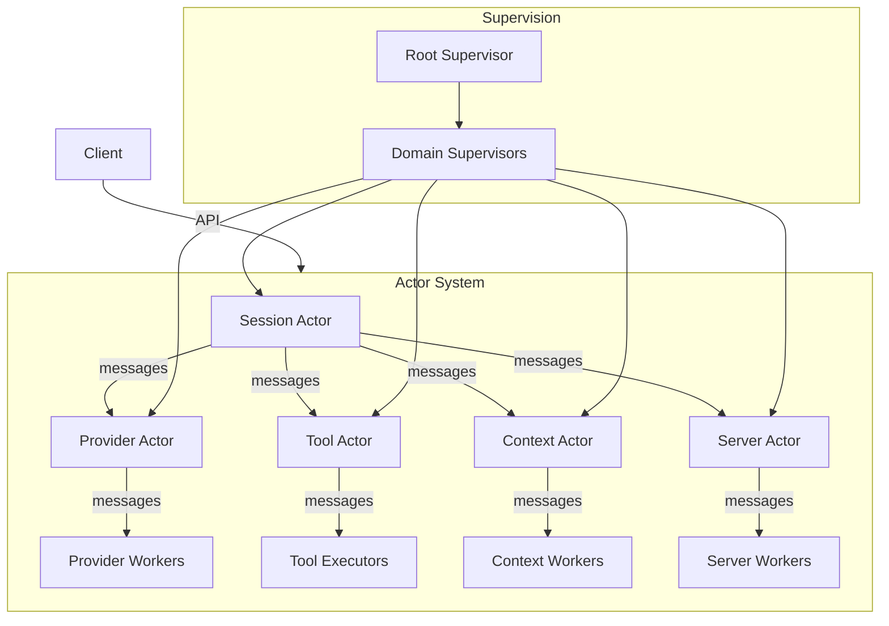
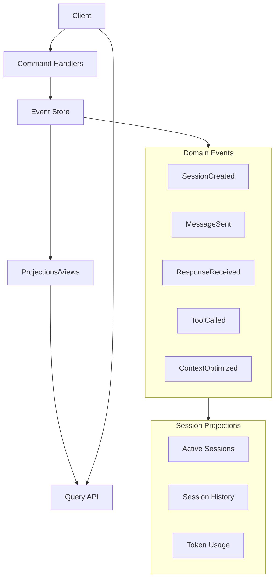
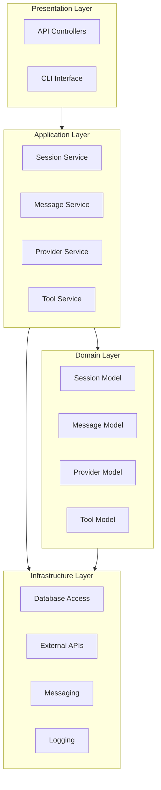

# Alternative Architectural Approaches for LLM Package

This document explores alternative architectural patterns that could be considered for the LLM package, beyond the component-based and domain-driven approaches already discussed.

## 1. Microservices Architecture

A microservices approach would split the current functionality into separate services that communicate over the network.

### Implementation Details:

- Each domain becomes a standalone service with its own API
- Services communicate via HTTP/gRPC for synchronous operations
- Message queue (Kafka, RabbitMQ) for asynchronous events
- Each service manages its own database/state

### Pros:

- **Independent Deployment**: Services can be updated separately
- **Technology Flexibility**: Different languages/frameworks per service
- **Scalability**: Each service can scale independently
- **Team Organization**: Teams can own specific services

### Cons:

- **Operational Complexity**: More infrastructure to manage
- **Network Latency**: Slower than in-process communication
- **Debugging Challenges**: Tracing issues across services is harder
- **Data Consistency**: More complex to maintain consistency

### Fit for LLM Package:

Microservices would be **overkill** for the current LLM package needs:

- The application isn't large enough to justify the operational overhead
- LLM interactions benefit from low-latency in-process communication
- The team may not need the organizational benefits yet

## 2. Hexagonal (Ports and Adapters) Architecture

Hexagonal architecture focuses on separating business logic from external concerns.

### Implementation Details:

- **Domain Core**: Contains pure business logic without external dependencies
- **Ports**: Interfaces defining how the domain interacts with the outside
- **Adapters**: Implementations of ports for specific technologies
- **Use Cases**: Orchestrate domain operations through ports

### Pros:

- **Business Logic Isolation**: Core domain untainted by external concerns
- **Testability**: Domain logic easily tested without external dependencies
- **Flexibility**: External components can be replaced without affecting core
- **Maintainability**: Clear boundaries between business logic and infrastructure

### Cons:

- **Increased Abstraction**: More interfaces and indirection
- **Learning Curve**: Requires discipline to maintain the boundaries
- **Potential Overengineering**: Can add complexity for simpler applications

### Fit for LLM Package:

Hexagonal architecture could be a **good fit** for parts of the LLM package:

- Isolate core LLM interaction logic from specific providers
- Create clean interfaces between business rules and external systems
- Allow easy testing of complex context management strategies

## 3. Actor Model Architecture

The Actor model treats components as isolated actors that communicate only through message passing.

### Implementation Details:

- **Actors**: Encapsulated units with private state that only communicate via messages
- **Hierarchy**: Supervisor tree for fault tolerance
- **Message Passing**: Asynchronous communication with no shared state
- **Concurrency**: Natural model for concurrent/parallel processing

### Pros:

- **Excellent Concurrency Model**: Natural fit for concurrent systems
- **Fault Tolerance**: Supervision ensures system resilience
- **Distributed Potential**: Actors can run across multiple nodes
- **State Isolation**: No shared mutable state reduces bugs

### Cons:

- **Mental Model Shift**: Different way of thinking about program flow
- **Framework Dependency**: Usually requires specialized frameworks (Akka, Orleans)
- **Debugging Challenges**: Message-passing flow can be harder to debug
- **Ecosystem Integration**: May not integrate well with existing TypeScript ecosystem

### Fit for LLM Package:

The Actor model could be **interesting for specific features** of the LLM package:

- Managing multiple concurrent LLM interactions
- Handling streaming responses naturally
- Providing resilience for unreliable LLM services
- However, full adoption would require significant architectural change

## 4. Event Sourcing Architecture

Event Sourcing stores all changes as a sequence of events rather than just current state.

### Implementation Details:

- **Event Store**: Immutable log of all events that have occurred
- **Commands**: Validate and process requests, emitting events
- **Projections**: Build read models/views from events
- **Query Models**: Optimized representations for specific queries

### Pros:

- **Complete Audit Trail**: All changes are recorded
- **Temporal Queries**: Can reconstruct state at any point in time
- **Scalable Reads**: Projections can be optimized for specific queries
- **Evolvability**: New projections can be added without changing events

### Cons:

- **Complexity**: More complex than traditional CRUD
- **Learning Curve**: Different mindset for modeling systems
- **Performance Considerations**: Rebuilding state from events has overhead
- **Eventual Consistency**: Projections may lag behind event stream

### Fit for LLM Package:

Event Sourcing could be **valuable for specific aspects** of the LLM package:

- Maintaining complete conversation history with ability to replay
- Tracking token usage and context window optimization decisions
- Supporting analytics on LLM interactions
- Enabling advanced debugging of complex interactions

## 5. Layered Architecture

A traditional layered architecture organizes the system into horizontal layers, each with a specific responsibility.

### Implementation Details:

- **Presentation Layer**: Handles user interaction
- **Application Layer**: Coordinates domain objects and infrastructure
- **Domain Layer**: Contains business logic and models
- **Infrastructure Layer**: Provides technical capabilities

### Pros:

- **Familiarity**: Well-understood pattern
- **Clear Organization**: Easy to locate functionality
- **Separation of Concerns**: Each layer has a defined purpose
- **Learning Curve**: Minimal for most developers

### Cons:

- **Rigid Structure**: Can be inflexible for cross-cutting concerns
- **Layer Leakage**: Higher layers may become dependent on details of lower layers
- **Monolithic Tendency**: Often leads to monolithic applications
- **Testing Challenges**: Lower layers hard to test in isolation

### Fit for LLM Package:

A layered architecture would be a **reasonable default approach** but has limitations:

- Provides basic organization of the codebase
- Familiar to most developers
- Less sophisticated than domain-driven for managing complex domain logic
- May not provide enough isolation between components

## Comparison and Recommendation

### Architectural Fitness Matrix

| Architecture Pattern | Complexity | Modularity | Testability | Performance | Fit for LLM Package               |
| -------------------- | ---------- | ---------- | ----------- | ----------- | --------------------------------- |
| Component-Based      | Low        | Medium     | Medium      | High        | Good initial approach             |
| Domain-Driven (CQRS) | Medium     | High       | High        | Medium-High | Best for long-term                |
| Microservices        | High       | High       | Medium      | Low         | Overkill for current needs        |
| Hexagonal            | Medium     | High       | High        | High        | Good alternative                  |
| Actor Model          | High       | High       | Medium      | Medium-High | Interesting for specific features |
| Event Sourcing       | High       | Medium     | High        | Medium      | Valuable for specific aspects     |
| Layered              | Low        | Low        | Medium      | High        | Basic but limited                 |

### Recommendation

Based on the analysis, we recommend the **Domain-Driven Architecture with CQRS** as presented in the main proposal:

1. It provides the right balance of modularity, testability, and performance
2. It addresses the specific coupling issues identified in the current code
3. It can be implemented incrementally without a complete rewrite
4. It provides clear boundaries while maintaining coordination between components

As a secondary option, elements of the **Hexagonal Architecture** could be incorporated to further isolate core business logic from external concerns, particularly for provider interactions and context management strategies.
