# LLM Package Architecture Analysis

## Current Structure

The `@llm` package is organized into several subdirectories focusing on different aspects of LLM functionality:

```mermaid
graph TD
    LLM[LLM Package] --> SessionManager
    LLM --> TokenModule[Token Management]
    LLM --> ContextModule[Context Management]
    LLM --> ProviderModule[Provider Management]
    LLM --> ToolsModule[Tools Management]

    SessionManager --> TokenModule
    SessionManager --> ContextModule
    SessionManager --> ProviderModule
    SessionManager --> ToolsModule

    TokenModule --> TokenCounter[TokenCounter]

    ContextModule --> ContextWindowAdapter
    ContextModule --> RelevancePruning
    ContextModule --> ConversationSummarization
    ContextModule --> DynamicSummarization
    ContextModule --> MessageClustering
    ContextModule --> CostOptimization
    ContextModule --> AdaptiveContextStrategy
    ContextModule --> RelevanceScorer

    ProviderModule --> ProviderAdapter
    ProviderModule --> ProviderConverters
    ProviderModule --> LLMProviderFactory
    ProviderModule --> ProviderTypes[Provider Interfaces]
    ProviderModule --> ModelRegistry
    ProviderModule --> ProviderImplementations[Provider Implementations]

    ProviderImplementations --> AnthropicProvider
    ProviderImplementations --> OpenAIProvider
    ProviderImplementations --> GrokProvider

    ToolsModule --> ToolAdapter
    ToolsModule --> ToolCapabilityManager

    SessionManager --> Storage[Session Storage]
```

## Function-Level Architecture

To understand the full "spiderweb" of connections between different components, here is a more detailed diagram showing function-level dependencies:

```mermaid
graph TD
    %% Session Manager Core Functions
    SessionManager --- SM_initialize[initializeSession]
    SessionManager --- SM_send[sendMessage]
    SessionManager --- SM_stream[sendMessageStream]
    SessionManager --- SM_optimizeContext[optimizeContext]
    SessionManager --- SM_cleanup[cleanup]

    %% Provider-related Functions
    SM_initialize --> PF_getProvider[LLMProviderFactory.getProvider]
    SM_send --> P_sendMessage[Provider.sendMessage]
    SM_stream --> P_streamMessage[Provider.streamMessage]
    SM_send --> SM_formatTools[formatToolsForLLM]
    SM_stream --> SM_formatTools

    %% Token Management Functions
    SM_send --> TC_count[countTokens]
    SM_stream --> TC_count
    SM_send --> TC_updateMetrics[updateTokenMetrics]
    SM_stream --> TC_updateMetrics
    TC_updateMetrics --> TC_calculateTokens[calculateMessageTokens]
    TC_updateMetrics --> TC_calculateCost[calculateTokenCost]
    TC_updateMetrics --> TC_isContextCritical[isContextWindowCritical]

    %% Context Management Functions
    SM_optimizeContext --> CM_truncateByRelevance[truncateByRelevance]
    SM_optimizeContext --> CM_truncateBySummarization[truncateBySummarization]
    SM_optimizeContext --> CM_truncateOldestMessages[truncateOldestMessages]
    CM_truncateByRelevance --> RP_pruneMessages[pruneMessagesByRelevance]
    CM_truncateBySummarization --> CS_summarize[summarizeConversation]
    SM_send --> CM_checkForSummarization[checkAndTriggerSummarization]

    %% Tool Management Functions
    SM_send --> TM_processToolCall[processToolCall]
    SM_stream --> TM_processToolCall
    TM_processToolCall --> TM_executeTool[executeTool]
    TM_processToolCall --> TM_mapToolName[mapToolName]
    SM_formatTools --> TA_adaptTool[ToolAdapter.adaptTool]
    TM_processToolCall --> TA_parseToolCall[ToolAdapter.parseToolCall]

    %% Server Management Functions
    SM_initialize --> ServerLaunch[serverLauncher.launchServer]
    SM_initialize --> ServerPool[ServerPool.getInstance]
    SM_cleanup --> ServerStop[serverLauncher.stopAll]

    %% Storage Functions
    SM_initialize --> Storage_store[sessionStorage.storeSession]
    SM_send --> Storage_store
    SM_stream --> Storage_store

    %% Provider Interface
    P_sendMessage --> P_countTokens[Provider.countTokens]
    P_sendMessage --> P_formatTools[Provider.formatToolsForProvider]
    P_sendMessage --> P_parseToolCall[Provider.parseToolCall]
    P_streamMessage --> P_countTokens
    P_streamMessage --> P_formatTools
    P_streamMessage --> P_parseToolCall

    %% Summarization Module
    CS_summarize --> CS_createSummary[createMessageSummary]
    CS_createSummary --> CS_callLLM[callLLMForSummarization]
    CS_summarize --> CS_createMessage[createSummaryMessage]

    %% Tool Capability Management
    SM_formatTools --> TCM_checkSupport[ToolCapabilityManager.checkToolSupport]

    %% Provider Conversion
    P_sendMessage --> PC_convert[ProviderConverters.convertMessage]

    %% Context Window Adapter
    SM_optimizeContext --> CWA_formatContext[ContextWindowAdapter.formatMessagesForModel]

    %% Common dependencies shared across modules
    SM_send --> SM_getSession[getSession]
    SM_stream --> SM_getSession
    SM_optimizeContext --> SM_getSession
    TM_processToolCall --> SM_getSession

    %% Cross-module Dependencies
    CS_callLLM --> SM_send
    RP_pruneMessages --> TC_count
    CM_truncateBySummarization --> TC_count
```

## Component Functions and Cross-dependencies

### Session Manager

- **Core Functions**:
  - `initializeSession`: Creates new session, initializes providers and servers
  - `sendMessage`: Sends a message to the LLM and processes response
  - `sendMessageStream`: Streaming version of sendMessage
  - `optimizeContext`: Manages context window size using various strategies
  - `getSession`: Retrieves a session by ID
  - `cleanup`: Releases resources and terminates sessions

### Provider Management

- **Key Functions**:
  - `LLMProviderFactory.getProvider`: Creates appropriate provider instance
  - `Provider.sendMessage`: Sends a message to the specific LLM
  - `Provider.streamMessage`: Streaming version of sendMessage
  - `Provider.countTokens`: Counts tokens for the specific model
  - `Provider.formatToolsForProvider`: Converts tools to provider-specific format
  - `Provider.parseToolCall`: Extracts tool calls from provider responses
  - `ProviderConverters.convertMessage`: Converts messages between provider formats

### Token Management

- **Key Functions**:
  - `countTokens`: Counts tokens in a piece of text
  - `calculateMessageTokens`: Computes token usage across message types
  - `calculateTokenCost`: Estimates cost of token usage
  - `isContextWindowCritical`: Determines if context window is near capacity
  - `getContextLimit`: Returns the token limit for a given model

### Context Management

- **Key Functions**:
  - `truncateByRelevance`: Removes less relevant messages to reduce context size
  - `truncateBySummarization`: Creates summaries to compress conversation
  - `truncateOldestMessages`: Removes oldest messages when context is full
  - `checkAndTriggerSummarization`: Checks if summarization is needed
  - `pruneMessagesByRelevance`: Scores and removes messages based on relevance
  - `summarizeConversation`: Creates summaries of conversation segments
  - `createMessageSummary`: Creates a summary of specific messages
  - `callLLMForSummarization`: Uses the LLM to generate a summary

### Tool Management

- **Key Functions**:
  - `formatToolsForLLM`: Prepares tools for use with specific LLM
  - `processToolCall`: Handles tool calls from LLM responses
  - `executeTool`: Executes a specific tool with parameters
  - `mapToolName`: Maps tool names across different formats
  - `ToolAdapter.adaptTool`: Converts tool to provider-specific format
  - `ToolAdapter.parseToolCall`: Extracts tool calls from responses
  - `ToolCapabilityManager.checkToolSupport`: Verifies if a tool is supported

### Server Management

- **Key Functions**:
  - `serverLauncher.launchServer`: Starts a server process
  - `serverLauncher.stopAll`: Terminates all server processes
  - `ServerPool.getInstance`: Gets shared server instance
  - `ServerPool.getOrStartServer`: Gets or starts a shared server

## Cross-cutting Concerns

Several functions create complex dependencies across different modules:

1. **Context Optimization**:

   - `optimizeContext` depends on token counting, relevance pruning, and summarization
   - `summarizeConversation` calls back to `sendMessage` to use the LLM for summarization

2. **Message Processing**:

   - `sendMessage` depends on token counting, provider interaction, tool processing
   - `sendMessageStream` shares similar dependencies to `sendMessage`

3. **Tool Execution**:

   - `processToolCall` calls both tool-specific logic and provider-specific adapters
   - Tool results are added back into the conversation context

4. **Server Management**:
   - Server management is integrated into session initialization and cleanup
   - Creates a complex lifecycle dependency between sessions and servers

## Design Issues

The function-level analysis reveals several problematic patterns:

1. **Circular Dependencies**:

   - Summarization uses the LLM via `callLLMForSummarization`, creating a circular dependency
   - Context management depends on token counting which depends on session metrics

2. **Cross-Module References**:

   - Many components directly reference the SessionManager, creating tight coupling
   - Utility functions are often called directly instead of through abstractions

3. **Mixed Responsibilities**:

   - `sendMessage` handles token counting, context management, and tool processing
   - `optimizeContext` contains implementation details for multiple strategies

4. **Direct References to External Libraries**:
   - Direct use of Anthropic and OpenAI libraries within the SessionManager
   - Provider-specific format handling mixed with core session logic

## Impact on Refactoring

The function-level dependencies highlight why refactoring is challenging:

1. The SessionManager is a central hub with connections to nearly all other components
2. Many components have direct references back to SessionManager, creating cyclic dependencies
3. The boundary between different concerns (tokens, context, tools) is blurred
4. Provider-specific logic is scattered throughout the codebase

This reinforces the need for a careful, incremental refactoring approach with proper interface definitions and dependency inversion to break these cycles.

## Issues with Current Implementation

The current implementation has several issues that make it difficult to maintain and extend:

1. **Monolithic SessionManager**: The `session.ts` file is ~3000 lines and handles too many responsibilities that should be delegated to specialized classes.

2. **Tight Coupling**: SessionManager is tightly coupled to specific implementations of providers, tools, and context management strategies.

3. **Mixed Concerns**: Logic for tools, providers, and context management is scattered between session.ts and their respective modules.

4. **Poor Separation of Concerns**: The SessionManager handles both high-level session management and low-level details of provider interaction, tool execution, etc.
