# Current LLM Package Architecture Analysis

This document provides a detailed analysis of the current LLM package architecture, focusing on its structure, components, and the relationships between them.

## High-Level Structure

The `@llm` package is organized into several subdirectories focusing on different aspects of LLM functionality:

```mermaid
graph TD
    LLM[LLM Package] --> SessionManager
    LLM --> TokenModule[Token Management]
    LLM --> ContextModule[Context Management]
    LLM --> ProviderModule[Provider Management]
    LLM --> ToolsModule[Tools Management]

    SessionManager --> TokenModule
    SessionManager --> ContextModule
    SessionManager --> ProviderModule
    SessionManager --> ToolsModule

    TokenModule --> TokenCounter[TokenCounter]

    ContextModule --> ContextWindowAdapter
    ContextModule --> RelevancePruning
    ContextModule --> ConversationSummarization
    ContextModule --> DynamicSummarization
    ContextModule --> MessageClustering
    ContextModule --> CostOptimization
    ContextModule --> AdaptiveContextStrategy
    ContextModule --> RelevanceScorer

    ProviderModule --> ProviderAdapter
    ProviderModule --> ProviderConverters
    ProviderModule --> LLMProviderFactory
    ProviderModule --> ProviderTypes[Provider Interfaces]
    ProviderModule --> ModelRegistry
    ProviderModule --> ProviderImplementations[Provider Implementations]

    ProviderImplementations --> AnthropicProvider
    ProviderImplementations --> OpenAIProvider
    ProviderImplementations --> GrokProvider

    ToolsModule --> ToolAdapter
    ToolsModule --> ToolCapabilityManager

    SessionManager --> Storage[Session Storage]
```

## Function-Level Architecture

To understand the full "spiderweb" of connections between different components, here is a more detailed diagram showing function-level dependencies:

```mermaid
graph TD
    %% Session Manager Core Functions
    SessionManager --- SM_initialize[initializeSession]
    SessionManager --- SM_send[sendMessage]
    SessionManager --- SM_stream[sendMessageStream]
    SessionManager --- SM_optimizeContext[optimizeContext]
    SessionManager --- SM_cleanup[cleanup]

    %% Provider-related Functions
    SM_initialize --> PF_getProvider[LLMProviderFactory.getProvider]
    SM_send --> P_sendMessage[Provider.sendMessage]
    SM_stream --> P_streamMessage[Provider.streamMessage]
    SM_send --> SM_formatTools[formatToolsForLLM]
    SM_stream --> SM_formatTools

    %% Token Management Functions
    SM_send --> TC_count[countTokens]
    SM_stream --> TC_count
    SM_send --> TC_updateMetrics[updateTokenMetrics]
    SM_stream --> TC_updateMetrics
    TC_updateMetrics --> TC_calculateTokens[calculateMessageTokens]
    TC_updateMetrics --> TC_calculateCost[calculateTokenCost]
    TC_updateMetrics --> TC_isContextCritical[isContextWindowCritical]

    %% Context Management Functions
    SM_optimizeContext --> CM_truncateByRelevance[truncateByRelevance]
    SM_optimizeContext --> CM_truncateBySummarization[truncateBySummarization]
    SM_optimizeContext --> CM_truncateOldestMessages[truncateOldestMessages]
    CM_truncateByRelevance --> RP_pruneMessages[pruneMessagesByRelevance]
    CM_truncateBySummarization --> CS_summarize[summarizeConversation]
    SM_send --> CM_checkForSummarization[checkAndTriggerSummarization]

    %% Tool Management Functions
    SM_send --> TM_processToolCall[processToolCall]
    SM_stream --> TM_processToolCall
    TM_processToolCall --> TM_executeTool[executeTool]
    TM_processToolCall --> TM_mapToolName[mapToolName]
    SM_formatTools --> TA_adaptTool[ToolAdapter.adaptTool]
    TM_processToolCall --> TA_parseToolCall[ToolAdapter.parseToolCall]

    %% Server Management Functions
    SM_initialize --> ServerLaunch[serverLauncher.launchServer]
    SM_initialize --> ServerPool[ServerPool.getInstance]
    SM_cleanup --> ServerStop[serverLauncher.stopAll]

    %% Storage Functions
    SM_initialize --> Storage_store[sessionStorage.storeSession]
    SM_send --> Storage_store
    SM_stream --> Storage_store

    %% Provider Interface
    P_sendMessage --> P_countTokens[Provider.countTokens]
    P_sendMessage --> P_formatTools[Provider.formatToolsForProvider]
    P_sendMessage --> P_parseToolCall[Provider.parseToolCall]
    P_streamMessage --> P_countTokens
    P_streamMessage --> P_formatTools
    P_streamMessage --> P_parseToolCall

    %% Summarization Module
    CS_summarize --> CS_createSummary[createMessageSummary]
    CS_createSummary --> CS_callLLM[callLLMForSummarization]
    CS_summarize --> CS_createMessage[createSummaryMessage]

    %% Tool Capability Management
    SM_formatTools --> TCM_checkSupport[ToolCapabilityManager.checkToolSupport]

    %% Provider Conversion
    P_sendMessage --> PC_convert[ProviderConverters.convertMessage]

    %% Context Window Adapter
    SM_optimizeContext --> CWA_formatContext[ContextWindowAdapter.formatMessagesForModel]

    %% Common dependencies shared across modules
    SM_send --> SM_getSession[getSession]
    SM_stream --> SM_getSession
    SM_optimizeContext --> SM_getSession
    TM_processToolCall --> SM_getSession

    %% Cross-module Dependencies
    CS_callLLM --> SM_send
    RP_pruneMessages --> TC_count
    CM_truncateBySummarization --> TC_count
```

## Component Descriptions and Key Functions

### 1. Session Manager (`session.ts`)

The SessionManager is the central class managing chat sessions, currently handling multiple responsibilities:

- **Core Functions**:
  - `initializeSession(config)`: Creates new session, initializes providers and servers
  - `sendMessage(sessionId, message)`: Sends a message to the LLM and processes response
  - `sendMessageStream(sessionId, message)`: Streaming version of sendMessage
  - `optimizeContext(sessionId)`: Manages context window size using various strategies
  - `getSession(sessionId)`: Retrieves a session by ID
  - `cleanup()`: Releases resources and terminates sessions

### 2. Provider Management (`provider/`)

The provider management subsystem handles integration with various LLM providers:

- **Key Functions**:
  - `LLMProviderFactory.getProvider(type, config)`: Creates appropriate provider instance
  - `Provider.sendMessage(message, options)`: Sends a message to the specific LLM
  - `Provider.streamMessage(message, options)`: Streaming version of sendMessage
  - `Provider.countTokens(text, model)`: Counts tokens for the specific model
  - `Provider.formatToolsForProvider(tools)`: Converts tools to provider-specific format
  - `Provider.parseToolCall(response)`: Extracts tool calls from provider responses
  - `ProviderConverters.convertMessage(message, sourceProvider, targetProvider)`: Converts messages between provider formats

### 3. Token Management (`tokens/`)

The token management subsystem handles token counting and optimization:

- **Key Functions**:
  - `countTokens(text, model)`: Counts tokens in a piece of text
  - `calculateMessageTokens(messages, model)`: Computes token usage across message types
  - `calculateTokenCost(tokens, model)`: Estimates cost of token usage
  - `isContextWindowCritical(sessionMetrics)`: Determines if context window is near capacity
  - `getContextLimit(model)`: Returns the token limit for a given model

### 4. Context Management (`context_management/`)

Context management optimizes the conversation context window:

- **Key Functions**:
  - `truncateByRelevance(session)`: Removes less relevant messages to reduce context size
  - `truncateBySummarization(session, targetTokens)`: Creates summaries to compress conversation
  - `truncateOldestMessages(session)`: Removes oldest messages when context is full
  - `checkAndTriggerSummarization(sessionId, manager)`: Checks if summarization is needed
  - `pruneMessagesByRelevance(session)`: Scores and removes messages based on relevance
  - `summarizeConversation(session)`: Creates summaries of conversation segments
  - `createMessageSummary(messages, model)`: Creates a summary of specific messages
  - `callLLMForSummarization(conversation, model)`: Uses the LLM to generate a summary

### 5. Tool Management (`tools/`)

The tools management subsystem handles tool execution and adaptation:

- **Key Functions**:
  - `formatToolsForLLM(tools)`: Prepares tools for use with specific LLM
  - `processToolCall(session, message)`: Handles tool calls from LLM responses
  - `executeTool(session, toolName, parameters)`: Executes a specific tool with parameters
  - `mapToolName(toolName)`: Maps tool names across different formats
  - `ToolAdapter.adaptTool(tool, providerType)`: Converts tool to provider-specific format
  - `ToolAdapter.parseToolCall(response)`: Extracts tool calls from responses
  - `ToolCapabilityManager.checkToolSupport(tool, provider)`: Verifies if a tool is supported

### 6. Server Management

Server management handles MCP server processes:

- **Key Functions**:
  - `serverLauncher.launchServer(serverName, config)`: Starts a server process
  - `serverLauncher.stopAll()`: Terminates all server processes
  - `ServerPool.getInstance()`: Gets shared server instance
  - `ServerPool.getOrStartServer(sessionId, serverName, config)`: Gets or starts a shared server

## Cross-cutting Concerns

Several functions create complex dependencies across different modules:

1. **Context Optimization**:

   - `optimizeContext` depends on token counting, relevance pruning, and summarization
   - `summarizeConversation` calls back to `sendMessage` to use the LLM for summarization

2. **Message Processing**:

   - `sendMessage` depends on token counting, provider interaction, tool processing
   - `sendMessageStream` shares similar dependencies to `sendMessage`

3. **Tool Execution**:

   - `processToolCall` calls both tool-specific logic and provider-specific adapters
   - Tool results are added back into the conversation context

4. **Server Management**:
   - Server management is integrated into session initialization and cleanup
   - Creates a complex lifecycle dependency between sessions and servers

## Architectural Issues

The current implementation has several issues that make it difficult to maintain and extend:

### 1. Circular Dependencies

- Summarization uses the LLM via `callLLMForSummarization`, creating a circular dependency
- Context management depends on token counting which depends on session metrics
- Tools formats depend on providers, and providers parse tool calls

### 2. Cross-Module References

- Many components directly reference the SessionManager, creating tight coupling
- Utility functions are often called directly instead of through abstractions
- Components access internal state of other components

### 3. Mixed Responsibilities

- SessionManager handles session lifecycle, provider interaction, tool execution, and context optimization
- `sendMessage` handles token counting, context management, and tool processing
- `optimizeContext` contains implementation details for multiple strategies

### 4. Direct References to External Libraries

- Direct use of Anthropic and OpenAI libraries within the SessionManager
- Provider-specific format handling mixed with core session logic

### 5. Monolithic Implementation

- The `session.ts` file is ~3000 lines and handles too many responsibilities
- Difficult to understand, test, and maintain due to size and complexity

## Summary

The current architecture suffers from being too centralized around the SessionManager, with high coupling between components and unclear separation of concerns. The function-level dependencies highlight why refactoring is challenging: there are many cross-component dependencies and circular references that need to be carefully untangled.

This document provides the foundation for understanding the current architecture and the issues that need to be addressed in a refactoring plan.
