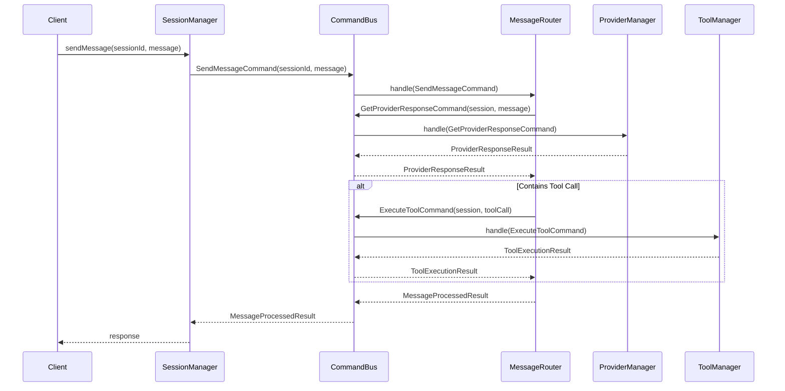
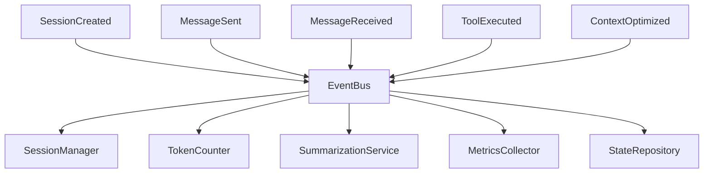
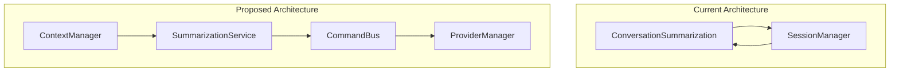
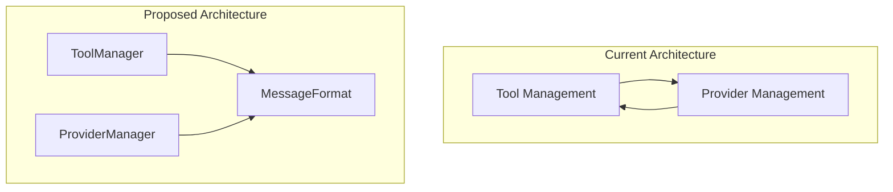
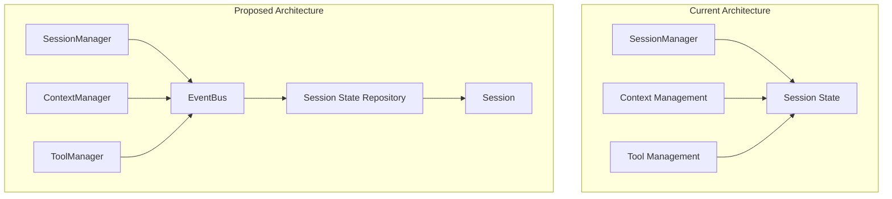

# Proposed Domain-Driven Architecture

This document outlines the proposed domain-driven architecture for the LLM package, designed to address the issues identified in the current implementation.

## Core Architecture Design

The proposed architecture applies Domain-Driven Design principles with event-driven communication to create a more modular, maintainable system:

```mermaid
graph TD
    %% Client and API layer
    Client[Client Application] --> SessionManager

    %% Infrastructure components
    CommandBus([Command Bus])
    EventBus([Event Bus])
    SessionStateRepo[(Session State Repository)]

    %% Core components/domains with their internal structure
    subgraph SessionDomain[Session Domain]
        SessionManager --> SessionFactory
        SessionManager --> SessionRegistry
        SessionManager --> SessionValidator
    end

    subgraph MessageDomain[Message Processing]
        MessageRouter --> StreamProcessor
        MessageRouter --> ResponseFormatter
        MessageRouter --> MessageTransformer
    end

    subgraph ProviderDomain[Provider Management]
        ProviderManager --> ProviderFactory
        ProviderManager --> ModelRegistry
        ProviderFactory --> ProviderAdapters

        ProviderAdapters --> AnthropicAdapter
        ProviderAdapters --> OpenAIAdapter
        ProviderAdapters --> GrokAdapter
        ProviderAdapters --> CustomAdapters[Custom Adapters]
    end

    subgraph ToolDomain[Tool Management]
        ToolManager --> ToolRegistry
        ToolManager --> ToolExecutionEngine
        ToolManager --> ToolValidation

        ToolRegistry --> SystemTools
        ToolRegistry --> UserTools
        ToolRegistry --> ExtensionTools
    end

    subgraph ContextDomain[Context Management]
        ContextManager --> TokenCounter
        ContextManager --> StrategySelector

        StrategySelector --> SummarizationStrategy
        StrategySelector --> PruningStrategy
        StrategySelector --> TruncationStrategy
        StrategySelector --> AdaptiveStrategy

        SummarizationStrategy -.-> SummarizationService
        PruningStrategy -.-> RelevanceService
    end

    subgraph ServerDomain[Server Management]
        ServerManager --> ServerLauncher
        ServerManager --> ServerDiscovery
        ServerManager --> ServerHealthMonitor
        ServerManager --> ServerPool
    end

    %% Command flows - using the command bus
    SessionManager -- issues commands --> CommandBus
    CommandBus -- routes to --> MessageRouter
    CommandBus -- routes to --> ProviderManager
    CommandBus -- routes to --> ToolManager
    CommandBus -- routes to --> ContextManager
    CommandBus -- routes to --> ServerManager

    %% Event publishing and subscription
    SessionManager -- publishes events --> EventBus
    MessageRouter -- publishes events --> EventBus
    ProviderManager -- publishes events --> EventBus
    ToolManager -- publishes events --> EventBus
    ContextManager -- publishes events --> EventBus

    %% Event subscriptions
    EventBus -- notifies --> SessionManager
    EventBus -- notifies --> TokenCounter
    EventBus -- notifies --> MetricsCollector[Metrics Collector]
    EventBus -- notifies --> LoggingService[Logging Service]

    %% State repository access
    SessionDomain -- manages --> SessionStateRepo
    MessageDomain -- reads from --> SessionStateRepo
    ToolDomain -- reads from --> SessionStateRepo
    ContextDomain -- reads from --> SessionStateRepo

    %% Provider-specific communications
    SummarizationService -.-> CommandBus

    %% Cross-cutting concerns
    ErrorHandler[Error Handler] -.- SessionManager
    ErrorHandler -.- MessageRouter
    ErrorHandler -.- ProviderManager
    ErrorHandler -.- ToolManager

    %% Styling
    classDef domain fill:#e4f0f5,stroke:#333,stroke-width:1px
    classDef bus fill:#fcf7d5,stroke:#333,stroke-width:1px
    classDef repo fill:#e2f0cb,stroke:#333,stroke-width:1px
    classDef service fill:#f5e1e2,stroke:#333,stroke-width:1px

    %% Apply styles
    class SessionDomain,MessageDomain,ProviderDomain,ToolDomain,ContextDomain,ServerDomain domain
    class CommandBus,EventBus bus
    class SessionStateRepo repo
    class ErrorHandler,MetricsCollector,LoggingService service
```



## Key Architectural Patterns

### 1. Domain-Driven Design

The system is organized into bounded contexts (domains) with clear responsibilities:

- **Session Domain**: Manages session lifecycle and configuration
- **Message Domain**: Handles message routing and processing
- **Provider Domain**: Manages LLM provider interactions
- **Tool Domain**: Manages tool registration and execution
- **Context Domain**: Handles context window optimization
- **Server Domain**: Manages server processes and lifecycles

### 2. Command/Query Responsibility Segregation (CQRS)

Operations are handled through commands, eliminating direct method calls between domains:



### 3. Event-Driven State Changes

State changes are communicated through events, allowing loose coupling:



### 4. Repository Pattern

The SessionStateRepository provides controlled access to shared state:

```typescript
interface SessionStateRepository {
  getSession(sessionId: string): Promise<Session>;
  updateSession(sessionId: string, updates: Partial<Session>): Promise<void>;
  getMessages(sessionId: string): Promise<ChatMessage[]>;
  addMessage(sessionId: string, message: ChatMessage): Promise<void>;
}
```

## Domain Component Interfaces

### 1. SessionManager

```typescript
interface SessionManager {
  // Core session lifecycle
  createSession(config: SessionConfig): Promise<string>;
  getSession(sessionId: string): Promise<SessionInfo>;
  deleteSession(sessionId: string): Promise<void>;

  // Session operations (delegated via commands)
  sendMessage(sessionId: string, message: string): Promise<MessageResponse>;
  streamMessage(
    sessionId: string,
    message: string
  ): AsyncGenerator<MessageChunk>;

  // Session metadata
  listSessions(): Promise<SessionInfo[]>;
  getSessionStats(sessionId: string): Promise<SessionStats>;
}
```

### 2. CommandBus

```typescript
interface CommandBus {
  dispatch<T extends Command>(command: T): Promise<Result>;
  registerHandler<T extends Command>(
    commandType: Constructor<T>,
    handler: CommandHandler<T>
  ): void;
}

// Example command
interface SendMessageCommand extends Command {
  sessionId: string;
  message: string;
}
```

### 3. EventBus

```typescript
interface EventBus {
  publish<T extends Event>(event: T): void;
  subscribe<T extends Event>(
    eventType: Constructor<T>,
    handler: EventHandler<T>
  ): Subscription;
}

// Example event
interface MessageSentEvent extends Event {
  sessionId: string;
  message: ChatMessage;
  timestamp: Date;
}
```

### 4. ProviderManager

```typescript
interface ProviderManager {
  // Provider lifecycle
  createProvider(
    providerType: string,
    config: ProviderConfig
  ): Promise<LLMProviderInterface>;

  // Provider operations
  sendMessage(
    session: Session,
    message: string,
    options?: MessageOptions
  ): Promise<LLMResponse>;
  streamMessage(
    session: Session,
    message: string,
    options?: MessageOptions
  ): AsyncGenerator<LLMResponseChunk>;

  // Provider metadata
  getAvailableProviders(): string[];
  getProviderModels(providerType: string): ModelCapability[];
  getSupportedFeatures(providerType: string, modelId: string): FeatureSet;
}
```

### 5. ToolManager

```typescript
interface ToolManager {
  // Tool registration
  registerTool(tool: MCPTool): void;

  // Tool operations
  formatTools(tools: MCPTool[], providerType: string): unknown[];
  processToolCall(session: Session, message: ChatMessage): Promise<ChatMessage>;
  executeTool(
    session: Session,
    toolName: string,
    parameters: Record<string, unknown>
  ): Promise<unknown>;

  // Tool metadata
  getAvailableTools(): MCPTool[];
  isToolSupported(
    toolName: string,
    providerType: string,
    modelId: string
  ): boolean;
}
```

### 6. ContextManager

```typescript
interface ContextManager {
  // Context operations
  checkContext(session: Session): boolean;
  updateMetrics(session: Session): TokenMetrics;
  optimizeContext(session: Session): Promise<TokenMetrics>;

  // Strategy management
  selectStrategy(session: Session): TruncationStrategy;
  setContextSettings(
    session: Session,
    settings: Partial<ContextSettings>
  ): void;

  // Metrics
  getTokenUsage(session: Session): TokenMetrics;
}
```

### 7. ServerManager

```typescript
interface ServerManager {
  // Server lifecycle
  startServer(serverName: string, config: ServerConfig): Promise<Client>;
  stopServer(serverName: string): Promise<void>;
  restartServer(serverName: string): Promise<Client>;
  stopAll(): Promise<void>;

  // Session-server association
  registerSessionServers(sessionId: string, serverNames: string[]): void;
  releaseSessionServers(sessionId: string): Promise<void>;
}
```

### 8. MessageRouter

```typescript
interface MessageRouter {
  // Message operations
  routeMessage(session: Session, message: string): Promise<ChatMessage>;
  streamMessage(
    session: Session,
    message: string
  ): AsyncGenerator<MessageChunk>;
  continuationStream(session: Session): AsyncGenerator<MessageChunk>;

  // Response processing
  processResponse(
    session: Session,
    response: ChatMessage
  ): Promise<ChatMessage>;
}
```

## Breaking Circular Dependencies

The proposed architecture resolves circular dependencies in several ways:

### 1. Summarization Service Redesign



**Key Changes:**

- SummarizationService issues commands through CommandBus instead of directly calling SessionManager
- Commands are routed to ProviderManager for LLM interactions
- ContextManager delegates to SummarizationService rather than embedding summarization logic

### 2. Tool-Provider Decoupling



**Key Changes:**

- Define a common canonical message format for communication
- ToolManager adapts tools to canonical format
- ProviderManager adapts canonical format to provider-specific format
- Remove direct dependencies between tool and provider implementations

### 3. Event-Based State Management



**Key Changes:**

- Session state is owned by SessionManager through the SessionStateRepository
- Components request changes via commands/events
- Updates are applied in a controlled manner by the repository
- Components observe state changes via events

## Benefits of the Proposed Architecture

1. **Reduced Coupling**: Components interact through well-defined interfaces (Command/Event buses)

2. **Clearer Responsibilities**: Each domain has a specific focus with clear boundaries

3. **Better Testability**: Components can be tested in isolation with mocked buses

4. **Improved Maintainability**: Changes in one domain don't affect others

5. **Enhanced Scalability**: Domains can be evolved independently

6. **Easier Debugging**: Command/event flow provides clear traceability of operations

## Implementation Considerations

The implementation will follow an incremental approach:

1. **Infrastructure First**: Build the core infrastructure components (Command Bus, Event Bus, Repository)

2. **Domain by Domain**: Implement domains one by one, starting with the least coupled

3. **Gradual Migration**: Move functionality from SessionManager to new components incrementally

4. **Comprehensive Testing**: Each step should maintain existing functionality and add tests for new components
