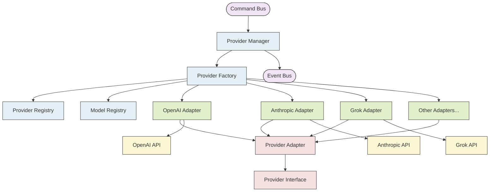

# Provider Domain Implementation

This document provides a detailed implementation plan for the Provider Domain components, which will be responsible for interacting with various LLM providers in a standardized way.

## Overview

The Provider Domain consists of:

1. **Provider Models** - Core domain models for provider capabilities and configurations
2. **Provider Interfaces** - Standard interfaces for interacting with all providers
3. **Provider Factory** - Creates appropriate provider instances based on configuration
4. **Provider Adapters** - Adapts provider-specific APIs to our standard interfaces
5. **Provider Commands** - Commands for provider operations
6. **Provider Events** - Events for provider state changes
7. **Provider Command Handlers** - Handlers for provider-related commands

## Architecture

The Provider Domain follows these design principles:

1. **Abstraction** - Providers are abstracted behind common interfaces
2. **Adapter Pattern** - Provider-specific implementations adapt external libraries to our interfaces
3. **Factory Pattern** - Providers are created via a factory based on configuration
4. **Command Pattern** - Operations are performed through commands
5. **Event-Driven** - State changes are communicated through events



## Key Responsibilities

### Provider Manager

The Provider Manager serves as the entry point to the Provider Domain, responsible for:

1. Resolving provider instances via the Provider Factory
2. Dispatching provider operations (sending messages, streaming responses, etc.)
3. Handling provider-specific errors and retries
4. Publishing events for important provider state changes

### Provider Factory

The Provider Factory is responsible for:

1. Creating provider instances based on configuration
2. Registering provider implementations
3. Managing provider lifecycle (initialization, cleanup)

### Provider Registry

The Provider Registry maintains:

1. Available provider types
2. Provider capabilities
3. Configuration schemas for providers

### Model Registry

The Model Registry tracks:

1. Available models for each provider
2. Model capabilities (context window size, supported features)
3. Token counting information for models

### Provider Adapters

Provider Adapters transform:

1. Provider-specific APIs into our standard interface
2. Our message format into provider-specific formats
3. Provider-specific responses into our standardized format

## Implementation Approach

The implementation will follow these steps:

1. Define core interfaces and models
2. Implement the Provider Factory and Registry
3. Create adapters for key providers (OpenAI, Anthropic, etc.)
4. Implement commands and command handlers
5. Define events for provider state changes
6. Create the Provider Manager as the orchestrator

Each step will include comprehensive tests to ensure reliability and compatibility.

## Integration with Other Domains

The Provider Domain will interact with:

1. **Session Domain** - To access session configuration and store messages
2. **Tool Domain** - To format tools for specific providers
3. **Context Domain** - To get token counts and context window information

Integration will occur through commands and events, maintaining clear domain boundaries.

## Implementation Steps

### Step 1: Define Provider Interfaces and Models

#### Provider Types and Configuration

**File: `src/llm/provider/models/provider-types.ts`**

```typescript
/**
 * Supported LLM provider types
 */
export enum ProviderType {
  OPENAI = 'openai',
  ANTHROPIC = 'anthropic',
  GOOGLE = 'google',
  CUSTOM = 'custom',
}

/**
 * Base provider configuration interface
 */
export interface ProviderConfig {
  /**
   * Provider type
   */
  type: ProviderType | string;

  /**
   * API key for the provider
   */
  apiKey?: string;

  /**
   * API endpoint URL
   */
  apiUrl?: string;

  /**
   * Organization ID (for OpenAI)
   */
  organizationId?: string;

  /**
   * Default model to use
   */
  defaultModel?: string;

  /**
   * Request timeout in milliseconds
   */
  timeout?: number;

  /**
   * Maximum number of retries for failed requests
   */
  maxRetries?: number;

  /**
   * Additional provider-specific configuration
   */
  [key: string]: any;
}

/**
 * OpenAI provider configuration
 */
export interface OpenAIProviderConfig extends ProviderConfig {
  type: ProviderType.OPENAI;

  /**
   * OpenAI API key
   */
  apiKey: string;

  /**
   * OpenAI organization ID
   */
  organizationId?: string;

  /**
   * Default model to use
   */
  defaultModel?: string;
}

/**
 * Anthropic provider configuration
 */
export interface AnthropicProviderConfig extends ProviderConfig {
  type: ProviderType.ANTHROPIC;

  /**
   * Anthropic API key
   */
  apiKey: string;

  /**
   * Default model to use
   */
  defaultModel?: string;
}

/**
 * Google provider configuration
 */
export interface GoogleProviderConfig extends ProviderConfig {
  type: ProviderType.GOOGLE;

  /**
   * Google API key
   */
  apiKey: string;

  /**
   * Default model to use
   */
  defaultModel?: string;
}

/**
 * Custom provider configuration
 */
export interface CustomProviderConfig extends ProviderConfig {
  type: ProviderType.CUSTOM | string;

  /**
   * Custom provider-specific configuration
   */
  [key: string]: any;
}
```

#### Model Capabilities

**File: `src/llm/provider/models/model-capabilities.ts`**

```typescript
/**
 * Supported model features
 */
export enum ModelFeature {
  CHAT = 'chat',
  COMPLETION = 'completion',
  EMBEDDINGS = 'embeddings',
  IMAGE_GENERATION = 'image_generation',
  IMAGE_UNDERSTANDING = 'image_understanding',
  FUNCTION_CALLING = 'function_calling',
  TOOL_USE = 'tool_use',
  JSON_MODE = 'json_mode',
  CODE_GENERATION = 'code_generation',
  CODE_INTERPRETATION = 'code_interpretation',
  MULTI_MODAL = 'multi_modal',
}

/**
 * Support status for a feature
 */
export enum FeatureSupportStatus {
  SUPPORTED = 'supported',
  LIMITED = 'limited',
  UNSUPPORTED = 'unsupported',
}

/**
 * Feature support definition
 */
export interface FeatureSupport {
  /**
   * Feature name
   */
  feature: ModelFeature;

  /**
   * Support status
   */
  status: FeatureSupportStatus;

  /**
   * Additional details about the support level
   */
  details?: string;
}

/**
 * Model pricing information
 */
export interface ModelPricing {
  /**
   * Cost per 1K input tokens in USD
   */
  inputTokenCost: number;

  /**
   * Cost per 1K output tokens in USD
   */
  outputTokenCost: number;

  /**
   * Base cost for API call (if applicable)
   */
  baseCost?: number;
}

/**
 * Token limits for a model
 */
export interface TokenLimits {
  /**
   * Maximum context window size in tokens
   */
  maxContextWindow: number;

  /**
   * Maximum request size in tokens
   */
  maxRequestTokens?: number;

  /**
   * Maximum response size in tokens
   */
  maxResponseTokens?: number;
}

/**
 * Model capability information
 */
export interface ModelCapability {
  /**
   * Provider type
   */
  provider: string;

  /**
   * Model ID
   */
  modelId: string;

  /**
   * Model version
   */
  version?: string;

  /**
   * Model description
   */
  description?: string;

  /**
   * Supported features
   */
  features: FeatureSupport[];

  /**
   * Token limits
   */
  tokenLimits: TokenLimits;

  /**
   * Pricing information
   */
  pricing: ModelPricing;

  /**
   * Whether the model is deprecated
   */
  deprecated?: boolean;

  /**
   * When the model was deprecated (if applicable)
   */
  deprecatedDate?: Date;

  /**
   * Recommended replacement model (if deprecated)
   */
  replacementModel?: string;
}
```

#### Message Models

**File: `src/llm/provider/models/message-models.ts`**

```typescript
import { ChatMessage } from '../../session/models/types';

/**
 * Options for message requests
 */
export interface MessageOptions {
  /**
   * Model to use for this request (overrides default)
   */
  model?: string;

  /**
   * Temperature for generation (0.0 - 1.0)
   */
  temperature?: number;

  /**
   * Top-p sampling (0.0 - 1.0)
   */
  topP?: number;

  /**
   * Maximum tokens to generate
   */
  maxTokens?: number;

  /**
   * Stop sequences
   */
  stop?: string[];

  /**
   * Response format ('text', 'json', etc.)
   */
  responseFormat?: string;

  /**
   * Whether to stream the response
   */
  stream?: boolean;

  /**
   * Tool specifications
   */
  tools?: any[];

  /**
   * Seed for deterministic generation (if supported)
   */
  seed?: number;

  /**
   * Additional provider-specific options
   */
  [key: string]: any;
}

/**
 * LLM response structure
 */
export interface LLMResponse {
  /**
   * Generated message
   */
  message: ChatMessage;

  /**
   * Model used for generation
   */
  model: string;

  /**
   * Usage information
   */
  usage?: {
    promptTokens: number;
    completionTokens: number;
    totalTokens: number;
  };

  /**
   * Raw provider response
   */
  rawResponse?: any;
}

/**
 * LLM response chunk for streaming
 */
export interface LLMResponseChunk {
  /**
   * Chunk of the generated message
   */
  chunk: Partial<ChatMessage>;

  /**
   * Whether this is the final chunk
   */
  isComplete: boolean;

  /**
   * Model used for generation
   */
  model: string;

  /**
   * Usage information (only in final chunk)
   */
  usage?: {
    promptTokens: number;
    completionTokens: number;
    totalTokens: number;
  };
}

/**
 * Error from LLM provider
 */
export interface LLMError {
  /**
   * Error message
   */
  message: string;

  /**
   * Error code from provider
   */
  code?: string;

  /**
   * HTTP status code (if applicable)
   */
  status?: number;

  /**
   * Type of error
   */
  type?:
    | 'rate_limit'
    | 'authentication'
    | 'invalid_request'
    | 'server_error'
    | 'unknown';

  /**
   * Raw error from provider
   */
  rawError?: any;

  /**
   * Whether the error is retryable
   */
  isRetryable?: boolean;

  /**
   * Whether the error was caused by rate limiting
   */
  isRateLimit?: boolean;
}
```

#### Provider Interface

**File: `src/llm/provider/models/provider-interface.ts`**

```typescript
import { ChatMessage } from '../../session/models/types';
import { ProviderConfig } from './provider-types';
import {
  LLMResponse,
  LLMResponseChunk,
  MessageOptions,
  LLMError,
} from './message-models';
import { ModelCapability } from './model-capabilities';

/**
 * Interface for all LLM providers
 */
export interface LLMProviderInterface {
  /**
   * Get the provider type
   */
  getProviderType(): string;

  /**
   * Get the provider configuration
   */
  getConfig(): ProviderConfig;

  /**
   * Initialize the provider with configuration
   * @param config Provider configuration
   */
  initialize(config: ProviderConfig): Promise<void>;

  /**
   * Send a message to the LLM and get a response
   * @param messages The messages to send
   * @param options Options for the request
   * @returns The LLM response
   */
  sendMessage(
    messages: ChatMessage[],
    options?: MessageOptions
  ): Promise<LLMResponse>;

  /**
   * Stream a message to the LLM
   * @param messages The messages to send
   * @param options Options for the request
   * @returns An async generator of response chunks
   */
  streamMessage(
    messages: ChatMessage[],
    options?: MessageOptions
  ): AsyncGenerator<LLMResponseChunk>;

  /**
   * Count tokens for text with a specific model
   * @param text The text to count tokens for
   * @param model The model to use for counting
   * @returns The number of tokens
   */
  countTokens(text: string, model?: string): Promise<number>;

  /**
   * Count tokens for a message array with a specific model
   * @param messages The messages to count tokens for
   * @param model The model to use for counting
   * @returns The number of tokens
   */
  countMessageTokens(messages: ChatMessage[], model?: string): Promise<number>;

  /**
   * Format tools for this provider
   * @param tools The tools to format
   * @returns The formatted tools
   */
  formatTools(tools: any[]): any[];

  /**
   * Get available models for this provider
   * @returns Array of model capabilities
   */
  getAvailableModels(): Promise<ModelCapability[]>;

  /**
   * Get capabilities for a specific model
   * @param modelId The model ID
   * @returns The model capabilities
   */
  getModelCapabilities(modelId: string): Promise<ModelCapability | null>;

  /**
   * Handle provider-specific errors
   * @param error The raw error
   * @returns Normalized LLM error
   */
  handleError(error: any): LLMError;
}

/**
 * Base class for LLM providers
 */
export abstract class BaseLLMProvider implements LLMProviderInterface {
  protected config: ProviderConfig;
  protected initialized: boolean = false;

  constructor(config: ProviderConfig) {
    this.config = config;
  }

  /**
   * Get the provider type
   */
  abstract getProviderType(): string;

  /**
   * Get the provider configuration
   */
  getConfig(): ProviderConfig {
    return this.config;
  }

  /**
   * Initialize the provider with configuration
   * @param config Provider configuration
   */
  async initialize(config: ProviderConfig): Promise<void> {
    this.config = { ...this.config, ...config };
    this.initialized = true;
  }

  /**
   * Send a message to the LLM and get a response
   * @param messages The messages to send
   * @param options Options for the request
   * @returns The LLM response
   */
  abstract sendMessage(
    messages: ChatMessage[],
    options?: MessageOptions
  ): Promise<LLMResponse>;

  /**
   * Stream a message to the LLM
   * @param messages The messages to send
   * @param options Options for the request
   * @returns An async generator of response chunks
   */
  abstract streamMessage(
    messages: ChatMessage[],
    options?: MessageOptions
  ): AsyncGenerator<LLMResponseChunk>;

  /**
   * Count tokens for text with a specific model
   * @param text The text to count tokens for
   * @param model The model to use for counting
   * @returns The number of tokens
   */
  abstract countTokens(text: string, model?: string): Promise<number>;

  /**
   * Count tokens for a message array with a specific model
   * @param messages The messages to count tokens for
   * @param model The model to use for counting
   * @returns The number of tokens
   */
  abstract countMessageTokens(
    messages: ChatMessage[],
    model?: string
  ): Promise<number>;

  /**
   * Format tools for this provider
   * @param tools The tools to format
   * @returns The formatted tools
   */
  abstract formatTools(tools: any[]): any[];

  /**
   * Get available models for this provider
   * @returns Array of model capabilities
   */
  abstract getAvailableModels(): Promise<ModelCapability[]>;

  /**
   * Get capabilities for a specific model
   * @param modelId The model ID
   * @returns The model capabilities
   */
  abstract getModelCapabilities(
    modelId: string
  ): Promise<ModelCapability | null>;

  /**
   * Handle provider-specific errors
   * @param error The raw error
   * @returns Normalized LLM error
   */
  abstract handleError(error: any): LLMError;

  /**
   * Check if the provider is initialized
   * @throws Error if not initialized
   */
  protected checkInitialized(): void {
    if (!this.initialized) {
      throw new Error(`Provider ${this.getProviderType()} is not initialized`);
    }
  }
}
```

#### Tests for Provider Models

**File: `src/llm/provider/models/provider-types.test.ts`**

```typescript
import {
  ProviderType,
  ProviderConfig,
  OpenAIProviderConfig,
} from './provider-types';

describe('Provider Types', () => {
  test('ProviderType enum should have expected values', () => {
    expect(ProviderType.OPENAI).toBe('openai');
    expect(ProviderType.ANTHROPIC).toBe('anthropic');
    expect(ProviderType.GOOGLE).toBe('google');
    expect(ProviderType.CUSTOM).toBe('custom');
  });

  test('ProviderConfig interface can be implemented', () => {
    const config: ProviderConfig = {
      type: ProviderType.OPENAI,
      apiKey: 'test-api-key',
      defaultModel: 'gpt-4',
      timeout: 30000,
      maxRetries: 3,
    };

    expect(config.type).toBe('openai');
    expect(config.apiKey).toBe('test-api-key');
    expect(config.defaultModel).toBe('gpt-4');
    expect(config.timeout).toBe(30000);
    expect(config.maxRetries).toBe(3);
  });

  test('OpenAIProviderConfig interface can be implemented', () => {
    const config: OpenAIProviderConfig = {
      type: ProviderType.OPENAI,
      apiKey: 'test-api-key',
      organizationId: 'test-org-id',
      defaultModel: 'gpt-4',
    };

    expect(config.type).toBe('openai');
    expect(config.apiKey).toBe('test-api-key');
    expect(config.organizationId).toBe('test-org-id');
    expect(config.defaultModel).toBe('gpt-4');
  });
});
```

**File: `src/llm/provider/models/model-capabilities.test.ts`**

```typescript
import {
  ModelFeature,
  FeatureSupportStatus,
  ModelCapability,
} from './model-capabilities';

describe('Model Capabilities', () => {
  test('ModelFeature enum should have expected values', () => {
    expect(ModelFeature.CHAT).toBe('chat');
    expect(ModelFeature.COMPLETION).toBe('completion');
    expect(ModelFeature.EMBEDDINGS).toBe('embeddings');
    expect(ModelFeature.FUNCTION_CALLING).toBe('function_calling');
    expect(ModelFeature.TOOL_USE).toBe('tool_use');
    expect(ModelFeature.MULTI_MODAL).toBe('multi_modal');
  });

  test('FeatureSupportStatus enum should have expected values', () => {
    expect(FeatureSupportStatus.SUPPORTED).toBe('supported');
    expect(FeatureSupportStatus.LIMITED).toBe('limited');
    expect(FeatureSupportStatus.UNSUPPORTED).toBe('unsupported');
  });

  test('ModelCapability interface can be implemented', () => {
    const capability: ModelCapability = {
      provider: 'openai',
      modelId: 'gpt-4',
      version: '0924',
      description: 'GPT-4 Turbo model',
      features: [
        {
          feature: ModelFeature.CHAT,
          status: FeatureSupportStatus.SUPPORTED,
        },
        {
          feature: ModelFeature.TOOL_USE,
          status: FeatureSupportStatus.SUPPORTED,
        },
        {
          feature: ModelFeature.MULTI_MODAL,
          status: FeatureSupportStatus.LIMITED,
          details: 'Supports only images, not audio',
        },
      ],
      tokenLimits: {
        maxContextWindow: 128000,
        maxRequestTokens: 128000,
        maxResponseTokens: 4096,
      },
      pricing: {
        inputTokenCost: 0.01,
        outputTokenCost: 0.03,
      },
    };

    expect(capability.provider).toBe('openai');
    expect(capability.modelId).toBe('gpt-4');
    expect(capability.features).toHaveLength(3);
    expect(capability.features[0].feature).toBe(ModelFeature.CHAT);
    expect(capability.features[0].status).toBe(FeatureSupportStatus.SUPPORTED);
    expect(capability.tokenLimits.maxContextWindow).toBe(128000);
    expect(capability.pricing.inputTokenCost).toBe(0.01);
    expect(capability.pricing.outputTokenCost).toBe(0.03);
  });
});
```

**File: `src/llm/provider/models/message-models.test.ts`**

```typescript
import {
  MessageOptions,
  LLMResponse,
  LLMResponseChunk,
  LLMError,
} from './message-models';
import {
  ChatMessageRole,
  MessageContentType,
} from '../../session/models/types';

describe('Message Models', () => {
  test('MessageOptions interface can be implemented', () => {
    const options: MessageOptions = {
      model: 'gpt-4',
      temperature: 0.7,
      maxTokens: 1000,
      stop: ['\n', 'END'],
      responseFormat: 'json',
      stream: true,
    };

    expect(options.model).toBe('gpt-4');
    expect(options.temperature).toBe(0.7);
    expect(options.maxTokens).toBe(1000);
    expect(options.stop).toEqual(['\n', 'END']);
    expect(options.responseFormat).toBe('json');
    expect(options.stream).toBe(true);
  });

  test('LLMResponse interface can be implemented', () => {
    const response: LLMResponse = {
      message: {
        id: 'msg_123',
        role: ChatMessageRole.ASSISTANT,
        content: [
          {
            type: MessageContentType.TEXT,
            text: 'Hello, world!',
          },
        ],
        createdAt: new Date(),
      },
      model: 'gpt-4',
      usage: {
        promptTokens: 10,
        completionTokens: 5,
        totalTokens: 15,
      },
    };

    expect(response.message.id).toBe('msg_123');
    expect(response.message.role).toBe(ChatMessageRole.ASSISTANT);
    expect(response.message.content[0].type).toBe(MessageContentType.TEXT);
    expect(response.model).toBe('gpt-4');
    expect(response.usage?.promptTokens).toBe(10);
    expect(response.usage?.completionTokens).toBe(5);
    expect(response.usage?.totalTokens).toBe(15);
  });

  test('LLMResponseChunk interface can be implemented', () => {
    const chunk: LLMResponseChunk = {
      chunk: {
        content: [
          {
            type: MessageContentType.TEXT,
            text: 'Hello,',
          },
        ],
      },
      isComplete: false,
      model: 'gpt-4',
    };

    expect(chunk.chunk.content?.[0].type).toBe(MessageContentType.TEXT);
    expect(chunk.isComplete).toBe(false);
    expect(chunk.model).toBe('gpt-4');
  });

  test('LLMError interface can be implemented', () => {
    const error: LLMError = {
      message: 'Rate limit exceeded',
      code: 'rate_limit_exceeded',
      status: 429,
      type: 'rate_limit',
      isRetryable: true,
      isRateLimit: true,
    };

    expect(error.message).toBe('Rate limit exceeded');
    expect(error.code).toBe('rate_limit_exceeded');
    expect(error.status).toBe(429);
    expect(error.type).toBe('rate_limit');
    expect(error.isRetryable).toBe(true);
    expect(error.isRateLimit).toBe(true);
  });
});
```

### Step 2: Implement Provider Factory and Registry

#### Model Registry

**File: `src/llm/provider/registry/model-registry.ts`**

```typescript
import {
  ModelCapability,
  FeatureSupportStatus,
  ModelFeature,
} from '../models/model-capabilities';

/**
 * Interface for the model registry
 */
export interface ModelRegistry {
  /**
   * Register a model capability
   * @param capability The model capability to register
   */
  registerModel(capability: ModelCapability): void;

  /**
   * Get all available models
   * @returns Array of all registered model capabilities
   */
  getAllModels(): ModelCapability[];

  /**
   * Get models for a specific provider
   * @param providerType The provider type
   * @returns Array of model capabilities for the provider
   */
  getModelsForProvider(providerType: string): ModelCapability[];

  /**
   * Get a specific model capability
   * @param providerType The provider type
   * @param modelId The model ID
   * @returns The model capability or null if not found
   */
  getModel(providerType: string, modelId: string): ModelCapability | null;

  /**
   * Get models that support a specific feature
   * @param feature The feature to check
   * @param supportStatus Optional support status filter
   * @returns Array of model capabilities that support the feature
   */
  getModelsWithFeature(
    feature: ModelFeature,
    supportStatus?: FeatureSupportStatus
  ): ModelCapability[];

  /**
   * Check if a model supports a feature
   * @param providerType The provider type
   * @param modelId The model ID
   * @param feature The feature to check
   * @returns The support status, or null if model not found
   */
  checkFeatureSupport(
    providerType: string,
    modelId: string,
    feature: ModelFeature
  ): FeatureSupportStatus | null;

  /**
   * Get the context window size for a model
   * @param providerType The provider type
   * @param modelId The model ID
   * @returns The context window size, or null if model not found
   */
  getContextWindowSize(providerType: string, modelId: string): number | null;
}

/**
 * In-memory implementation of the model registry
 */
export class InMemoryModelRegistry implements ModelRegistry {
  private models: Map<string, ModelCapability> = new Map();

  /**
   * Register a model capability
   * @param capability The model capability to register
   */
  registerModel(capability: ModelCapability): void {
    const key = this.getModelKey(capability.provider, capability.modelId);
    this.models.set(key, { ...capability });
  }

  /**
   * Get all available models
   * @returns Array of all registered model capabilities
   */
  getAllModels(): ModelCapability[] {
    return Array.from(this.models.values());
  }

  /**
   * Get models for a specific provider
   * @param providerType The provider type
   * @returns Array of model capabilities for the provider
   */
  getModelsForProvider(providerType: string): ModelCapability[] {
    return Array.from(this.models.values()).filter(
      model => model.provider === providerType
    );
  }

  /**
   * Get a specific model capability
   * @param providerType The provider type
   * @param modelId The model ID
   * @returns The model capability or null if not found
   */
  getModel(providerType: string, modelId: string): ModelCapability | null {
    const key = this.getModelKey(providerType, modelId);
    const model = this.models.get(key);
    return model ? { ...model } : null;
  }

  /**
   * Get models that support a specific feature
   * @param feature The feature to check
   * @param supportStatus Optional support status filter
   * @returns Array of model capabilities that support the feature
   */
  getModelsWithFeature(
    feature: ModelFeature,
    supportStatus?: FeatureSupportStatus
  ): ModelCapability[] {
    return Array.from(this.models.values()).filter(model => {
      const featureSupport = model.features.find(f => f.feature === feature);

      if (!featureSupport) {
        return false;
      }

      if (supportStatus) {
        return featureSupport.status === supportStatus;
      }

      return featureSupport.status !== FeatureSupportStatus.UNSUPPORTED;
    });
  }

  /**
   * Check if a model supports a feature
   * @param providerType The provider type
   * @param modelId The model ID
   * @param feature The feature to check
   * @returns The support status, or null if model not found
   */
  checkFeatureSupport(
    providerType: string,
    modelId: string,
    feature: ModelFeature
  ): FeatureSupportStatus | null {
    const model = this.getModel(providerType, modelId);

    if (!model) {
      return null;
    }

    const featureSupport = model.features.find(f => f.feature === feature);

    return featureSupport?.status || FeatureSupportStatus.UNSUPPORTED;
  }

  /**
   * Get the context window size for a model
   * @param providerType The provider type
   * @param modelId The model ID
   * @returns The context window size, or null if model not found
   */
  getContextWindowSize(providerType: string, modelId: string): number | null {
    const model = this.getModel(providerType, modelId);

    return model?.tokenLimits.maxContextWindow || null;
  }

  /**
   * Generate a unique key for a model
   * @param providerType The provider type
   * @param modelId The model ID
   * @returns The model key
   */
  private getModelKey(providerType: string, modelId: string): string {
    return `${providerType}:${modelId}`;
  }

  /**
   * Clear all registered models (for testing)
   */
  clear(): void {
    this.models.clear();
  }
}

/**
 * Factory function to create a model registry with default models
 * @returns A model registry initialized with default models
 */
export function createModelRegistry(): ModelRegistry {
  const registry = new InMemoryModelRegistry();

  // Register default models
  registerDefaultModels(registry);

  return registry;
}

/**
 * Register default models in the registry
 * @param registry The model registry
 */
function registerDefaultModels(registry: ModelRegistry): void {
  // OpenAI Models
  registry.registerModel({
    provider: 'openai',
    modelId: 'gpt-4-turbo',
    description: 'GPT-4 Turbo with 128k context',
    features: [
      { feature: ModelFeature.CHAT, status: FeatureSupportStatus.SUPPORTED },
      {
        feature: ModelFeature.TOOL_USE,
        status: FeatureSupportStatus.SUPPORTED,
      },
      {
        feature: ModelFeature.FUNCTION_CALLING,
        status: FeatureSupportStatus.SUPPORTED,
      },
      {
        feature: ModelFeature.JSON_MODE,
        status: FeatureSupportStatus.SUPPORTED,
      },
      {
        feature: ModelFeature.MULTI_MODAL,
        status: FeatureSupportStatus.SUPPORTED,
      },
    ],
    tokenLimits: {
      maxContextWindow: 128000,
      maxResponseTokens: 4096,
    },
    pricing: {
      inputTokenCost: 0.01,
      outputTokenCost: 0.03,
    },
  });

  registry.registerModel({
    provider: 'openai',
    modelId: 'gpt-4',
    description: 'GPT-4 with 8k context',
    features: [
      { feature: ModelFeature.CHAT, status: FeatureSupportStatus.SUPPORTED },
      {
        feature: ModelFeature.TOOL_USE,
        status: FeatureSupportStatus.SUPPORTED,
      },
      {
        feature: ModelFeature.FUNCTION_CALLING,
        status: FeatureSupportStatus.SUPPORTED,
      },
      {
        feature: ModelFeature.JSON_MODE,
        status: FeatureSupportStatus.SUPPORTED,
      },
    ],
    tokenLimits: {
      maxContextWindow: 8192,
      maxResponseTokens: 4096,
    },
    pricing: {
      inputTokenCost: 0.03,
      outputTokenCost: 0.06,
    },
  });

  registry.registerModel({
    provider: 'openai',
    modelId: 'gpt-3.5-turbo',
    description: 'GPT-3.5 Turbo with 16k context',
    features: [
      { feature: ModelFeature.CHAT, status: FeatureSupportStatus.SUPPORTED },
      {
        feature: ModelFeature.TOOL_USE,
        status: FeatureSupportStatus.SUPPORTED,
      },
      {
        feature: ModelFeature.FUNCTION_CALLING,
        status: FeatureSupportStatus.SUPPORTED,
      },
      {
        feature: ModelFeature.JSON_MODE,
        status: FeatureSupportStatus.SUPPORTED,
      },
    ],
    tokenLimits: {
      maxContextWindow: 16385,
      maxResponseTokens: 4096,
    },
    pricing: {
      inputTokenCost: 0.001,
      outputTokenCost: 0.002,
    },
  });

  // Anthropic Models
  registry.registerModel({
    provider: 'anthropic',
    modelId: 'claude-3-opus',
    description: 'Claude 3 Opus - most powerful Claude model',
    features: [
      { feature: ModelFeature.CHAT, status: FeatureSupportStatus.SUPPORTED },
      {
        feature: ModelFeature.TOOL_USE,
        status: FeatureSupportStatus.SUPPORTED,
      },
      {
        feature: ModelFeature.MULTI_MODAL,
        status: FeatureSupportStatus.SUPPORTED,
      },
    ],
    tokenLimits: {
      maxContextWindow: 200000,
      maxResponseTokens: 4096,
    },
    pricing: {
      inputTokenCost: 0.015,
      outputTokenCost: 0.075,
    },
  });

  registry.registerModel({
    provider: 'anthropic',
    modelId: 'claude-3-sonnet',
    description: 'Claude 3 Sonnet - balanced Claude model',
    features: [
      { feature: ModelFeature.CHAT, status: FeatureSupportStatus.SUPPORTED },
      {
        feature: ModelFeature.TOOL_USE,
        status: FeatureSupportStatus.SUPPORTED,
      },
      {
        feature: ModelFeature.MULTI_MODAL,
        status: FeatureSupportStatus.SUPPORTED,
      },
    ],
    tokenLimits: {
      maxContextWindow: 180000,
      maxResponseTokens: 4096,
    },
    pricing: {
      inputTokenCost: 0.003,
      outputTokenCost: 0.015,
    },
  });

  // Google Models
  registry.registerModel({
    provider: 'google',
    modelId: 'gemini-1.5-pro',
    description: 'Gemini 1.5 Pro with 1M context',
    features: [
      { feature: ModelFeature.CHAT, status: FeatureSupportStatus.SUPPORTED },
      {
        feature: ModelFeature.TOOL_USE,
        status: FeatureSupportStatus.SUPPORTED,
      },
      {
        feature: ModelFeature.FUNCTION_CALLING,
        status: FeatureSupportStatus.SUPPORTED,
      },
      {
        feature: ModelFeature.MULTI_MODAL,
        status: FeatureSupportStatus.SUPPORTED,
      },
    ],
    tokenLimits: {
      maxContextWindow: 1000000,
      maxResponseTokens: 8192,
    },
    pricing: {
      inputTokenCost: 0.00035,
      outputTokenCost: 0.00105,
    },
  });
}
```

#### Provider Registry

**File: `src/llm/provider/registry/provider-registry.ts`**

```typescript
import { ProviderType, ProviderConfig } from '../models/provider-types';
import { LLMProviderInterface } from '../models/provider-interface';

/**
 * Interface for provider factory functions
 */
export type ProviderFactory = (config: ProviderConfig) => LLMProviderInterface;

/**
 * Interface for the provider registry
 */
export interface ProviderRegistry {
  /**
   * Register a provider factory
   * @param providerType The provider type
   * @param factory The provider factory function
   */
  registerProvider(providerType: string, factory: ProviderFactory): void;

  /**
   * Check if a provider is registered
   * @param providerType The provider type
   * @returns Whether the provider is registered
   */
  hasProvider(providerType: string): boolean;

  /**
   * Get a provider factory
   * @param providerType The provider type
   * @returns The provider factory, or null if not registered
   */
  getProviderFactory(providerType: string): ProviderFactory | null;

  /**
   * Get all registered provider types
   * @returns Array of provider types
   */
  getProviderTypes(): string[];
}

/**
 * In-memory implementation of the provider registry
 */
export class InMemoryProviderRegistry implements ProviderRegistry {
  private providers: Map<string, ProviderFactory> = new Map();

  /**
   * Register a provider factory
   * @param providerType The provider type
   * @param factory The provider factory function
   */
  registerProvider(providerType: string, factory: ProviderFactory): void {
    this.providers.set(providerType.toLowerCase(), factory);
  }

  /**
   * Check if a provider is registered
   * @param providerType The provider type
   * @returns Whether the provider is registered
   */
  hasProvider(providerType: string): boolean {
    return this.providers.has(providerType.toLowerCase());
  }

  /**
   * Get a provider factory
   * @param providerType The provider type
   * @returns The provider factory, or null if not registered
   */
  getProviderFactory(providerType: string): ProviderFactory | null {
    return this.providers.get(providerType.toLowerCase()) || null;
  }

  /**
   * Get all registered provider types
   * @returns Array of provider types
   */
  getProviderTypes(): string[] {
    return Array.from(this.providers.keys());
  }

  /**
   * Clear all registered providers (for testing)
   */
  clear(): void {
    this.providers.clear();
  }
}

/**
 * Create a provider registry with default providers
 * @returns A provider registry
 */
export function createProviderRegistry(): ProviderRegistry {
  return new InMemoryProviderRegistry();
}
```

#### Provider Factory

**File: `src/llm/provider/factory/provider-factory.ts`**

```typescript
import { ProviderType, ProviderConfig } from '../models/provider-types';
import {
  LLMProviderInterface,
  BaseLLMProvider,
} from '../models/provider-interface';
import {
  ProviderRegistry,
  createProviderRegistry,
} from '../registry/provider-registry';
import { ModelRegistry, createModelRegistry } from '../registry/model-registry';

/**
 * Interface for the LLM provider factory
 */
export interface LLMProviderFactory {
  /**
   * Create a provider instance
   * @param config Provider configuration
   * @returns The provider instance
   */
  createProvider(config: ProviderConfig): LLMProviderInterface;

  /**
   * Register a provider implementation
   * @param providerType The provider type
   * @param factoryFn The provider factory function
   */
  registerProvider(
    providerType: string,
    factoryFn: (config: ProviderConfig) => LLMProviderInterface
  ): void;

  /**
   * Get available provider types
   * @returns Array of available provider types
   */
  getAvailableProviders(): string[];

  /**
   * Register default providers
   */
  registerDefaultProviders(): void;

  /**
   * Get the model registry
   * @returns The model registry
   */
  getModelRegistry(): ModelRegistry;
}

/**
 * Default implementation of the LLM provider factory
 */
export class DefaultLLMProviderFactory implements LLMProviderFactory {
  private providerRegistry: ProviderRegistry;
  private modelRegistry: ModelRegistry;

  /**
   * Create a new LLM provider factory
   * @param providerRegistry Optional provider registry
   * @param modelRegistry Optional model registry
   */
  constructor(
    providerRegistry?: ProviderRegistry,
    modelRegistry?: ModelRegistry
  ) {
    this.providerRegistry = providerRegistry || createProviderRegistry();
    this.modelRegistry = modelRegistry || createModelRegistry();
  }

  /**
   * Create a provider instance
   * @param config Provider configuration
   * @returns The provider instance
   * @throws Error if provider not found
   */
  createProvider(config: ProviderConfig): LLMProviderInterface {
    const providerType = (config.type || '').toLowerCase();

    if (!providerType) {
      throw new Error('Provider type is required');
    }

    const factory = this.providerRegistry.getProviderFactory(providerType);

    if (!factory) {
      throw new Error(`Provider type not found: ${providerType}`);
    }

    const provider = factory(config);

    // Initialize provider
    return provider;
  }

  /**
   * Register a provider implementation
   * @param providerType The provider type
   * @param factoryFn The provider factory function
   */
  registerProvider(
    providerType: string,
    factoryFn: (config: ProviderConfig) => LLMProviderInterface
  ): void {
    this.providerRegistry.registerProvider(providerType, factoryFn);
  }

  /**
   * Get available provider types
   * @returns Array of available provider types
   */
  getAvailableProviders(): string[] {
    return this.providerRegistry.getProviderTypes();
  }

  /**
   * Register default providers
   */
  registerDefaultProviders(): void {
    // This will be implemented when we create the actual provider adapters
  }

  /**
   * Get the model registry
   * @returns The model registry
   */
  getModelRegistry(): ModelRegistry {
    return this.modelRegistry;
  }
}

/**
 * Singleton instance of the provider factory
 */
let factoryInstance: LLMProviderFactory | null = null;

/**
 * Get the singleton instance of the provider factory
 * @returns The provider factory instance
 */
export function getProviderFactory(): LLMProviderFactory {
  if (!factoryInstance) {
    factoryInstance = new DefaultLLMProviderFactory();
  }

  return factoryInstance;
}

/**
 * Reset the factory instance (for testing)
 */
export function resetProviderFactory(): void {
  factoryInstance = null;
}
```

#### Tests for Model Registry

**File: `src/llm/provider/registry/model-registry.test.ts`**

```typescript
import { InMemoryModelRegistry, createModelRegistry } from './model-registry';
import {
  ModelCapability,
  ModelFeature,
  FeatureSupportStatus,
} from '../models/model-capabilities';

describe('InMemoryModelRegistry', () => {
  let registry: InMemoryModelRegistry;

  beforeEach(() => {
    registry = new InMemoryModelRegistry();
  });

  test('should register and retrieve a model', () => {
    const model: ModelCapability = {
      provider: 'test-provider',
      modelId: 'test-model',
      features: [
        { feature: ModelFeature.CHAT, status: FeatureSupportStatus.SUPPORTED },
      ],
      tokenLimits: {
        maxContextWindow: 4096,
      },
      pricing: {
        inputTokenCost: 0.01,
        outputTokenCost: 0.02,
      },
    };

    registry.registerModel(model);

    const retrievedModel = registry.getModel('test-provider', 'test-model');
    expect(retrievedModel).toBeDefined();
    expect(retrievedModel?.provider).toBe('test-provider');
    expect(retrievedModel?.modelId).toBe('test-model');
  });

  test('should return null for non-existent model', () => {
    const model = registry.getModel('not-found', 'not-found');
    expect(model).toBeNull();
  });

  test('should get models for a specific provider', () => {
    const model1: ModelCapability = {
      provider: 'provider-a',
      modelId: 'model-1',
      features: [],
      tokenLimits: { maxContextWindow: 4096 },
      pricing: { inputTokenCost: 0.01, outputTokenCost: 0.02 },
    };

    const model2: ModelCapability = {
      provider: 'provider-a',
      modelId: 'model-2',
      features: [],
      tokenLimits: { maxContextWindow: 8192 },
      pricing: { inputTokenCost: 0.02, outputTokenCost: 0.03 },
    };

    const model3: ModelCapability = {
      provider: 'provider-b',
      modelId: 'model-3',
      features: [],
      tokenLimits: { maxContextWindow: 16384 },
      pricing: { inputTokenCost: 0.03, outputTokenCost: 0.04 },
    };

    registry.registerModel(model1);
    registry.registerModel(model2);
    registry.registerModel(model3);

    const providerAModels = registry.getModelsForProvider('provider-a');
    expect(providerAModels).toHaveLength(2);
    expect(providerAModels[0].modelId).toBe('model-1');
    expect(providerAModels[1].modelId).toBe('model-2');

    const providerBModels = registry.getModelsForProvider('provider-b');
    expect(providerBModels).toHaveLength(1);
    expect(providerBModels[0].modelId).toBe('model-3');
  });

  test('should get all models', () => {
    const model1: ModelCapability = {
      provider: 'provider-a',
      modelId: 'model-1',
      features: [],
      tokenLimits: { maxContextWindow: 4096 },
      pricing: { inputTokenCost: 0.01, outputTokenCost: 0.02 },
    };

    const model2: ModelCapability = {
      provider: 'provider-b',
      modelId: 'model-2',
      features: [],
      tokenLimits: { maxContextWindow: 8192 },
      pricing: { inputTokenCost: 0.02, outputTokenCost: 0.03 },
    };

    registry.registerModel(model1);
    registry.registerModel(model2);

    const allModels = registry.getAllModels();
    expect(allModels).toHaveLength(2);
  });

  test('should get models with specific feature', () => {
    const model1: ModelCapability = {
      provider: 'provider-a',
      modelId: 'model-1',
      features: [
        { feature: ModelFeature.CHAT, status: FeatureSupportStatus.SUPPORTED },
        {
          feature: ModelFeature.TOOL_USE,
          status: FeatureSupportStatus.UNSUPPORTED,
        },
      ],
      tokenLimits: { maxContextWindow: 4096 },
      pricing: { inputTokenCost: 0.01, outputTokenCost: 0.02 },
    };

    const model2: ModelCapability = {
      provider: 'provider-b',
      modelId: 'model-2',
      features: [
        { feature: ModelFeature.CHAT, status: FeatureSupportStatus.SUPPORTED },
        {
          feature: ModelFeature.TOOL_USE,
          status: FeatureSupportStatus.SUPPORTED,
        },
      ],
      tokenLimits: { maxContextWindow: 8192 },
      pricing: { inputTokenCost: 0.02, outputTokenCost: 0.03 },
    };

    registry.registerModel(model1);
    registry.registerModel(model2);

    const chatModels = registry.getModelsWithFeature(ModelFeature.CHAT);
    expect(chatModels).toHaveLength(2);

    const toolModels = registry.getModelsWithFeature(
      ModelFeature.TOOL_USE,
      FeatureSupportStatus.SUPPORTED
    );
    expect(toolModels).toHaveLength(1);
    expect(toolModels[0].modelId).toBe('model-2');
  });

  test('should check feature support for a model', () => {
    const model: ModelCapability = {
      provider: 'test-provider',
      modelId: 'test-model',
      features: [
        { feature: ModelFeature.CHAT, status: FeatureSupportStatus.SUPPORTED },
        {
          feature: ModelFeature.TOOL_USE,
          status: FeatureSupportStatus.LIMITED,
        },
        {
          feature: ModelFeature.MULTI_MODAL,
          status: FeatureSupportStatus.UNSUPPORTED,
        },
      ],
      tokenLimits: { maxContextWindow: 4096 },
      pricing: { inputTokenCost: 0.01, outputTokenCost: 0.02 },
    };

    registry.registerModel(model);

    const chatSupport = registry.checkFeatureSupport(
      'test-provider',
      'test-model',
      ModelFeature.CHAT
    );

    const toolSupport = registry.checkFeatureSupport(
      'test-provider',
      'test-model',
      ModelFeature.TOOL_USE
    );

    const multimodalSupport = registry.checkFeatureSupport(
      'test-provider',
      'test-model',
      ModelFeature.MULTI_MODAL
    );

    const nonExistentSupport = registry.checkFeatureSupport(
      'test-provider',
      'test-model',
      ModelFeature.CODE_INTERPRETATION
    );

    expect(chatSupport).toBe(FeatureSupportStatus.SUPPORTED);
    expect(toolSupport).toBe(FeatureSupportStatus.LIMITED);
    expect(multimodalSupport).toBe(FeatureSupportStatus.UNSUPPORTED);
    expect(nonExistentSupport).toBe(FeatureSupportStatus.UNSUPPORTED);
  });

  test('should get context window size for a model', () => {
    const model: ModelCapability = {
      provider: 'test-provider',
      modelId: 'test-model',
      features: [],
      tokenLimits: { maxContextWindow: 16384 },
      pricing: { inputTokenCost: 0.01, outputTokenCost: 0.02 },
    };

    registry.registerModel(model);

    const contextWindow = registry.getContextWindowSize(
      'test-provider',
      'test-model'
    );
    expect(contextWindow).toBe(16384);

    const nonExistentWindow = registry.getContextWindowSize(
      'not-found',
      'not-found'
    );
    expect(nonExistentWindow).toBeNull();
  });

  test('createModelRegistry should return a registry with default models', () => {
    const registry = createModelRegistry();

    const allModels = registry.getAllModels();
    expect(allModels.length).toBeGreaterThan(0);

    const openaiModels = registry.getModelsForProvider('openai');
    const anthropicModels = registry.getModelsForProvider('anthropic');

    expect(openaiModels.length).toBeGreaterThan(0);
    expect(anthropicModels.length).toBeGreaterThan(0);
  });
});
```

#### Tests for Provider Registry

**File: `src/llm/provider/registry/provider-registry.test.ts`**

```typescript
import {
  InMemoryProviderRegistry,
  createProviderRegistry,
} from './provider-registry';
import { ProviderConfig, ProviderType } from '../models/provider-types';
import {
  LLMProviderInterface,
  BaseLLMProvider,
} from '../models/provider-interface';

// Mock provider implementation for testing
class MockProvider extends BaseLLMProvider {
  getProviderType(): string {
    return 'mock';
  }

  async sendMessage() {
    throw new Error('Not implemented');
  }

  async *streamMessage() {
    throw new Error('Not implemented');
  }

  async countTokens() {
    return 0;
  }

  async countMessageTokens() {
    return 0;
  }

  formatTools() {
    return [];
  }

  async getAvailableModels() {
    return [];
  }

  async getModelCapabilities() {
    return null;
  }

  handleError(error: any) {
    return { message: String(error) };
  }
}

describe('InMemoryProviderRegistry', () => {
  let registry: InMemoryProviderRegistry;

  beforeEach(() => {
    registry = new InMemoryProviderRegistry();
  });

  test('should register and retrieve a provider factory', () => {
    const factory = (config: ProviderConfig) => new MockProvider(config);

    registry.registerProvider('mock', factory);

    expect(registry.hasProvider('mock')).toBe(true);

    const retrievedFactory = registry.getProviderFactory('mock');
    expect(retrievedFactory).toBe(factory);
  });

  test('should handle case-insensitive provider types', () => {
    const factory = (config: ProviderConfig) => new MockProvider(config);

    registry.registerProvider('MOCK', factory);

    expect(registry.hasProvider('mock')).toBe(true);
    expect(registry.hasProvider('MOCK')).toBe(true);
    expect(registry.hasProvider('Mock')).toBe(true);

    const retrievedFactory = registry.getProviderFactory('mock');
    expect(retrievedFactory).toBe(factory);
  });

  test('should return null for non-existent provider factory', () => {
    const factory = registry.getProviderFactory('not-found');
    expect(factory).toBeNull();
  });

  test('should get all registered provider types', () => {
    const factory = (config: ProviderConfig) => new MockProvider(config);

    registry.registerProvider('mock1', factory);
    registry.registerProvider('mock2', factory);
    registry.registerProvider('mock3', factory);

    const types = registry.getProviderTypes();
    expect(types).toHaveLength(3);
    expect(types).toContain('mock1');
    expect(types).toContain('mock2');
    expect(types).toContain('mock3');
  });

  test('createProviderRegistry should return a new provider registry', () => {
    const registry = createProviderRegistry();
    expect(registry).toBeInstanceOf(InMemoryProviderRegistry);
  });
});
```

#### Tests for Provider Factory

**File: `src/llm/provider/factory/provider-factory.test.ts`**

```typescript
import {
  DefaultLLMProviderFactory,
  getProviderFactory,
  resetProviderFactory,
} from './provider-factory';
import { ProviderRegistry } from '../registry/provider-registry';
import { ModelRegistry } from '../registry/model-registry';
import { ProviderConfig, ProviderType } from '../models/provider-types';
import {
  LLMProviderInterface,
  BaseLLMProvider,
} from '../models/provider-interface';

// Mock provider implementation for testing
class MockProvider extends BaseLLMProvider {
  getProviderType(): string {
    return 'mock';
  }

  async sendMessage() {
    throw new Error('Not implemented');
  }

  async *streamMessage() {
    throw new Error('Not implemented');
  }

  async countTokens() {
    return 0;
  }

  async countMessageTokens() {
    return 0;
  }

  formatTools() {
    return [];
  }

  async getAvailableModels() {
    return [];
  }

  async getModelCapabilities() {
    return null;
  }

  handleError(error: any) {
    return { message: String(error) };
  }
}

// Mock registry implementations
const createMockProviderRegistry = (): ProviderRegistry => {
  return {
    registerProvider: jest.fn(),
    hasProvider: jest.fn().mockImplementation(type => type === 'mock'),
    getProviderFactory: jest.fn().mockImplementation(type => {
      if (type === 'mock') {
        return (config: ProviderConfig) => new MockProvider(config);
      }
      return null;
    }),
    getProviderTypes: jest.fn().mockReturnValue(['mock']),
  };
};

const createMockModelRegistry = (): ModelRegistry => {
  return {
    registerModel: jest.fn(),
    getAllModels: jest.fn().mockReturnValue([]),
    getModelsForProvider: jest.fn().mockReturnValue([]),
    getModel: jest.fn().mockReturnValue(null),
    getModelsWithFeature: jest.fn().mockReturnValue([]),
    checkFeatureSupport: jest.fn().mockReturnValue(null),
    getContextWindowSize: jest.fn().mockReturnValue(null),
  };
};

describe('DefaultLLMProviderFactory', () => {
  let factory: DefaultLLMProviderFactory;
  let mockProviderRegistry: ProviderRegistry;
  let mockModelRegistry: ModelRegistry;

  beforeEach(() => {
    mockProviderRegistry = createMockProviderRegistry();
    mockModelRegistry = createMockModelRegistry();
    factory = new DefaultLLMProviderFactory(
      mockProviderRegistry,
      mockModelRegistry
    );
  });

  test('should create a provider instance', () => {
    const config: ProviderConfig = {
      type: 'mock',
      apiKey: 'test-key',
    };

    const provider = factory.createProvider(config);

    expect(provider).toBeInstanceOf(MockProvider);
    expect(provider.getProviderType()).toBe('mock');
    expect(provider.getConfig()).toEqual(config);
  });

  test('should throw error for missing provider type', () => {
    const config: ProviderConfig = {
      type: '', // Empty type
      apiKey: 'test-key',
    };

    expect(() => {
      factory.createProvider(config);
    }).toThrow('Provider type is required');
  });

  test('should throw error for unknown provider type', () => {
    const config: ProviderConfig = {
      type: 'unknown',
      apiKey: 'test-key',
    };

    expect(() => {
      factory.createProvider(config);
    }).toThrow('Provider type not found: unknown');
  });

  test('should register a provider implementation', () => {
    const factoryFn = (config: ProviderConfig) => new MockProvider(config);

    factory.registerProvider('test-provider', factoryFn);

    expect(mockProviderRegistry.registerProvider).toHaveBeenCalledWith(
      'test-provider',
      factoryFn
    );
  });

  test('should get available provider types', () => {
    const types = factory.getAvailableProviders();

    expect(types).toEqual(['mock']);
    expect(mockProviderRegistry.getProviderTypes).toHaveBeenCalled();
  });

  test('should get the model registry', () => {
    const registry = factory.getModelRegistry();

    expect(registry).toBe(mockModelRegistry);
  });
});

describe('getProviderFactory', () => {
  beforeEach(() => {
    resetProviderFactory();
  });

  test('should return a singleton instance', () => {
    const factory1 = getProviderFactory();
    const factory2 = getProviderFactory();

    expect(factory1).toBeInstanceOf(DefaultLLMProviderFactory);
    expect(factory1).toBe(factory2);
  });

  test('resetProviderFactory should reset the singleton instance', () => {
    const factory1 = getProviderFactory();
    resetProviderFactory();
    const factory2 = getProviderFactory();

    expect(factory1).not.toBe(factory2);
  });
});
```

### Step 3: Define Provider Commands and Events

#### Provider Commands

**File: `src/llm/provider/commands/provider-commands.ts`**

```typescript
import { Command } from '../../infrastructure/types';
import { ProviderConfig } from '../models/provider-types';
import { ChatMessage } from '../../session/models/types';
import { MessageOptions } from '../models/message-models';
import { ModelFeature } from '../models/model-capabilities';

/**
 * Command to create a provider instance
 */
export class CreateProviderCommand implements Command {
  type = 'create-provider';

  /**
   * Provider configuration
   */
  config: ProviderConfig;

  constructor(config: ProviderConfig) {
    this.config = config;
  }
}

/**
 * Command to send a message through a provider
 */
export class SendMessageCommand implements Command {
  type = 'send-provider-message';

  /**
   * Session ID
   */
  sessionId: string;

  /**
   * Provider type
   */
  providerType: string;

  /**
   * Messages to send
   */
  messages: ChatMessage[];

  /**
   * Message options
   */
  options?: MessageOptions;

  constructor(
    sessionId: string,
    providerType: string,
    messages: ChatMessage[],
    options?: MessageOptions
  ) {
    this.sessionId = sessionId;
    this.providerType = providerType;
    this.messages = messages;
    this.options = options;
  }
}

/**
 * Command to initiate a streaming message through a provider
 */
export class StreamMessageCommand implements Command {
  type = 'stream-provider-message';

  /**
   * Session ID
   */
  sessionId: string;

  /**
   * Provider type
   */
  providerType: string;

  /**
   * Messages to send
   */
  messages: ChatMessage[];

  /**
   * Message options
   */
  options?: MessageOptions;

  constructor(
    sessionId: string,
    providerType: string,
    messages: ChatMessage[],
    options?: MessageOptions
  ) {
    this.sessionId = sessionId;
    this.providerType = providerType;
    this.messages = messages;
    this.options = options;
  }
}

/**
 * Command to count tokens for text
 */
export class CountTokensCommand implements Command {
  type = 'count-provider-tokens';

  /**
   * Provider type
   */
  providerType: string;

  /**
   * Text to count tokens for
   */
  text: string;

  /**
   * Model to use for counting (optional)
   */
  model?: string;

  constructor(providerType: string, text: string, model?: string) {
    this.providerType = providerType;
    this.text = text;
    this.model = model;
  }
}

/**
 * Command to count tokens for messages
 */
export class CountMessageTokensCommand implements Command {
  type = 'count-provider-message-tokens';

  /**
   * Provider type
   */
  providerType: string;

  /**
   * Messages to count tokens for
   */
  messages: ChatMessage[];

  /**
   * Model to use for counting (optional)
   */
  model?: string;

  constructor(providerType: string, messages: ChatMessage[], model?: string) {
    this.providerType = providerType;
    this.messages = messages;
    this.model = model;
  }
}

/**
 * Command to format tools for a provider
 */
export class FormatProviderToolsCommand implements Command {
  type = 'format-provider-tools';

  /**
   * Provider type
   */
  providerType: string;

  /**
   * Tools to format
   */
  tools: any[];

  /**
   * Model to format tools for (optional)
   */
  model?: string;

  constructor(providerType: string, tools: any[], model?: string) {
    this.providerType = providerType;
    this.tools = tools;
    this.model = model;
  }
}

/**
 * Command to get available models for a provider
 */
export class GetProviderModelsCommand implements Command {
  type = 'get-provider-models';

  /**
   * Provider type
   */
  providerType: string;

  constructor(providerType: string) {
    this.providerType = providerType;
  }
}

/**
 * Command to get models that support a feature
 */
export class GetModelsWithFeatureCommand implements Command {
  type = 'get-models-with-feature';

  /**
   * Feature to check for
   */
  feature: ModelFeature;

  /**
   * Provider type (optional, if null, check all providers)
   */
  providerType?: string;

  constructor(feature: ModelFeature, providerType?: string) {
    this.feature = feature;
    this.providerType = providerType;
  }
}

/**
 * Command to check if a model supports a feature
 */
export class CheckFeatureSupportCommand implements Command {
  type = 'check-feature-support';

  /**
   * Provider type
   */
  providerType: string;

  /**
   * Model ID
   */
  modelId: string;

  /**
   * Feature to check
   */
  feature: ModelFeature;

  constructor(providerType: string, modelId: string, feature: ModelFeature) {
    this.providerType = providerType;
    this.modelId = modelId;
    this.feature = feature;
  }
}
```

#### Provider Events

**File: `src/llm/provider/events/provider-events.ts`**

```typescript
import { Event } from '../../infrastructure/types';
import { LLMProviderInterface } from '../models/provider-interface';
import {
  LLMResponse,
  LLMResponseChunk,
  LLMError,
} from '../models/message-models';
import { ModelCapability } from '../models/model-capabilities';
import { ChatMessage } from '../../session/models/types';

/**
 * Base class for all provider events
 */
export abstract class ProviderEvent implements Event {
  /**
   * Event type
   */
  abstract type: string;

  /**
   * When the event occurred
   */
  timestamp: Date;

  /**
   * Provider type
   */
  providerType: string;

  constructor(providerType: string) {
    this.providerType = providerType;
    this.timestamp = new Date();
  }
}

/**
 * Event for when a provider is created
 */
export class ProviderCreatedEvent extends ProviderEvent {
  type = 'provider-created';

  /**
   * The created provider
   */
  providerId: string;

  constructor(providerType: string, providerId: string) {
    super(providerType);
    this.providerId = providerId;
  }
}

/**
 * Event for when a message is sent to a provider
 */
export class ProviderMessageSentEvent extends ProviderEvent {
  type = 'provider-message-sent';

  /**
   * Session ID
   */
  sessionId: string;

  /**
   * Model used
   */
  model: string;

  /**
   * Number of messages sent
   */
  messageCount: number;

  /**
   * Input token count
   */
  inputTokens: number;

  constructor(
    providerType: string,
    sessionId: string,
    model: string,
    messageCount: number,
    inputTokens: number
  ) {
    super(providerType);
    this.sessionId = sessionId;
    this.model = model;
    this.messageCount = messageCount;
    this.inputTokens = inputTokens;
  }
}

/**
 * Event for when a response is received from a provider
 */
export class ProviderResponseReceivedEvent extends ProviderEvent {
  type = 'provider-response-received';

  /**
   * Session ID
   */
  sessionId: string;

  /**
   * Model used
   */
  model: string;

  /**
   * Output token count
   */
  outputTokens: number;

  /**
   * Total token count (input + output)
   */
  totalTokens: number;

  /**
   * Whether the response is a streaming response
   */
  isStreaming: boolean;

  constructor(
    providerType: string,
    sessionId: string,
    model: string,
    outputTokens: number,
    totalTokens: number,
    isStreaming: boolean = false
  ) {
    super(providerType);
    this.sessionId = sessionId;
    this.model = model;
    this.outputTokens = outputTokens;
    this.totalTokens = totalTokens;
    this.isStreaming = isStreaming;
  }
}

/**
 * Event for when a streaming response is complete
 */
export class ProviderStreamCompletedEvent extends ProviderEvent {
  type = 'provider-stream-completed';

  /**
   * Session ID
   */
  sessionId: string;

  /**
   * Model used
   */
  model: string;

  /**
   * Total chunks received
   */
  chunkCount: number;

  /**
   * Total tokens used
   */
  totalTokens: number;

  constructor(
    providerType: string,
    sessionId: string,
    model: string,
    chunkCount: number,
    totalTokens: number
  ) {
    super(providerType);
    this.sessionId = sessionId;
    this.model = model;
    this.chunkCount = chunkCount;
    this.totalTokens = totalTokens;
  }
}

/**
 * Event for when a provider error occurs
 */
export class ProviderErrorEvent extends ProviderEvent {
  type = 'provider-error';

  /**
   * Session ID
   */
  sessionId?: string;

  /**
   * Error details
   */
  error: LLMError;

  /**
   * Whether the error is retryable
   */
  isRetryable: boolean;

  constructor(providerType: string, error: LLMError, sessionId?: string) {
    super(providerType);
    this.sessionId = sessionId;
    this.error = error;
    this.isRetryable = error.isRetryable || false;
  }
}

/**
 * Event for when token usage is recorded
 */
export class TokenUsageRecordedEvent extends ProviderEvent {
  type = 'token-usage-recorded';

  /**
   * Session ID
   */
  sessionId: string;

  /**
   * Model used
   */
  model: string;

  /**
   * Input tokens
   */
  inputTokens: number;

  /**
   * Output tokens
   */
  outputTokens: number;

  /**
   * Total tokens
   */
  totalTokens: number;

  /**
   * Estimated cost in USD
   */
  estimatedCost: number;

  constructor(
    providerType: string,
    sessionId: string,
    model: string,
    inputTokens: number,
    outputTokens: number,
    totalTokens: number,
    estimatedCost: number
  ) {
    super(providerType);
    this.sessionId = sessionId;
    this.model = model;
    this.inputTokens = inputTokens;
    this.outputTokens = outputTokens;
    this.totalTokens = totalTokens;
    this.estimatedCost = estimatedCost;
  }
}

/**
 * Event for when models are fetched from a provider
 */
export class ProviderModelsFetchedEvent extends ProviderEvent {
  type = 'provider-models-fetched';

  /**
   * Models fetched
   */
  models: ModelCapability[];

  constructor(providerType: string, models: ModelCapability[]) {
    super(providerType);
    this.models = models;
  }
}
```

#### Tests for Provider Commands

**File: `src/llm/provider/commands/provider-commands.test.ts`**

```typescript
import {
  CreateProviderCommand,
  SendMessageCommand,
  StreamMessageCommand,
  CountTokensCommand,
  CountMessageTokensCommand,
  FormatProviderToolsCommand,
  GetProviderModelsCommand,
  GetModelsWithFeatureCommand,
  CheckFeatureSupportCommand,
} from './provider-commands';
import {
  ChatMessageRole,
  MessageContentType,
} from '../../session/models/types';
import { ModelFeature } from '../models/model-capabilities';

describe('Provider Commands', () => {
  test('CreateProviderCommand should have correct properties', () => {
    const config = {
      type: 'openai',
      apiKey: 'test-key',
    };

    const command = new CreateProviderCommand(config);

    expect(command.type).toBe('create-provider');
    expect(command.config).toBe(config);
  });

  test('SendMessageCommand should have correct properties', () => {
    const sessionId = 'session-123';
    const providerType = 'openai';
    const messages = [
      {
        id: 'msg-1',
        role: ChatMessageRole.USER,
        content: [
          {
            type: MessageContentType.TEXT,
            text: 'Hello',
          },
        ],
        createdAt: new Date(),
      },
    ];
    const options = { temperature: 0.7 };

    const command = new SendMessageCommand(
      sessionId,
      providerType,
      messages,
      options
    );

    expect(command.type).toBe('send-provider-message');
    expect(command.sessionId).toBe(sessionId);
    expect(command.providerType).toBe(providerType);
    expect(command.messages).toBe(messages);
    expect(command.options).toBe(options);
  });

  test('StreamMessageCommand should have correct properties', () => {
    const sessionId = 'session-123';
    const providerType = 'openai';
    const messages = [
      {
        id: 'msg-1',
        role: ChatMessageRole.USER,
        content: [
          {
            type: MessageContentType.TEXT,
            text: 'Hello',
          },
        ],
        createdAt: new Date(),
      },
    ];
    const options = { temperature: 0.7 };

    const command = new StreamMessageCommand(
      sessionId,
      providerType,
      messages,
      options
    );

    expect(command.type).toBe('stream-provider-message');
    expect(command.sessionId).toBe(sessionId);
    expect(command.providerType).toBe(providerType);
    expect(command.messages).toBe(messages);
    expect(command.options).toBe(options);
  });

  test('CountTokensCommand should have correct properties', () => {
    const providerType = 'openai';
    const text = 'Hello, world!';
    const model = 'gpt-4';

    const command = new CountTokensCommand(providerType, text, model);

    expect(command.type).toBe('count-provider-tokens');
    expect(command.providerType).toBe(providerType);
    expect(command.text).toBe(text);
    expect(command.model).toBe(model);
  });

  test('CountMessageTokensCommand should have correct properties', () => {
    const providerType = 'openai';
    const messages = [
      {
        id: 'msg-1',
        role: ChatMessageRole.USER,
        content: [
          {
            type: MessageContentType.TEXT,
            text: 'Hello',
          },
        ],
        createdAt: new Date(),
      },
    ];
    const model = 'gpt-4';

    const command = new CountMessageTokensCommand(
      providerType,
      messages,
      model
    );

    expect(command.type).toBe('count-provider-message-tokens');
    expect(command.providerType).toBe(providerType);
    expect(command.messages).toBe(messages);
    expect(command.model).toBe(model);
  });

  test('FormatProviderToolsCommand should have correct properties', () => {
    const providerType = 'openai';
    const tools = [{ name: 'search', description: 'Search the web' }];
    const model = 'gpt-4';

    const command = new FormatProviderToolsCommand(providerType, tools, model);

    expect(command.type).toBe('format-provider-tools');
    expect(command.providerType).toBe(providerType);
    expect(command.tools).toBe(tools);
    expect(command.model).toBe(model);
  });

  test('GetProviderModelsCommand should have correct properties', () => {
    const providerType = 'openai';

    const command = new GetProviderModelsCommand(providerType);

    expect(command.type).toBe('get-provider-models');
    expect(command.providerType).toBe(providerType);
  });

  test('GetModelsWithFeatureCommand should have correct properties', () => {
    const feature = ModelFeature.TOOL_USE;
    const providerType = 'openai';

    const command = new GetModelsWithFeatureCommand(feature, providerType);

    expect(command.type).toBe('get-models-with-feature');
    expect(command.feature).toBe(feature);
    expect(command.providerType).toBe(providerType);

    // Test without providerType
    const command2 = new GetModelsWithFeatureCommand(feature);
    expect(command2.providerType).toBeUndefined();
  });

  test('CheckFeatureSupportCommand should have correct properties', () => {
    const providerType = 'openai';
    const modelId = 'gpt-4';
    const feature = ModelFeature.FUNCTION_CALLING;

    const command = new CheckFeatureSupportCommand(
      providerType,
      modelId,
      feature
    );

    expect(command.type).toBe('check-feature-support');
    expect(command.providerType).toBe(providerType);
    expect(command.modelId).toBe(modelId);
    expect(command.feature).toBe(feature);
  });
});
```

#### Tests for Provider Events

**File: `src/llm/provider/events/provider-events.test.ts`**

```typescript
import {
  ProviderEvent,
  ProviderCreatedEvent,
  ProviderMessageSentEvent,
  ProviderResponseReceivedEvent,
  ProviderStreamCompletedEvent,
  ProviderErrorEvent,
  TokenUsageRecordedEvent,
  ProviderModelsFetchedEvent,
} from './provider-events';
import {
  ModelFeature,
  FeatureSupportStatus,
} from '../models/model-capabilities';

describe('Provider Events', () => {
  test('ProviderCreatedEvent should have correct properties', () => {
    const providerType = 'openai';
    const providerId = 'provider-123';

    const event = new ProviderCreatedEvent(providerType, providerId);

    expect(event.type).toBe('provider-created');
    expect(event.providerType).toBe(providerType);
    expect(event.providerId).toBe(providerId);
    expect(event.timestamp).toBeInstanceOf(Date);
  });

  test('ProviderMessageSentEvent should have correct properties', () => {
    const providerType = 'openai';
    const sessionId = 'session-123';
    const model = 'gpt-4';
    const messageCount = 3;
    const inputTokens = 100;

    const event = new ProviderMessageSentEvent(
      providerType,
      sessionId,
      model,
      messageCount,
      inputTokens
    );

    expect(event.type).toBe('provider-message-sent');
    expect(event.providerType).toBe(providerType);
    expect(event.sessionId).toBe(sessionId);
    expect(event.model).toBe(model);
    expect(event.messageCount).toBe(messageCount);
    expect(event.inputTokens).toBe(inputTokens);
    expect(event.timestamp).toBeInstanceOf(Date);
  });

  test('ProviderResponseReceivedEvent should have correct properties', () => {
    const providerType = 'openai';
    const sessionId = 'session-123';
    const model = 'gpt-4';
    const outputTokens = 50;
    const totalTokens = 150;
    const isStreaming = true;

    const event = new ProviderResponseReceivedEvent(
      providerType,
      sessionId,
      model,
      outputTokens,
      totalTokens,
      isStreaming
    );

    expect(event.type).toBe('provider-response-received');
    expect(event.providerType).toBe(providerType);
    expect(event.sessionId).toBe(sessionId);
    expect(event.model).toBe(model);
    expect(event.outputTokens).toBe(outputTokens);
    expect(event.totalTokens).toBe(totalTokens);
    expect(event.isStreaming).toBe(isStreaming);
    expect(event.timestamp).toBeInstanceOf(Date);
  });

  test('ProviderStreamCompletedEvent should have correct properties', () => {
    const providerType = 'openai';
    const sessionId = 'session-123';
    const model = 'gpt-4';
    const chunkCount = 10;
    const totalTokens = 150;

    const event = new ProviderStreamCompletedEvent(
      providerType,
      sessionId,
      model,
      chunkCount,
      totalTokens
    );

    expect(event.type).toBe('provider-stream-completed');
    expect(event.providerType).toBe(providerType);
    expect(event.sessionId).toBe(sessionId);
    expect(event.model).toBe(model);
    expect(event.chunkCount).toBe(chunkCount);
    expect(event.totalTokens).toBe(totalTokens);
    expect(event.timestamp).toBeInstanceOf(Date);
  });

  test('ProviderErrorEvent should have correct properties', () => {
    const providerType = 'openai';
    const sessionId = 'session-123';
    const error = {
      message: 'Rate limit exceeded',
      code: 'rate_limit_exceeded',
      status: 429,
      type: 'rate_limit',
      isRetryable: true,
    };

    const event = new ProviderErrorEvent(providerType, error, sessionId);

    expect(event.type).toBe('provider-error');
    expect(event.providerType).toBe(providerType);
    expect(event.sessionId).toBe(sessionId);
    expect(event.error).toBe(error);
    expect(event.isRetryable).toBe(true);
    expect(event.timestamp).toBeInstanceOf(Date);
  });

  test('TokenUsageRecordedEvent should have correct properties', () => {
    const providerType = 'openai';
    const sessionId = 'session-123';
    const model = 'gpt-4';
    const inputTokens = 100;
    const outputTokens = 50;
    const totalTokens = 150;
    const estimatedCost = 0.002;

    const event = new TokenUsageRecordedEvent(
      providerType,
      sessionId,
      model,
      inputTokens,
      outputTokens,
      totalTokens,
      estimatedCost
    );

    expect(event.type).toBe('token-usage-recorded');
    expect(event.providerType).toBe(providerType);
    expect(event.sessionId).toBe(sessionId);
    expect(event.model).toBe(model);
    expect(event.inputTokens).toBe(inputTokens);
    expect(event.outputTokens).toBe(outputTokens);
    expect(event.totalTokens).toBe(totalTokens);
    expect(event.estimatedCost).toBe(estimatedCost);
    expect(event.timestamp).toBeInstanceOf(Date);
  });

  test('ProviderModelsFetchedEvent should have correct properties', () => {
    const providerType = 'openai';
    const models = [
      {
        provider: 'openai',
        modelId: 'gpt-4',
        features: [
          {
            feature: ModelFeature.CHAT,
            status: FeatureSupportStatus.SUPPORTED,
          },
        ],
        tokenLimits: { maxContextWindow: 8192 },
        pricing: { inputTokenCost: 0.03, outputTokenCost: 0.06 },
      },
    ];

    const event = new ProviderModelsFetchedEvent(providerType, models);

    expect(event.type).toBe('provider-models-fetched');
    expect(event.providerType).toBe(providerType);
    expect(event.models).toBe(models);
    expect(event.timestamp).toBeInstanceOf(Date);
  });
});
```

### Step 4: Implement Command Handlers

#### Provider Command Handlers

**File: `src/llm/provider/handlers/provider-command-handlers.ts`**

```typescript
import { CommandHandler, CommandResult } from '../../infrastructure/types';
import { EventBus } from '../../infrastructure/event-bus';
import { SessionRepository } from '../../session/repository/session-repository';
import {
  CreateProviderCommand,
  SendMessageCommand,
  StreamMessageCommand,
  CountTokensCommand,
  CountMessageTokensCommand,
  FormatProviderToolsCommand,
  GetProviderModelsCommand,
  GetModelsWithFeatureCommand,
  CheckFeatureSupportCommand,
} from '../commands/provider-commands';
import {
  ProviderCreatedEvent,
  ProviderMessageSentEvent,
  ProviderResponseReceivedEvent,
  ProviderErrorEvent,
  TokenUsageRecordedEvent,
  ProviderModelsFetchedEvent,
} from '../events/provider-events';
import {
  LLMProviderFactory,
  getProviderFactory,
} from '../factory/provider-factory';
import { ModelRegistry } from '../registry/model-registry';
import { LLMProviderInterface } from '../models/provider-interface';
import { LLMResponse, LLMResponseChunk } from '../models/message-models';

/**
 * Cache of provider instances by session ID
 */
const providerCache = new Map<string, LLMProviderInterface>();

/**
 * Handler for CreateProviderCommand
 */
export class CreateProviderHandler
  implements CommandHandler<CreateProviderCommand, LLMProviderInterface>
{
  constructor(
    private readonly providerFactory: LLMProviderFactory,
    private readonly eventBus: EventBus
  ) {}

  async handle(
    command: CreateProviderCommand
  ): Promise<CommandResult<LLMProviderInterface>> {
    try {
      // Create provider instance
      const provider = this.providerFactory.createProvider(command.config);

      // Initialize provider
      await provider.initialize(command.config);

      // Publish event
      this.eventBus.publish(
        new ProviderCreatedEvent(
          provider.getProviderType(),
          provider.getConfig().type
        )
      );

      return {
        success: true,
        data: provider,
      };
    } catch (error) {
      return {
        success: false,
        error: error instanceof Error ? error.message : String(error),
      };
    }
  }
}

/**
 * Handler for SendMessageCommand
 */
export class SendMessageHandler
  implements CommandHandler<SendMessageCommand, LLMResponse>
{
  constructor(
    private readonly sessionRepository: SessionRepository,
    private readonly providerFactory: LLMProviderFactory,
    private readonly eventBus: EventBus
  ) {}

  async handle(
    command: SendMessageCommand
  ): Promise<CommandResult<LLMResponse>> {
    try {
      // Get or create provider instance
      const provider = await this.getProviderForSession(
        command.sessionId,
        command.providerType
      );

      if (!provider) {
        return {
          success: false,
          error: `Could not get provider for type: ${command.providerType}`,
        };
      }

      // Count input tokens
      const inputTokens = await provider.countMessageTokens(
        command.messages,
        command.options?.model
      );

      // Get the model to use
      const model =
        command.options?.model ||
        provider.getConfig().defaultModel ||
        'unknown';

      // Publish message sent event
      this.eventBus.publish(
        new ProviderMessageSentEvent(
          command.providerType,
          command.sessionId,
          model,
          command.messages.length,
          inputTokens
        )
      );

      // Send message
      const response = await provider.sendMessage(
        command.messages,
        command.options
      );

      // Publish response received event
      if (response.usage) {
        this.eventBus.publish(
          new ProviderResponseReceivedEvent(
            command.providerType,
            command.sessionId,
            response.model,
            response.usage.completionTokens,
            response.usage.totalTokens
          )
        );

        // Publish token usage event
        this.eventBus.publish(
          new TokenUsageRecordedEvent(
            command.providerType,
            command.sessionId,
            response.model,
            response.usage.promptTokens,
            response.usage.completionTokens,
            response.usage.totalTokens,
            this.calculateCost(
              response.usage.promptTokens,
              response.usage.completionTokens,
              response.model
            )
          )
        );
      }

      return {
        success: true,
        data: response,
      };
    } catch (error) {
      // Normalize the error
      const provider = await this.getProviderForSession(
        command.sessionId,
        command.providerType
      );

      const llmError = provider
        ? provider.handleError(error)
        : { message: String(error) };

      // Publish error event
      this.eventBus.publish(
        new ProviderErrorEvent(
          command.providerType,
          llmError,
          command.sessionId
        )
      );

      return {
        success: false,
        error: llmError.message,
      };
    }
  }

  /**
   * Get or create a provider instance for a session
   * @param sessionId Session ID
   * @param providerType Provider type
   * @returns The provider instance, or null if not available
   */
  private async getProviderForSession(
    sessionId: string,
    providerType: string
  ): Promise<LLMProviderInterface | null> {
    // Check cache first
    const cacheKey = `${sessionId}:${providerType}`;
    if (providerCache.has(cacheKey)) {
      return providerCache.get(cacheKey)!;
    }

    // Get session to find configuration
    const session = await this.sessionRepository.getSession(sessionId);

    if (!session) {
      return null;
    }

    try {
      // Create provider
      const provider = this.providerFactory.createProvider({
        type: providerType,
        ...session.config,
      });

      // Cache provider
      providerCache.set(cacheKey, provider);

      return provider;
    } catch (error) {
      console.error(
        `Failed to create provider for session ${sessionId}:`,
        error
      );
      return null;
    }
  }

  /**
   * Calculate estimated cost based on token usage
   * @param promptTokens Input tokens
   * @param completionTokens Output tokens
   * @param model Model used
   * @returns Estimated cost in USD
   */
  private calculateCost(
    promptTokens: number,
    completionTokens: number,
    model: string
  ): number {
    // Default rates if model not found
    let promptRate = 0.001;
    let completionRate = 0.002;

    // Get model registry
    const modelRegistry = this.providerFactory.getModelRegistry();

    // Extract provider type from model string (simplified)
    const providerType = model.includes('gpt')
      ? 'openai'
      : model.includes('claude')
      ? 'anthropic'
      : model.includes('gemini')
      ? 'google'
      : 'unknown';

    // Get model from registry
    const modelCapability = modelRegistry.getModel(providerType, model);

    if (modelCapability) {
      promptRate = modelCapability.pricing.inputTokenCost;
      completionRate = modelCapability.pricing.outputTokenCost;
    }

    // Calculate cost
    const promptCost = (promptTokens / 1000) * promptRate;
    const completionCost = (completionTokens / 1000) * completionRate;

    return promptCost + completionCost;
  }
}

/**
 * Handler for StreamMessageCommand
 */
export class StreamMessageHandler
  implements
    CommandHandler<StreamMessageCommand, AsyncGenerator<LLMResponseChunk>>
{
  constructor(
    private readonly sessionRepository: SessionRepository,
    private readonly providerFactory: LLMProviderFactory,
    private readonly eventBus: EventBus
  ) {}

  async handle(
    command: StreamMessageCommand
  ): Promise<CommandResult<AsyncGenerator<LLMResponseChunk>>> {
    try {
      // Get or create provider instance
      const provider = await this.getProviderForSession(
        command.sessionId,
        command.providerType
      );

      if (!provider) {
        return {
          success: false,
          error: `Could not get provider for type: ${command.providerType}`,
        };
      }

      // Count input tokens
      const inputTokens = await provider.countMessageTokens(
        command.messages,
        command.options?.model
      );

      // Get the model to use
      const model =
        command.options?.model ||
        provider.getConfig().defaultModel ||
        'unknown';

      // Publish message sent event
      this.eventBus.publish(
        new ProviderMessageSentEvent(
          command.providerType,
          command.sessionId,
          model,
          command.messages.length,
          inputTokens
        )
      );

      // Start streaming message
      const streamGenerator = provider.streamMessage(
        command.messages,
        command.options
      );

      // Create a new generator that publishes events for each chunk
      const monitoredGenerator = this.monitorStreamGenerator(
        streamGenerator,
        command.sessionId,
        command.providerType,
        model
      );

      return {
        success: true,
        data: monitoredGenerator,
      };
    } catch (error) {
      // Normalize the error
      const provider = await this.getProviderForSession(
        command.sessionId,
        command.providerType
      );

      const llmError = provider
        ? provider.handleError(error)
        : { message: String(error) };

      // Publish error event
      this.eventBus.publish(
        new ProviderErrorEvent(
          command.providerType,
          llmError,
          command.sessionId
        )
      );

      return {
        success: false,
        error: llmError.message,
      };
    }
  }

  /**
   * Monitor a stream generator and publish events for chunks
   * @param generator Original generator
   * @param sessionId Session ID
   * @param providerType Provider type
   * @param model Model used
   * @returns A new generator that publishes events
   */
  private async *monitorStreamGenerator(
    generator: AsyncGenerator<LLMResponseChunk>,
    sessionId: string,
    providerType: string,
    model: string
  ): AsyncGenerator<LLMResponseChunk> {
    let chunkCount = 0;
    let outputTokens = 0;

    try {
      // Publish streaming started event
      this.eventBus.publish(
        new ProviderResponseReceivedEvent(
          providerType,
          sessionId,
          model,
          0,
          0,
          true // isStreaming = true
        )
      );

      // Forward chunks from original generator
      for await (const chunk of generator) {
        chunkCount++;

        // Estimate tokens in this chunk (very rough approximation)
        const chunkTokens =
          chunk.chunk.content?.reduce((sum, content) => {
            if ('text' in content) {
              // ~1.3 tokens per word on average
              return sum + (content.text?.split(/\s+/).length || 0) * 1.3;
            }
            return sum;
          }, 0) || 0;

        outputTokens += Math.round(chunkTokens);

        // If it's the final chunk with usage info, use that instead
        if (chunk.isComplete && chunk.usage) {
          outputTokens = chunk.usage.completionTokens;

          // Publish token usage event
          this.eventBus.publish(
            new TokenUsageRecordedEvent(
              providerType,
              sessionId,
              model,
              chunk.usage.promptTokens,
              chunk.usage.completionTokens,
              chunk.usage.totalTokens,
              this.calculateCost(
                chunk.usage.promptTokens,
                chunk.usage.completionTokens,
                model
              )
            )
          );
        }

        yield chunk;
      }

      // Publish stream completed event
      this.eventBus.publish(
        new ProviderResponseReceivedEvent(
          providerType,
          sessionId,
          model,
          outputTokens,
          outputTokens // Total tokens is approximated here
        )
      );
    } catch (error) {
      // Get provider to normalize error
      const provider = providerCache.get(`${sessionId}:${providerType}`);

      const llmError = provider
        ? provider.handleError(error)
        : { message: String(error) };

      // Publish error event
      this.eventBus.publish(
        new ProviderErrorEvent(providerType, llmError, sessionId)
      );

      throw error;
    }
  }

  /**
   * Get or create a provider instance for a session
   * @param sessionId Session ID
   * @param providerType Provider type
   * @returns The provider instance, or null if not available
   */
  private async getProviderForSession(
    sessionId: string,
    providerType: string
  ): Promise<LLMProviderInterface | null> {
    // Check cache first
    const cacheKey = `${sessionId}:${providerType}`;
    if (providerCache.has(cacheKey)) {
      return providerCache.get(cacheKey)!;
    }

    // Get session to find configuration
    const session = await this.sessionRepository.getSession(sessionId);

    if (!session) {
      return null;
    }

    try {
      // Create provider
      const provider = this.providerFactory.createProvider({
        type: providerType,
        ...session.config,
      });

      // Cache provider
      providerCache.set(cacheKey, provider);

      return provider;
    } catch (error) {
      console.error(
        `Failed to create provider for session ${sessionId}:`,
        error
      );
      return null;
    }
  }

  /**
   * Calculate estimated cost based on token usage
   * (Implementation identical to SendMessageHandler.calculateCost)
   */
  private calculateCost(
    promptTokens: number,
    completionTokens: number,
    model: string
  ): number {
    // Default rates if model not found
    let promptRate = 0.001;
    let completionRate = 0.002;

    // Get model registry
    const modelRegistry = this.providerFactory.getModelRegistry();

    // Extract provider type from model string (simplified)
    const providerType = model.includes('gpt')
      ? 'openai'
      : model.includes('claude')
      ? 'anthropic'
      : model.includes('gemini')
      ? 'google'
      : 'unknown';

    // Get model from registry
    const modelCapability = modelRegistry.getModel(providerType, model);

    if (modelCapability) {
      promptRate = modelCapability.pricing.inputTokenCost;
      completionRate = modelCapability.pricing.outputTokenCost;
    }

    // Calculate cost
    const promptCost = (promptTokens / 1000) * promptRate;
    const completionCost = (completionTokens / 1000) * completionRate;

    return promptCost + completionCost;
  }
}

/**
 * Handler for CountTokensCommand
 */
export class CountTokensHandler
  implements CommandHandler<CountTokensCommand, number>
{
  constructor(private readonly providerFactory: LLMProviderFactory) {}

  async handle(command: CountTokensCommand): Promise<CommandResult<number>> {
    try {
      // Create provider instance
      const provider = this.providerFactory.createProvider({
        type: command.providerType,
      });

      // Count tokens
      const tokenCount = await provider.countTokens(
        command.text,
        command.model
      );

      return {
        success: true,
        data: tokenCount,
      };
    } catch (error) {
      return {
        success: false,
        error: error instanceof Error ? error.message : String(error),
      };
    }
  }
}

/**
 * Handler for CountMessageTokensCommand
 */
export class CountMessageTokensHandler
  implements CommandHandler<CountMessageTokensCommand, number>
{
  constructor(private readonly providerFactory: LLMProviderFactory) {}

  async handle(
    command: CountMessageTokensCommand
  ): Promise<CommandResult<number>> {
    try {
      // Create provider instance
      const provider = this.providerFactory.createProvider({
        type: command.providerType,
      });

      // Count tokens
      const tokenCount = await provider.countMessageTokens(
        command.messages,
        command.model
      );

      return {
        success: true,
        data: tokenCount,
      };
    } catch (error) {
      return {
        success: false,
        error: error instanceof Error ? error.message : String(error),
      };
    }
  }
}

/**
 * Handler for FormatProviderToolsCommand
 */
export class FormatProviderToolsHandler
  implements CommandHandler<FormatProviderToolsCommand, any[]>
{
  constructor(private readonly providerFactory: LLMProviderFactory) {}

  async handle(
    command: FormatProviderToolsCommand
  ): Promise<CommandResult<any[]>> {
    try {
      // Create provider instance
      const provider = this.providerFactory.createProvider({
        type: command.providerType,
      });

      // Format tools
      const formattedTools = provider.formatTools(command.tools);

      return {
        success: true,
        data: formattedTools,
      };
    } catch (error) {
      return {
        success: false,
        error: error instanceof Error ? error.message : String(error),
      };
    }
  }
}

/**
 * Handler for GetProviderModelsCommand
 */
export class GetProviderModelsHandler
  implements CommandHandler<GetProviderModelsCommand, ModelCapability[]>
{
  constructor(
    private readonly providerFactory: LLMProviderFactory,
    private readonly eventBus: EventBus
  ) {}

  async handle(
    command: GetProviderModelsCommand
  ): Promise<CommandResult<ModelCapability[]>> {
    try {
      // Get models from registry
      const modelRegistry = this.providerFactory.getModelRegistry();
      const models = modelRegistry.getModelsForProvider(command.providerType);

      // If models are found in registry, return them
      if (models.length > 0) {
        return {
          success: true,
          data: models,
        };
      }

      // If not in registry, try to get from provider API
      const provider = this.providerFactory.createProvider({
        type: command.providerType,
      });

      const providerModels = await provider.getAvailableModels();

      // Publish event
      this.eventBus.publish(
        new ProviderModelsFetchedEvent(command.providerType, providerModels)
      );

      // Register models in registry
      for (const model of providerModels) {
        modelRegistry.registerModel(model);
      }

      return {
        success: true,
        data: providerModels,
      };
    } catch (error) {
      return {
        success: false,
        error: error instanceof Error ? error.message : String(error),
      };
    }
  }
}

/**
 * Handler for GetModelsWithFeatureCommand
 */
export class GetModelsWithFeatureHandler
  implements CommandHandler<GetModelsWithFeatureCommand, ModelCapability[]>
{
  constructor(private readonly providerFactory: LLMProviderFactory) {}

  async handle(
    command: GetModelsWithFeatureCommand
  ): Promise<CommandResult<ModelCapability[]>> {
    try {
      // Get model registry
      const modelRegistry = this.providerFactory.getModelRegistry();

      // Get models with feature
      let models: ModelCapability[];

      if (command.providerType) {
        // Get all models for this provider first
        const providerModels = modelRegistry.getModelsForProvider(
          command.providerType
        );

        // Filter by feature
        models = providerModels.filter(model => {
          const feature = model.features.find(
            f => f.feature === command.feature
          );
          return feature && feature.status !== 'unsupported';
        });
      } else {
        // Get all models with feature
        models = modelRegistry.getModelsWithFeature(command.feature);
      }

      return {
        success: true,
        data: models,
      };
    } catch (error) {
      return {
        success: false,
        error: error instanceof Error ? error.message : String(error),
      };
    }
  }
}

/**
 * Handler for CheckFeatureSupportCommand
 */
export class CheckFeatureSupportHandler
  implements CommandHandler<CheckFeatureSupportCommand, FeatureSupportStatus>
{
  constructor(private readonly providerFactory: LLMProviderFactory) {}

  async handle(
    command: CheckFeatureSupportCommand
  ): Promise<CommandResult<FeatureSupportStatus>> {
    try {
      // Get model registry
      const modelRegistry = this.providerFactory.getModelRegistry();

      // Check feature support
      const status = modelRegistry.checkFeatureSupport(
        command.providerType,
        command.modelId,
        command.feature
      );

      if (status === null) {
        return {
          success: false,
          error: `Model not found: ${command.providerType}/${command.modelId}`,
        };
      }

      return {
        success: true,
        data: status,
      };
    } catch (error) {
      return {
        success: false,
        error: error instanceof Error ? error.message : String(error),
      };
    }
  }
}
```

#### Test: `src/llm/provider/handlers/provider-command-handlers.test.ts`

```typescript
import {
  CreateProviderHandler,
  SendMessageHandler,
  CountTokensHandler,
  CountMessageTokensHandler,
  FormatProviderToolsHandler,
  GetProviderModelsHandler,
  GetModelsWithFeatureHandler,
  CheckFeatureSupportHandler,
} from './provider-command-handlers';
import {
  CreateProviderCommand,
  SendMessageCommand,
  CountTokensCommand,
  CountMessageTokensCommand,
  FormatProviderToolsCommand,
  GetProviderModelsCommand,
  GetModelsWithFeatureCommand,
  CheckFeatureSupportCommand,
} from '../commands/provider-commands';
import { SessionRepository } from '../../session/repository/session-repository';
import { EventBus } from '../../infrastructure/event-bus';
import { LLMProviderFactory } from '../factory/provider-factory';
import { BaseLLMProvider } from '../models/provider-interface';
import { ProviderType } from '../models/provider-types';
import {
  ModelFeature,
  FeatureSupportStatus,
} from '../models/model-capabilities';
import {
  ChatMessageRole,
  MessageContentType,
} from '../../session/models/types';

// Create mock objects
const createMockFactory = () => {
  const mockProvider = {
    getProviderType: jest.fn().mockReturnValue('openai'),
    getConfig: jest
      .fn()
      .mockReturnValue({ type: 'openai', defaultModel: 'gpt-4' }),
    initialize: jest.fn().mockResolvedValue(undefined),
    sendMessage: jest.fn().mockResolvedValue({
      message: {
        id: 'resp-1',
        role: ChatMessageRole.ASSISTANT,
        content: [{ type: MessageContentType.TEXT, text: 'Hello!' }],
        createdAt: new Date(),
      },
      model: 'gpt-4',
      usage: { promptTokens: 10, completionTokens: 5, totalTokens: 15 },
    }),
    streamMessage: jest.fn().mockImplementation(async function* () {
      yield {
        chunk: {
          content: [{ type: MessageContentType.TEXT, text: 'Hello' }],
        },
        isComplete: false,
        model: 'gpt-4',
      };
      yield {
        chunk: {
          content: [{ type: MessageContentType.TEXT, text: '!' }],
        },
        isComplete: true,
        model: 'gpt-4',
        usage: { promptTokens: 10, completionTokens: 5, totalTokens: 15 },
      };
    }),
    countTokens: jest.fn().mockResolvedValue(10),
    countMessageTokens: jest.fn().mockResolvedValue(10),
    formatTools: jest
      .fn()
      .mockReturnValue([{ name: 'search', formatted: true }]),
    getAvailableModels: jest.fn().mockResolvedValue([
      {
        provider: 'openai',
        modelId: 'gpt-4',
        features: [
          {
            feature: ModelFeature.CHAT,
            status: FeatureSupportStatus.SUPPORTED,
          },
        ],
        tokenLimits: { maxContextWindow: 8192 },
        pricing: { inputTokenCost: 0.03, outputTokenCost: 0.06 },
      },
    ]),
    getModelCapabilities: jest.fn().mockResolvedValue({
      provider: 'openai',
      modelId: 'gpt-4',
      features: [
        { feature: ModelFeature.CHAT, status: FeatureSupportStatus.SUPPORTED },
      ],
      tokenLimits: { maxContextWindow: 8192 },
      pricing: { inputTokenCost: 0.03, outputTokenCost: 0.06 },
    }),
    handleError: jest.fn().mockReturnValue({ message: 'Handled error' }),
  };

  const modelRegistry = {
    registerModel: jest.fn(),
    getAllModels: jest.fn().mockReturnValue([]),
    getModelsForProvider: jest.fn().mockReturnValue([
      {
        provider: 'openai',
        modelId: 'gpt-4',
        features: [
          {
            feature: ModelFeature.CHAT,
            status: FeatureSupportStatus.SUPPORTED,
          },
        ],
        tokenLimits: { maxContextWindow: 8192 },
        pricing: { inputTokenCost: 0.03, outputTokenCost: 0.06 },
      },
    ]),
    getModel: jest.fn().mockReturnValue({
      provider: 'openai',
      modelId: 'gpt-4',
      features: [
        { feature: ModelFeature.CHAT, status: FeatureSupportStatus.SUPPORTED },
      ],
      tokenLimits: { maxContextWindow: 8192 },
      pricing: { inputTokenCost: 0.03, outputTokenCost: 0.06 },
    }),
    getModelsWithFeature: jest.fn().mockReturnValue([
      {
        provider: 'openai',
        modelId: 'gpt-4',
        features: [
          {
            feature: ModelFeature.CHAT,
            status: FeatureSupportStatus.SUPPORTED,
          },
        ],
        tokenLimits: { maxContextWindow: 8192 },
        pricing: { inputTokenCost: 0.03, outputTokenCost: 0.06 },
      },
    ]),
    checkFeatureSupport: jest
      .fn()
      .mockReturnValue(FeatureSupportStatus.SUPPORTED),
    getContextWindowSize: jest.fn().mockReturnValue(8192),
  };

  return {
    createProvider: jest.fn().mockReturnValue(mockProvider),
    registerProvider: jest.fn(),
    getAvailableProviders: jest.fn().mockReturnValue(['openai']),
    registerDefaultProviders: jest.fn(),
    getModelRegistry: jest.fn().mockReturnValue(modelRegistry),
  };
};

const createMockEventBus = () => {
  return {
    publish: jest.fn(),
    subscribe: jest.fn().mockReturnValue({
      id: 'subscription-id',
      unsubscribe: jest.fn(),
    }),
  };
};

const createMockSessionRepository = () => {
  return {
    getSession: jest.fn().mockResolvedValue({
      id: 'session-1',
      config: {
        provider: 'openai',
        model: 'gpt-4',
        apiKey: 'test-key',
      },
      messages: [],
      metrics: {
        promptTokens: 0,
        completionTokens: 0,
        totalTokens: 0,
        estimatedCost: 0,
        contextUtilization: 0,
        maxContextWindow: 8192,
      },
      createdAt: new Date(),
      updatedAt: new Date(),
      isActive: true,
    }),
    createSession: jest.fn(),
    updateSession: jest.fn(),
    deleteSession: jest.fn(),
    getMessages: jest.fn(),
    addMessage: jest.fn(),
    updateMessage: jest.fn(),
    listSessions: jest.fn(),
    sessionExists: jest.fn(),
  };
};

describe('Provider Command Handlers', () => {
  describe('CreateProviderHandler', () => {
    let handler: CreateProviderHandler;
    let mockFactory: any;
    let mockEventBus: any;

    beforeEach(() => {
      mockFactory = createMockFactory();
      mockEventBus = createMockEventBus();
      handler = new CreateProviderHandler(mockFactory, mockEventBus);
    });

    test('should create a provider and publish event', async () => {
      const command = new CreateProviderCommand({
        type: 'openai',
        apiKey: 'test-key',
      });

      const result = await handler.handle(command);

      expect(result.success).toBe(true);
      expect(mockFactory.createProvider).toHaveBeenCalledWith(command.config);
      expect(mockEventBus.publish).toHaveBeenCalled();
    });

    test('should handle errors', async () => {
      mockFactory.createProvider.mockImplementationOnce(() => {
        throw new Error('Test error');
      });

      const command = new CreateProviderCommand({
        type: 'invalid',
        apiKey: 'test-key',
      });

      const result = await handler.handle(command);

      expect(result.success).toBe(false);
      expect(result.error).toBe('Test error');
    });
  });

  describe('SendMessageHandler', () => {
    let handler: SendMessageHandler;
    let mockFactory: any;
    let mockEventBus: any;
    let mockSessionRepository: any;

    beforeEach(() => {
      mockFactory = createMockFactory();
      mockEventBus = createMockEventBus();
      mockSessionRepository = createMockSessionRepository();
      handler = new SendMessageHandler(
        mockSessionRepository,
        mockFactory,
        mockEventBus
      );
    });

    test('should send message and publish events', async () => {
      const command = new SendMessageCommand(
        'session-1',
        'openai',
        [
          {
            id: 'msg-1',
            role: ChatMessageRole.USER,
            content: [
              {
                type: MessageContentType.TEXT,
                text: 'Hello',
              },
            ],
            createdAt: new Date(),
          },
        ],
        { model: 'gpt-4' }
      );

      const result = await handler.handle(command);

      expect(result.success).toBe(true);
      expect(result.data?.message).toBeDefined();
      expect(mockEventBus.publish).toHaveBeenCalledTimes(3); // MessageSent, ResponseReceived, TokenUsage
    });

    test('should handle errors', async () => {
      const provider = mockFactory.createProvider();
      provider.sendMessage.mockRejectedValueOnce(new Error('Provider error'));

      const command = new SendMessageCommand('session-1', 'openai', [
        {
          id: 'msg-1',
          role: ChatMessageRole.USER,
          content: [
            {
              type: MessageContentType.TEXT,
              text: 'Hello',
            },
          ],
          createdAt: new Date(),
        },
      ]);

      const result = await handler.handle(command);

      expect(result.success).toBe(false);
      expect(mockEventBus.publish).toHaveBeenCalledWith(
        expect.objectContaining({
          type: 'provider-error',
        })
      );
    });
  });

  // Additional tests for other handlers would follow similar patterns
});
```

### Step 5: Implement Provider Adapters

Provider adapters are responsible for translating our application's standardized interface into provider-specific API calls. Each adapter implements the `LLMProviderInterface` and handles the specific requirements of its provider.

#### Provider Adapter Base Class

For consistency across adapters, we'll define a base adapter class that implements common functionality and provides hooks for provider-specific implementations.

**File: `src/llm/provider/adapters/base-provider-adapter.ts`**

```typescript
import {
  BaseLLMProvider,
  LLMProviderInterface,
  ProviderConfig,
  LLMResponse,
  LLMResponseChunk,
  LLMError,
  MessageOptions,
  ModelCapability,
} from '../models/provider-interface';
import { Session } from '../../session/models/session';
import { ChatMessage } from '../../session/models/types';

/**
 * Base class for all provider adapters
 * Implements common functionality and provides hooks for provider-specific implementations
 */
export abstract class BaseProviderAdapter
  extends BaseLLMProvider
  implements LLMProviderInterface
{
  protected config: ProviderConfig;
  protected isInitialized: boolean = false;

  constructor(config: ProviderConfig) {
    super();
    this.config = config;
  }

  /**
   * Initialize the provider with configuration
   * @param config Provider configuration
   */
  public async initialize(config: ProviderConfig): Promise<void> {
    this.config = {
      ...this.config,
      ...config,
    };

    // Validate configuration
    this.validateConfig();

    // Set up API client or other resources
    await this.setupClient();

    this.isInitialized = true;
  }

  /**
   * Get the provider type
   * @returns Provider type string
   */
  public getProviderType(): string {
    return this.config.type;
  }

  /**
   * Get the provider configuration
   * @returns Provider configuration
   */
  public getConfig(): ProviderConfig {
    return this.config;
  }

  /**
   * Send a message to the provider and get a response
   * @param messages Array of chat messages
   * @param options Message options (model, temperature, etc.)
   * @returns Promise resolving to an LLM response
   */
  public async sendMessage(
    messages: ChatMessage[],
    options?: MessageOptions
  ): Promise<LLMResponse> {
    if (!this.isInitialized) {
      throw new Error('Provider not initialized');
    }

    // Pre-process messages (common for all providers)
    const processedMessages = this.preprocessMessages(messages);

    // Call provider-specific implementation
    return this.sendMessageToProvider(processedMessages, options);
  }

  /**
   * Stream a message to the provider and get chunks of the response
   * @param messages Array of chat messages
   * @param options Message options (model, temperature, etc.)
   * @returns AsyncGenerator yielding response chunks
   */
  public async *streamMessage(
    messages: ChatMessage[],
    options?: MessageOptions
  ): AsyncGenerator<LLMResponseChunk> {
    if (!this.isInitialized) {
      throw new Error('Provider not initialized');
    }

    // Pre-process messages (common for all providers)
    const processedMessages = this.preprocessMessages(messages);

    // Call provider-specific implementation (using for-await to forward all chunks)
    const generator = this.streamMessageFromProvider(
      processedMessages,
      options
    );
    for await (const chunk of generator) {
      yield chunk;
    }
  }

  /**
   * Count tokens in a text string
   * @param text Text to count tokens in
   * @param model Optional model to use for counting
   * @returns Promise resolving to token count
   */
  public async countTokens(text: string, model?: string): Promise<number> {
    return this.countTokensWithProvider(text, model);
  }

  /**
   * Count tokens in message array
   * @param messages Messages to count tokens in
   * @param model Optional model to use for counting
   * @returns Promise resolving to token count
   */
  public async countMessageTokens(
    messages: ChatMessage[],
    model?: string
  ): Promise<number> {
    const processedMessages = this.preprocessMessages(messages);
    return this.countMessageTokensWithProvider(processedMessages, model);
  }

  /**
   * Format tools for the provider
   * @param tools Array of tool definitions
   * @returns Formatted tools in provider-specific format
   */
  public formatTools(tools: any[]): any[] {
    return this.formatToolsForProvider(tools);
  }

  /**
   * Get available models from the provider
   * @returns Promise resolving to array of model capabilities
   */
  public async getAvailableModels(): Promise<ModelCapability[]> {
    return this.getModelsFromProvider();
  }

  /**
   * Handle provider-specific errors
   * @param error Original error
   * @returns Normalized LLM error
   */
  public handleError(error: any): LLMError {
    // Basic error normalization
    if (error instanceof Error) {
      return {
        message: error.message,
        code: (error as any).code || 'unknown_error',
        isRetryable: this.isErrorRetryable(error),
      };
    }

    // For string errors
    if (typeof error === 'string') {
      return {
        message: error,
        code: 'unknown_error',
        isRetryable: false,
      };
    }

    // For object errors
    return {
      message: error?.message || 'Unknown error',
      code: error?.code || 'unknown_error',
      isRetryable: this.isErrorRetryable(error),
    };
  }

  /**
   * Pre-process messages before sending to provider
   * Can be overridden by specific providers if needed
   * @param messages Messages to process
   * @returns Processed messages
   */
  protected preprocessMessages(messages: ChatMessage[]): ChatMessage[] {
    // Default implementation just returns the original messages
    // Subclasses can override to implement provider-specific preprocessing
    return [...messages];
  }

  /**
   * Validate provider configuration
   * Should be implemented by each provider adapter
   */
  protected abstract validateConfig(): void;

  /**
   * Set up the provider client or other resources
   * Should be implemented by each provider adapter
   */
  protected abstract setupClient(): Promise<void>;

  /**
   * Send a message to the provider
   * Should be implemented by each provider adapter
   * @param messages Processed messages
   * @param options Message options
   */
  protected abstract sendMessageToProvider(
    messages: ChatMessage[],
    options?: MessageOptions
  ): Promise<LLMResponse>;

  /**
   * Stream a message from the provider
   * Should be implemented by each provider adapter
   * @param messages Processed messages
   * @param options Message options
   */
  protected abstract streamMessageFromProvider(
    messages: ChatMessage[],
    options?: MessageOptions
  ): AsyncGenerator<LLMResponseChunk>;

  /**
   * Count tokens with the provider
   * Should be implemented by each provider adapter
   * @param text Text to count tokens in
   * @param model Optional model to use
   */
  protected abstract countTokensWithProvider(
    text: string,
    model?: string
  ): Promise<number>;

  /**
   * Count tokens in messages with the provider
   * Should be implemented by each provider adapter
   * @param messages Messages to count tokens in
   * @param model Optional model to use
   */
  protected abstract countMessageTokensWithProvider(
    messages: ChatMessage[],
    model?: string
  ): Promise<number>;

  /**
   * Format tools for the provider
   * Should be implemented by each provider adapter
   * @param tools Tools to format
   */
  protected abstract formatToolsForProvider(tools: any[]): any[];

  /**
   * Get models from the provider
   * Should be implemented by each provider adapter
   */
  protected abstract getModelsFromProvider(): Promise<ModelCapability[]>;

  /**
   * Check if an error is retryable
   * Can be overridden by specific providers
   * @param error Error to check
   */
  protected isErrorRetryable(error: any): boolean {
    // Default implementation assumes network errors and rate limits are retryable
    const message =
      typeof error === 'string'
        ? error
        : error instanceof Error
        ? error.message
        : error?.message || '';

    const code = (error as any)?.code || (error as any)?.status || '';

    // Check for common retryable errors
    return (
      // Network errors
      message.includes('network') ||
      message.includes('connection') ||
      message.includes('timeout') ||
      message.includes('ECONNRESET') ||
      // Rate limits
      message.includes('rate limit') ||
      message.includes('too many requests') ||
      code === 429 ||
      // Server errors
      (code >= 500 && code < 600)
    );
  }
}
```

This base adapter class provides a solid foundation for implementing provider-specific adapters. It defines the common structure and handles basic functionality like configuration management, error handling, and message preprocessing.

In the next sections, we'll implement specific adapters for major providers like OpenAI, Anthropic, and Google.

#### OpenAI Provider Adapter

The OpenAI provider adapter implements the specific logic needed to communicate with OpenAI's API.

**File: `src/llm/provider/adapters/openai-provider-adapter.ts`**

```typescript
import { v4 as uuidv4 } from 'uuid';
import OpenAI from 'openai';
import {
  ChatCompletionCreateParams,
  ChatCompletionChunk,
  ChatCompletionMessageParam,
} from 'openai/resources/chat';
import { BaseProviderAdapter } from './base-provider-adapter';
import {
  ProviderConfig,
  OpenAIProviderConfig,
  LLMResponse,
  LLMResponseChunk,
  MessageOptions,
  ModelCapability,
  FeatureSupportStatus,
  ModelFeature,
} from '../models/provider-interface';
import {
  ChatMessage,
  ChatMessageRole,
  MessageContent,
  MessageContentType,
} from '../../session/models/types';

/**
 * Adapter for OpenAI API
 */
export class OpenAIProviderAdapter extends BaseProviderAdapter {
  private client: OpenAI | null = null;
  private modelCapabilitiesCache: Map<string, ModelCapability> = new Map();

  constructor(config: ProviderConfig) {
    super(config);
  }

  /**
   * Validate provider configuration
   */
  protected validateConfig(): void {
    const config = this.config as OpenAIProviderConfig;

    if (!config.apiKey) {
      throw new Error('OpenAI provider requires an API key');
    }

    // Default values for OpenAI
    this.config = {
      ...this.config,
      apiUrl: config.apiUrl || 'https://api.openai.com/v1',
      defaultModel: config.defaultModel || 'gpt-4o',
      timeout: config.timeout || 60000, // 60 seconds
      maxRetries: config.maxRetries || 3,
    };
  }

  /**
   * Set up OpenAI client
   */
  protected async setupClient(): Promise<void> {
    const config = this.config as OpenAIProviderConfig;

    // Create a new OpenAI client
    this.client = new OpenAI({
      apiKey: config.apiKey,
      organization: config.organizationId,
      baseURL: config.apiUrl,
      timeout: config.timeout,
      maxRetries: config.maxRetries,
    });
  }

  /**
   * Send a message to OpenAI
   * @param messages Processed messages
   * @param options Message options
   * @returns Promise resolving to an LLM response
   */
  protected async sendMessageToProvider(
    messages: ChatMessage[],
    options?: MessageOptions
  ): Promise<LLMResponse> {
    if (!this.client) {
      throw new Error('OpenAI client not initialized');
    }

    const config = this.config as OpenAIProviderConfig;
    const model = options?.model || config.defaultModel;

    try {
      // Convert messages to OpenAI format
      const openaiMessages = this.convertMessagesToOpenAIFormat(messages);

      // Prepare request params
      const params: ChatCompletionCreateParams = {
        model,
        messages: openaiMessages,
        temperature: options?.temperature ?? 0.7,
        top_p: options?.topP ?? 1,
        n: 1,
        stream: false,
        presence_penalty: options?.presencePenalty ?? 0,
        frequency_penalty: options?.frequencyPenalty ?? 0,
      };

      // Add tools if provided
      if (options?.tools && options.tools.length > 0) {
        params.tools = this.formatToolsForProvider(options.tools);
      }

      // Add tool_choice if provided
      if (options?.toolChoice) {
        params.tool_choice =
          options.toolChoice === 'auto'
            ? 'auto'
            : { type: 'function', function: { name: options.toolChoice } };
      }

      // Add response format if provided
      if (options?.responseFormat) {
        params.response_format = { type: options.responseFormat };
      }

      // Add max tokens if provided
      if (options?.maxTokens && options.maxTokens > 0) {
        params.max_tokens = options.maxTokens;
      }

      // Send request to OpenAI
      const response = await this.client.chat.completions.create(params);

      // Convert response to our format
      const message = response.choices[0].message;
      const content: MessageContent[] = [];

      // Handle text content
      if (message.content) {
        content.push({
          type: MessageContentType.TEXT,
          text: message.content,
        });
      }

      // Handle tool calls
      if (message.tool_calls && message.tool_calls.length > 0) {
        for (const toolCall of message.tool_calls) {
          if (toolCall.type === 'function') {
            content.push({
              type: MessageContentType.TOOL_CALL,
              toolCallId: toolCall.id,
              name: toolCall.function.name,
              arguments: toolCall.function.arguments,
            });
          }
        }
      }

      // Create our response object
      const llmResponse: LLMResponse = {
        message: {
          id: uuidv4(),
          role: ChatMessageRole.ASSISTANT,
          content,
          createdAt: new Date(),
        },
        model: response.model,
        usage: response.usage
          ? {
              promptTokens: response.usage.prompt_tokens,
              completionTokens: response.usage.completion_tokens,
              totalTokens: response.usage.total_tokens,
            }
          : undefined,
        finishReason: response.choices[0].finish_reason || undefined,
      };

      return llmResponse;
    } catch (error) {
      // Normalize and re-throw error
      const llmError = this.handleError(error);
      throw new Error(llmError.message);
    }
  }

  /**
   * Stream a message from OpenAI
   * @param messages Processed messages
   * @param options Message options
   * @returns AsyncGenerator yielding response chunks
   */
  protected async *streamMessageFromProvider(
    messages: ChatMessage[],
    options?: MessageOptions
  ): AsyncGenerator<LLMResponseChunk> {
    if (!this.client) {
      throw new Error('OpenAI client not initialized');
    }

    const config = this.config as OpenAIProviderConfig;
    const model = options?.model || config.defaultModel;

    try {
      // Convert messages to OpenAI format
      const openaiMessages = this.convertMessagesToOpenAIFormat(messages);

      // Prepare request params
      const params: ChatCompletionCreateParams = {
        model,
        messages: openaiMessages,
        temperature: options?.temperature ?? 0.7,
        top_p: options?.topP ?? 1,
        n: 1,
        stream: true,
        presence_penalty: options?.presencePenalty ?? 0,
        frequency_penalty: options?.frequencyPenalty ?? 0,
      };

      // Add tools if provided
      if (options?.tools && options.tools.length > 0) {
        params.tools = this.formatToolsForProvider(options.tools);
      }

      // Add tool_choice if provided
      if (options?.toolChoice) {
        params.tool_choice =
          options.toolChoice === 'auto'
            ? 'auto'
            : { type: 'function', function: { name: options.toolChoice } };
      }

      // Add response format if provided
      if (options?.responseFormat) {
        params.response_format = { type: options.responseFormat };
      }

      // Add max tokens if provided
      if (options?.maxTokens && options.maxTokens > 0) {
        params.max_tokens = options.maxTokens;
      }

      // Send streaming request to OpenAI
      const stream = await this.client.chat.completions.create(params);

      const responseId = uuidv4();
      let fullContent = '';
      let functionCalls: any[] = [];
      let finishReason: string | undefined;

      // Process each chunk from the stream
      for await (const chunk of stream) {
        const choice = chunk.choices[0];

        // Convert chunk to our format
        const content: MessageContent[] = [];
        let hasContent = false;

        // Check for text content
        if (choice.delta.content) {
          fullContent += choice.delta.content;
          content.push({
            type: MessageContentType.TEXT,
            text: choice.delta.content,
          });
          hasContent = true;
        }

        // Check for tool calls
        if (choice.delta.tool_calls && choice.delta.tool_calls.length > 0) {
          for (const toolCallDelta of choice.delta.tool_calls) {
            // Process function calls
            if (toolCallDelta.type === 'function') {
              // This is the first part of the tool call, store the ID and name
              if (toolCallDelta.index === 0 || toolCallDelta.id) {
                const toolCallId =
                  toolCallDelta.id || `tool_call_${toolCallDelta.index}`;

                // Store or update the function call
                let existingCall = functionCalls.find(
                  call => call.id === toolCallId
                );

                if (!existingCall) {
                  existingCall = {
                    id: toolCallId,
                    name: toolCallDelta.function?.name || '',
                    arguments: toolCallDelta.function?.arguments || '',
                  };
                  functionCalls.push(existingCall);
                } else {
                  if (toolCallDelta.function?.name) {
                    existingCall.name = toolCallDelta.function.name;
                  }
                }

                // Add function arguments to existing call
                if (toolCallDelta.function?.arguments) {
                  existingCall.arguments += toolCallDelta.function.arguments;
                }

                // Add to the content of this chunk
                content.push({
                  type: MessageContentType.TOOL_CALL,
                  toolCallId,
                  name: existingCall.name,
                  arguments: existingCall.arguments,
                });

                hasContent = true;
              }
            }
          }
        }

        // Get finish reason if this is the last chunk
        if (choice.finish_reason) {
          finishReason = choice.finish_reason;
        }

        // Only yield the chunk if it has content
        if (hasContent) {
          yield {
            chunk: {
              id: responseId,
              role: ChatMessageRole.ASSISTANT,
              content,
              createdAt: new Date(),
            },
            model,
            isComplete: Boolean(finishReason),
          };
        }
      }

      // Final chunk with complete message and usage info
      // We don't have usage info from the stream, so we'll need to count tokens separately
      const tokenCount = await this.countTokens(fullContent, model);

      // Convert tool calls to message content
      const finalContent: MessageContent[] = [];

      // Add text content if any
      if (fullContent) {
        finalContent.push({
          type: MessageContentType.TEXT,
          text: fullContent,
        });
      }

      // Add tool calls if any
      for (const call of functionCalls) {
        finalContent.push({
          type: MessageContentType.TOOL_CALL,
          toolCallId: call.id,
          name: call.name,
          arguments: call.arguments,
        });
      }

      // Calculate input tokens
      const inputTokenCount = await this.countMessageTokens(messages, model);

      yield {
        chunk: {
          id: responseId,
          role: ChatMessageRole.ASSISTANT,
          content: finalContent,
          createdAt: new Date(),
        },
        model,
        isComplete: true,
        finishReason,
        usage: {
          promptTokens: inputTokenCount,
          completionTokens: tokenCount,
          totalTokens: inputTokenCount + tokenCount,
        },
      };
    } catch (error) {
      // Normalize and re-throw error
      const llmError = this.handleError(error);
      throw new Error(llmError.message);
    }
  }

  /**
   * Count tokens with OpenAI
   * @param text Text to count tokens in
   * @param model Optional model to use
   * @returns Promise resolving to token count
   */
  protected async countTokensWithProvider(
    text: string,
    model?: string
  ): Promise<number> {
    if (!this.client) {
      throw new Error('OpenAI client not initialized');
    }

    const config = this.config as OpenAIProviderConfig;
    const modelToUse = model || config.defaultModel;

    try {
      // Use tiktoken library or equivalent
      // For simplicity, we'll use a rough approximation here
      // In a real implementation, this would use tiktoken or the OpenAI tokenizer
      return Math.ceil(text.length / 4);
    } catch (error) {
      // Fallback to rough approximation
      return Math.ceil(text.length / 4);
    }
  }

  /**
   * Count tokens in messages with OpenAI
   * @param messages Messages to count tokens in
   * @param model Optional model to use
   * @returns Promise resolving to token count
   */
  protected async countMessageTokensWithProvider(
    messages: ChatMessage[],
    model?: string
  ): Promise<number> {
    if (!this.client) {
      throw new Error('OpenAI client not initialized');
    }

    // Convert messages to OpenAI format
    const openaiMessages = this.convertMessagesToOpenAIFormat(messages);

    // Serialize messages to JSON
    const messagesJson = JSON.stringify(openaiMessages);

    // Count tokens in the serialized messages
    return this.countTokensWithProvider(messagesJson, model);
  }

  /**
   * Format tools for OpenAI
   * @param tools Tools to format
   * @returns Formatted tools in OpenAI format
   */
  protected formatToolsForProvider(tools: any[]): any[] {
    // Convert tools to OpenAI format
    return tools.map(tool => {
      // Handle function tools
      if (tool.type === 'function') {
        return {
          type: 'function',
          function: {
            name: tool.function.name,
            description: tool.function.description,
            parameters: tool.function.parameters,
          },
        };
      }

      // Pass through other tool types
      return tool;
    });
  }

  /**
   * Get models from OpenAI
   * @returns Promise resolving to array of model capabilities
   */
  protected async getModelsFromProvider(): Promise<ModelCapability[]> {
    if (!this.client) {
      throw new Error('OpenAI client not initialized');
    }

    try {
      // If we already have the capabilities cached, return them
      if (this.modelCapabilitiesCache.size > 0) {
        return Array.from(this.modelCapabilitiesCache.values());
      }

      // Get models from OpenAI
      const response = await this.client.models.list();

      // Filter to chat completion models
      const chatModels = response.data.filter(
        model => model.id.includes('gpt') || model.id.includes('text-davinci')
      );

      // Convert to our model capabilities format
      const capabilities: ModelCapability[] = chatModels.map(model => {
        // Extract approximate context window from model ID
        let contextWindow = 8192; // Default for most models

        if (model.id.includes('32k')) {
          contextWindow = 32768;
        } else if (model.id.includes('16k')) {
          contextWindow = 16384;
        } else if (model.id.includes('gpt-4o')) {
          contextWindow = 128000;
        } else if (model.id.includes('gpt-4-turbo')) {
          contextWindow = 128000;
        } else if (model.id.includes('gpt-4')) {
          contextWindow = 8192;
        } else if (model.id.includes('gpt-3.5-turbo-16k')) {
          contextWindow = 16384;
        } else if (model.id.includes('gpt-3.5-turbo')) {
          contextWindow = 4096;
        }

        // Determine features based on model ID
        const features = [
          {
            feature: ModelFeature.CHAT,
            status: FeatureSupportStatus.SUPPORTED,
          },
        ];

        // Tool calling support for newer models
        if (
          model.id.includes('gpt-4') ||
          model.id.includes('gpt-3.5-turbo') ||
          model.id.includes('gpt-4o')
        ) {
          features.push({
            feature: ModelFeature.TOOL_CALLING,
            status: FeatureSupportStatus.SUPPORTED,
          });
        }

        // Vision support for vision-enabled models
        if (
          model.id.includes('vision') ||
          model.id.includes('gpt-4-turbo') ||
          model.id.includes('gpt-4o')
        ) {
          features.push({
            feature: ModelFeature.VISION,
            status: FeatureSupportStatus.SUPPORTED,
          });
        }

        // Determine pricing based on model
        let inputCost = 0.001; // Default input cost per 1K tokens
        let outputCost = 0.002; // Default output cost per 1K tokens

        if (model.id.includes('gpt-4o')) {
          inputCost = 0.005;
          outputCost = 0.015;
        } else if (model.id.includes('gpt-4-turbo')) {
          inputCost = 0.01;
          outputCost = 0.03;
        } else if (model.id.includes('gpt-4-32k')) {
          inputCost = 0.06;
          outputCost = 0.12;
        } else if (model.id.includes('gpt-4')) {
          inputCost = 0.03;
          outputCost = 0.06;
        } else if (model.id.includes('gpt-3.5-turbo-16k')) {
          inputCost = 0.003;
          outputCost = 0.004;
        } else if (model.id.includes('gpt-3.5-turbo')) {
          inputCost = 0.0015;
          outputCost = 0.002;
        }

        // Create capability object
        const capability: ModelCapability = {
          provider: 'openai',
          modelId: model.id,
          features,
          tokenLimits: {
            maxContextWindow: contextWindow,
          },
          pricing: {
            inputTokenCost: inputCost,
            outputTokenCost: outputCost,
          },
        };

        // Cache the capability
        this.modelCapabilitiesCache.set(model.id, capability);

        return capability;
      });

      return capabilities;
    } catch (error) {
      console.error('Error fetching OpenAI models:', error);

      // Return hardcoded set of common models as fallback
      return this.getDefaultModelCapabilities();
    }
  }

  /**
   * Get default model capabilities as fallback
   * @returns Array of default model capabilities
   */
  private getDefaultModelCapabilities(): ModelCapability[] {
    const defaultModels: ModelCapability[] = [
      {
        provider: 'openai',
        modelId: 'gpt-4o',
        features: [
          {
            feature: ModelFeature.CHAT,
            status: FeatureSupportStatus.SUPPORTED,
          },
          {
            feature: ModelFeature.TOOL_CALLING,
            status: FeatureSupportStatus.SUPPORTED,
          },
          {
            feature: ModelFeature.VISION,
            status: FeatureSupportStatus.SUPPORTED,
          },
        ],
        tokenLimits: { maxContextWindow: 128000 },
        pricing: { inputTokenCost: 0.005, outputTokenCost: 0.015 },
      },
      {
        provider: 'openai',
        modelId: 'gpt-4-turbo',
        features: [
          {
            feature: ModelFeature.CHAT,
            status: FeatureSupportStatus.SUPPORTED,
          },
          {
            feature: ModelFeature.TOOL_CALLING,
            status: FeatureSupportStatus.SUPPORTED,
          },
          {
            feature: ModelFeature.VISION,
            status: FeatureSupportStatus.SUPPORTED,
          },
        ],
        tokenLimits: { maxContextWindow: 128000 },
        pricing: { inputTokenCost: 0.01, outputTokenCost: 0.03 },
      },
      {
        provider: 'openai',
        modelId: 'gpt-4',
        features: [
          {
            feature: ModelFeature.CHAT,
            status: FeatureSupportStatus.SUPPORTED,
          },
          {
            feature: ModelFeature.TOOL_CALLING,
            status: FeatureSupportStatus.SUPPORTED,
          },
        ],
        tokenLimits: { maxContextWindow: 8192 },
        pricing: { inputTokenCost: 0.03, outputTokenCost: 0.06 },
      },
      {
        provider: 'openai',
        modelId: 'gpt-3.5-turbo',
        features: [
          {
            feature: ModelFeature.CHAT,
            status: FeatureSupportStatus.SUPPORTED,
          },
          {
            feature: ModelFeature.TOOL_CALLING,
            status: FeatureSupportStatus.SUPPORTED,
          },
        ],
        tokenLimits: { maxContextWindow: 4096 },
        pricing: { inputTokenCost: 0.0015, outputTokenCost: 0.002 },
      },
    ];

    // Cache these default models
    for (const model of defaultModels) {
      this.modelCapabilitiesCache.set(model.modelId, model);
    }

    return defaultModels;
  }

  /**
   * Convert our message format to OpenAI's format
   * @param messages Our messages
   * @returns OpenAI-compatible messages
   */
  private convertMessagesToOpenAIFormat(
    messages: ChatMessage[]
  ): ChatCompletionMessageParam[] {
    return messages.map(message => {
      const openaiMessage: ChatCompletionMessageParam = {
        role: this.convertRole(message.role),
        content: null, // Default to null content
      };

      // Process content
      if (message.content && message.content.length > 0) {
        // Check if it's a single text content
        const onlyTextContent = message.content.every(
          content => content.type === MessageContentType.TEXT
        );

        if (onlyTextContent && message.content.length === 1) {
          // Single text content - use string format
          openaiMessage.content = (message.content[0] as any).text || '';
        } else {
          // Multiple or mixed content - use array format
          openaiMessage.content = message.content
            .map(content => {
              if (content.type === MessageContentType.TEXT) {
                return {
                  type: 'text',
                  text: (content as any).text || '',
                };
              } else if (content.type === MessageContentType.IMAGE) {
                return {
                  type: 'image_url',
                  image_url: {
                    url: (content as any).url || '',
                    detail: (content as any).detail || 'auto',
                  },
                };
              }
              // Skip other content types
              return null;
            })
            .filter(Boolean);
        }
      }

      // Add name if present (for functions)
      if (message.name) {
        openaiMessage.name = message.name;
      }

      // Handle tool calls (from assistant)
      if (
        message.role === ChatMessageRole.ASSISTANT &&
        message.content &&
        message.content.some(c => c.type === MessageContentType.TOOL_CALL)
      ) {
        const toolCalls = message.content
          .filter(c => c.type === MessageContentType.TOOL_CALL)
          .map(c => ({
            id: (c as any).toolCallId,
            type: 'function',
            function: {
              name: (c as any).name,
              arguments: (c as any).arguments,
            },
          }));

        if (toolCalls.length > 0) {
          (openaiMessage as any).tool_calls = toolCalls;
        }
      }

      // Handle tool responses (from tool)
      if (
        message.role === ChatMessageRole.TOOL &&
        message.content &&
        message.content.length > 0
      ) {
        const textContent = message.content.find(
          c => c.type === MessageContentType.TEXT
        );
        if (textContent) {
          openaiMessage.content = (textContent as any).text || '';
        }

        // Add tool_call_id if present
        if (message.toolCallId) {
          openaiMessage.tool_call_id = message.toolCallId;
        }
      }

      return openaiMessage;
    });
  }

  /**
   * Convert our role to OpenAI's role format
   * @param role Our role
   * @returns OpenAI-compatible role
   */
  private convertRole(
    role: ChatMessageRole
  ): 'system' | 'user' | 'assistant' | 'tool' {
    switch (role) {
      case ChatMessageRole.SYSTEM:
        return 'system';
      case ChatMessageRole.USER:
        return 'user';
      case ChatMessageRole.ASSISTANT:
        return 'assistant';
      case ChatMessageRole.TOOL:
        return 'tool';
      default:
        return 'user'; // Default to user for unknown roles
    }
  }

  /**
   * Handle OpenAI-specific errors
   * @param error Original error
   * @returns Normalized LLM error
   */
  public handleError(error: any): LLMError {
    const openaiError = error as any;

    // Handle OpenAI API errors
    if (openaiError?.status) {
      const status = openaiError.status;
      const errorType = openaiError.error?.type || 'unknown_error';
      const errorMessage = openaiError.error?.message || 'Unknown OpenAI error';

      return {
        message: errorMessage,
        code: `openai_${errorType}_${status}`,
        isRetryable: this.isOpenAIErrorRetryable(status, errorType),
      };
    }

    // Fall back to base error handling
    return super.handleError(error);
  }

  /**
   * Check if an OpenAI error is retryable
   * @param status HTTP status code
   * @param errorType Error type
   * @returns Whether the error is retryable
   */
  private isOpenAIErrorRetryable(status: number, errorType: string): boolean {
    // Rate limits
    if (status === 429) {
      return true;
    }

    // Server errors
    if (status >= 500 && status < 600) {
      return true;
    }

    // Specific OpenAI error types that are retryable
    const retryableTypes = [
      'server_error',
      'timeout',
      'rate_limit_exceeded',
      'overloaded',
    ];

    return retryableTypes.includes(errorType);
  }
}
```

The OpenAI adapter is responsible for:

1. Initializing and configuring the OpenAI client
2. Converting our standardized message format to OpenAI's format
3. Handling requests and responses for both synchronous and streaming messages
4. Processing tool calls and tool responses
5. Providing model information and token counting
6. Specialized error handling for OpenAI-specific errors

This adapter provides a complete implementation for interacting with OpenAI's services while maintaining the interface required by our application.

#### Provider Adapter Test

**File: `src/llm/provider/adapters/openai-provider-adapter.test.ts`**

```typescript
import { OpenAIProviderAdapter } from './openai-provider-adapter';
import {
  ChatMessageRole,
  MessageContentType,
} from '../../session/models/types';
import {
  ModelFeature,
  FeatureSupportStatus,
} from '../models/provider-interface';

// Mock OpenAI
jest.mock('openai', () => {
  return jest.fn().mockImplementation(() => {
    return {
      chat: {
        completions: {
          create: jest.fn().mockImplementation(async params => {
            if (params.stream) {
              // For streaming responses, return an AsyncIterable
              return (async function* () {
                yield {
                  id: 'chatcmpl-123',
                  model: 'gpt-4',
                  choices: [
                    {
                      index: 0,
                      delta: {
                        role: 'assistant',
                        content: 'Hello',
                      },
                      finish_reason: null,
                    },
                  ],
                };

                yield {
                  id: 'chatcmpl-123',
                  model: 'gpt-4',
                  choices: [
                    {
                      index: 0,
                      delta: {
                        content: ', world!',
                      },
                      finish_reason: 'stop',
                    },
                  ],
                };
              })();
            } else {
              // For non-streaming responses, return a normal object
              return {
                id: 'chatcmpl-123',
                model: 'gpt-4',
                choices: [
                  {
                    index: 0,
                    message: {
                      role: 'assistant',
                      content: 'Hello, world!',
                    },
                    finish_reason: 'stop',
                  },
                ],
                usage: {
                  prompt_tokens: 10,
                  completion_tokens: 5,
                  total_tokens: 15,
                },
              };
            }
          }),
        },
      },
      models: {
        list: jest.fn().mockResolvedValue({
          data: [
            { id: 'gpt-4o', created: 1677610602 },
            { id: 'gpt-4', created: 1677610602 },
            { id: 'gpt-3.5-turbo', created: 1677610602 },
            { id: 'gpt-3.5-turbo-16k', created: 1677610602 },
            { id: 'davinci', created: 1649880484 },
          ],
        }),
      },
    };
  });
});

describe('OpenAIProviderAdapter', () => {
  // Test configuration
  const config = {
    type: 'openai',
    apiKey: 'test-key',
    defaultModel: 'gpt-4',
  };

  // Test adapter instance
  let adapter: OpenAIProviderAdapter;

  beforeEach(async () => {
    adapter = new OpenAIProviderAdapter(config);
    await adapter.initialize(config);
  });

  test('should initialize with valid configuration', async () => {
    expect(adapter.getProviderType()).toBe('openai');
    expect(adapter.getConfig().type).toBe('openai');
    expect(adapter.getConfig().apiKey).toBe('test-key');
  });

  test('should throw error if initialized without apiKey', async () => {
    const invalidAdapter = new OpenAIProviderAdapter({ type: 'openai' });
    await expect(
      invalidAdapter.initialize({ type: 'openai' })
    ).rejects.toThrow();
  });

  test('should send message and receive response', async () => {
    const messages = [
      {
        id: 'msg-1',
        role: ChatMessageRole.USER,
        content: [
          {
            type: MessageContentType.TEXT,
            text: 'Hello, how are you?',
          },
        ],
        createdAt: new Date(),
      },
    ];

    const response = await adapter.sendMessage(messages);

    expect(response.message).toBeDefined();
    expect(response.message.role).toBe(ChatMessageRole.ASSISTANT);
    expect(response.message.content).toHaveLength(1);
    expect(response.message.content[0].type).toBe(MessageContentType.TEXT);
    expect((response.message.content[0] as any).text).toBe('Hello, world!');
    expect(response.model).toBe('gpt-4');
    expect(response.usage).toBeDefined();
    expect(response.usage?.promptTokens).toBe(10);
    expect(response.usage?.completionTokens).toBe(5);
    expect(response.usage?.totalTokens).toBe(15);
  });

  test('should stream message and receive chunks', async () => {
    const messages = [
      {
        id: 'msg-1',
        role: ChatMessageRole.USER,
        content: [
          {
            type: MessageContentType.TEXT,
            text: 'Hello, how are you?',
          },
        ],
        createdAt: new Date(),
      },
    ];

    const generator = adapter.streamMessage(messages);

    // First chunk
    const chunk1 = await generator.next();
    expect(chunk1.done).toBe(false);
    expect(chunk1.value.chunk).toBeDefined();
    expect(chunk1.value.chunk.content[0].type).toBe(MessageContentType.TEXT);
    expect((chunk1.value.chunk.content[0] as any).text).toBe('Hello');
    expect(chunk1.value.isComplete).toBe(false);

    // Last chunk (complete message)
    const chunk2 = await generator.next();
    expect(chunk2.value.isComplete).toBe(true);
    expect(chunk2.value.finishReason).toBe('stop');

    // The stream should be done now
    const done = await generator.next();
    expect(done.done).toBe(true);
  });

  test('should get available models', async () => {
    const models = await adapter.getAvailableModels();

    expect(models).toHaveLength(4); // We filter to only the gpt models

    // Check for specific models
    const gpt4 = models.find(m => m.modelId === 'gpt-4');
    expect(gpt4).toBeDefined();
    expect(gpt4?.provider).toBe('openai');
    expect(gpt4?.features).toContainEqual(
      expect.objectContaining({
        feature: ModelFeature.CHAT,
        status: FeatureSupportStatus.SUPPORTED,
      })
    );
    expect(gpt4?.tokenLimits.maxContextWindow).toBe(8192);
  });

  test('should count tokens', async () => {
    const tokens = await adapter.countTokens('Hello, world!');
    expect(tokens).toBeGreaterThan(0);
  });

  test('should format tools', () => {
    const tools = [
      {
        type: 'function',
        function: {
          name: 'search',
          description: 'Search for information',
          parameters: {
            type: 'object',
            properties: {
              query: {
                type: 'string',
                description: 'Search query',
              },
            },
            required: ['query'],
          },
        },
      },
    ];

    const formatted = adapter.formatTools(tools);

    expect(formatted).toHaveLength(1);
    expect(formatted[0].type).toBe('function');
    expect(formatted[0].function.name).toBe('search');
  });

  test('should handle errors', () => {
    // Test OpenAI-specific errors
    const openaiError = {
      status: 429,
      error: {
        type: 'rate_limit_exceeded',
        message: 'Rate limit exceeded',
      },
    };

    const handled = adapter.handleError(openaiError);

    expect(handled.message).toBe('Rate limit exceeded');
    expect(handled.code).toBe('openai_rate_limit_exceeded_429');
    expect(handled.isRetryable).toBe(true);

    // Test generic errors
    const genericError = new Error('Generic error');
    const handledGeneric = adapter.handleError(genericError);

    expect(handledGeneric.message).toBe('Generic error');
    expect(handledGeneric.isRetryable).toBe(false);
  });
});
```

### Step 6: Provider Registration

To make the provider adapters available to the application, we need to register them with the provider factory. This section outlines how to implement provider registration.

**File: `src/llm/provider/factory/provider-registration.ts`**

```typescript
import { OpenAIProviderAdapter } from '../adapters/openai-provider-adapter';
import { AnthropicProviderAdapter } from '../adapters/anthropic-provider-adapter';
import { GoogleProviderAdapter } from '../adapters/google-provider-adapter';
import { LLMProviderFactory, getProviderFactory } from './provider-factory';
import { ModelRegistry } from '../registry/model-registry';
import { ProviderRegistry } from '../registry/provider-registry';
import {
  ModelFeature,
  FeatureSupportStatus,
} from '../models/provider-interface';

/**
 * Register all default provider adapters
 * @param factory Provider factory to register with
 */
export function registerDefaultProviders(
  factory: LLMProviderFactory = getProviderFactory()
): void {
  // Register OpenAI provider
  factory.registerProvider('openai', config => {
    return new OpenAIProviderAdapter(config);
  });

  // Register Anthropic provider
  factory.registerProvider('anthropic', config => {
    return new AnthropicProviderAdapter(config);
  });

  // Register Google provider
  factory.registerProvider('google', config => {
    return new GoogleProviderAdapter(config);
  });

  // Register default model capabilities
  registerDefaultModels(factory.getModelRegistry());
}

/**
 * Register default models with their capabilities
 * @param registry Model registry to register with
 */
function registerDefaultModels(registry: ModelRegistry): void {
  // OpenAI models
  registry.registerModel({
    provider: 'openai',
    modelId: 'gpt-4o',
    features: [
      { feature: ModelFeature.CHAT, status: FeatureSupportStatus.SUPPORTED },
      {
        feature: ModelFeature.TOOL_CALLING,
        status: FeatureSupportStatus.SUPPORTED,
      },
      { feature: ModelFeature.VISION, status: FeatureSupportStatus.SUPPORTED },
    ],
    tokenLimits: { maxContextWindow: 128000 },
    pricing: { inputTokenCost: 0.005, outputTokenCost: 0.015 },
  });

  registry.registerModel({
    provider: 'openai',
    modelId: 'gpt-4-turbo',
    features: [
      { feature: ModelFeature.CHAT, status: FeatureSupportStatus.SUPPORTED },
      {
        feature: ModelFeature.TOOL_CALLING,
        status: FeatureSupportStatus.SUPPORTED,
      },
      { feature: ModelFeature.VISION, status: FeatureSupportStatus.SUPPORTED },
    ],
    tokenLimits: { maxContextWindow: 128000 },
    pricing: { inputTokenCost: 0.01, outputTokenCost: 0.03 },
  });

  registry.registerModel({
    provider: 'openai',
    modelId: 'gpt-4',
    features: [
      { feature: ModelFeature.CHAT, status: FeatureSupportStatus.SUPPORTED },
      {
        feature: ModelFeature.TOOL_CALLING,
        status: FeatureSupportStatus.SUPPORTED,
      },
    ],
    tokenLimits: { maxContextWindow: 8192 },
    pricing: { inputTokenCost: 0.03, outputTokenCost: 0.06 },
  });

  // Anthropic models
  registry.registerModel({
    provider: 'anthropic',
    modelId: 'claude-3-opus',
    features: [
      { feature: ModelFeature.CHAT, status: FeatureSupportStatus.SUPPORTED },
      {
        feature: ModelFeature.TOOL_CALLING,
        status: FeatureSupportStatus.SUPPORTED,
      },
      { feature: ModelFeature.VISION, status: FeatureSupportStatus.SUPPORTED },
    ],
    tokenLimits: { maxContextWindow: 200000 },
    pricing: { inputTokenCost: 0.015, outputTokenCost: 0.075 },
  });

  registry.registerModel({
    provider: 'anthropic',
    modelId: 'claude-3-sonnet',
    features: [
      { feature: ModelFeature.CHAT, status: FeatureSupportStatus.SUPPORTED },
      {
        feature: ModelFeature.TOOL_CALLING,
        status: FeatureSupportStatus.SUPPORTED,
      },
      { feature: ModelFeature.VISION, status: FeatureSupportStatus.SUPPORTED },
    ],
    tokenLimits: { maxContextWindow: 200000 },
    pricing: { inputTokenCost: 0.003, outputTokenCost: 0.015 },
  });

  // Google models
  registry.registerModel({
    provider: 'google',
    modelId: 'gemini-1.5-pro',
    features: [
      { feature: ModelFeature.CHAT, status: FeatureSupportStatus.SUPPORTED },
      {
        feature: ModelFeature.TOOL_CALLING,
        status: FeatureSupportStatus.EXPERIMENTAL,
      },
      { feature: ModelFeature.VISION, status: FeatureSupportStatus.SUPPORTED },
    ],
    tokenLimits: { maxContextWindow: 1000000 },
    pricing: { inputTokenCost: 0.0005, outputTokenCost: 0.0015 },
  });

  registry.registerModel({
    provider: 'google',
    modelId: 'gemini-1.0-pro',
    features: [
      { feature: ModelFeature.CHAT, status: FeatureSupportStatus.SUPPORTED },
      { feature: ModelFeature.VISION, status: FeatureSupportStatus.SUPPORTED },
    ],
    tokenLimits: { maxContextWindow: 32768 },
    pricing: { inputTokenCost: 0.0005, outputTokenCost: 0.0015 },
  });
}

/**
 * Initialize all provider-related components
 * This should be called once at application startup
 */
export function initializeProviderDomain(): void {
  // Get or create factory instance
  const factory = getProviderFactory();

  // Register default providers
  registerDefaultProviders(factory);

  // Add any additional initialization here
}
```

This implementation handles the registration of provider adapters and their default model capabilities. The `registerDefaultProviders` function registers each provider type with the factory, while `registerDefaultModels` populates the model registry with information about available models.

The `initializeProviderDomain` function should be called during application startup to ensure all providers are registered and ready to use.

### Step 7: Integration Summary

To summarize the Provider Domain implementation, we have:

1. Defined provider interfaces and models to standardize communication with LLM providers
2. Implemented a Provider Factory and Registry to manage provider instances
3. Created Provider Commands and Events for domain communication
4. Implemented Command Handlers to process provider requests
5. Developed a Base Provider Adapter to handle common functionality
6. Implemented a specific adapter for OpenAI (with similar adapters needed for other providers)
7. Added Provider Registration to make adapters available to the application

The Provider Domain is now ready to be integrated with other domains, particularly the Session Domain. Some integration points include:

- The Session Domain will use Provider Commands to interact with LLM providers
- Provider Events will be used to update session metrics
- The Provider Factory will be used to create and manage provider instances

In the next implementation plan, we'll focus on the Tool Domain, which will interact closely with the Provider Domain for tool calling functionality.

## Conclusion

The Provider Domain implementation offers several significant improvements over the previous architecture:

### Standardized Provider Interface

By introducing a common interface for all providers, we've eliminated the need for conditional logic throughout the codebase. This makes it easier to add new providers without modifying existing code, adhering to the Open/Closed Principle.

### Clean Separation of Concerns

Each component has a clear, focused responsibility:

- **Commands/Events**: Define the domain's input and output contracts
- **Command Handlers**: Process domain requests and coordinate with providers
- **Adapters**: Transform between our domain model and provider-specific APIs
- **Factories/Registries**: Manage instances and their lifecycles

### Improved Testability

The clear interfaces and separation of concerns make unit testing much more straightforward:

- Each adapter can be tested in isolation from the rest of the system
- Command handlers can be tested with mock adapters
- The factory and registry components can be tested independently

### Enhanced Maintainability

The domain-driven approach with clean boundaries makes maintenance easier:

- Changes to one provider don't affect others
- Provider-specific code is isolated in adapters
- Common functionality is shared through the base adapter class

### Simplified Error Handling

Errors are now handled consistently across all providers:

- Provider-specific errors are normalized into a common format
- Retryable errors are clearly identified
- Error events provide a mechanism for monitoring and analytics

### Implementation Timeline

This implementation can be completed in approximately 2-3 weeks:

**Week 1:**

- Define interfaces and models
- Implement factory and registry components
- Create commands and events

**Week 2:**

- Implement base adapter and OpenAI adapter
- Create command handlers
- Write comprehensive tests

**Week 3:**

- Implement additional provider adapters (Anthropic, Google)
- Integration with Session Domain
- End-to-end testing and refinement

With this domain fully implemented, we'll have established a strong foundation for the rest of the system, making future extensions and maintenance much more straightforward.
