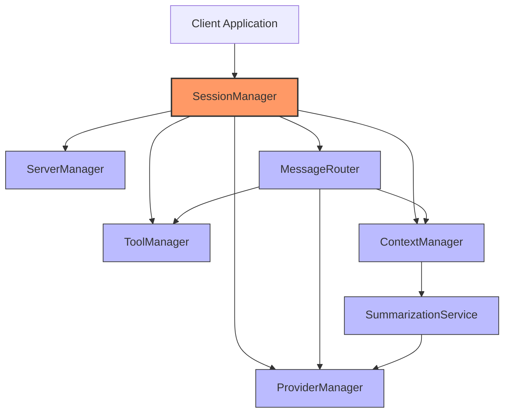
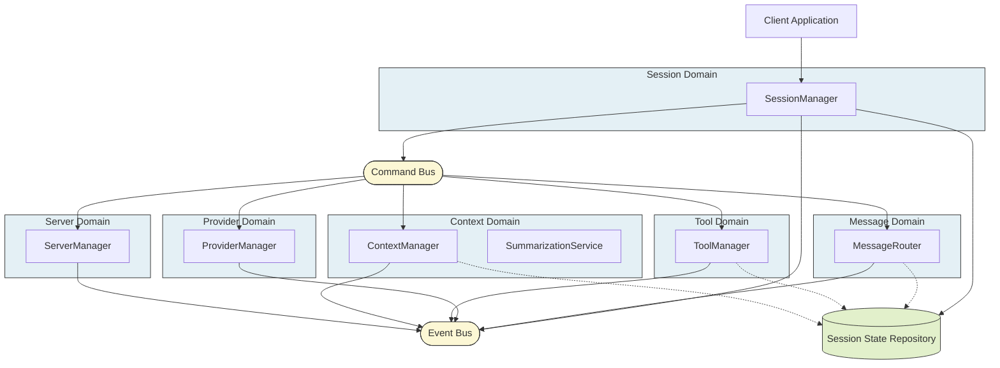
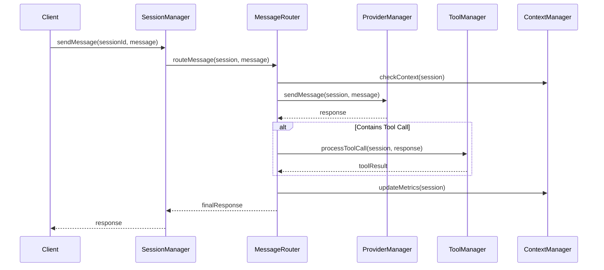
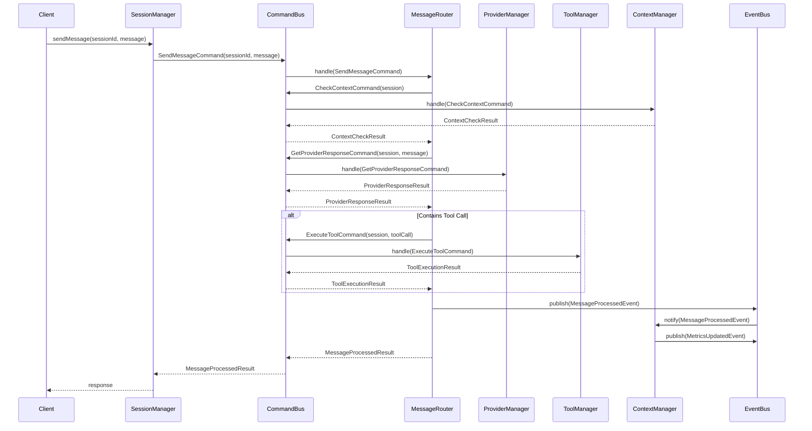

# LLM Architecture Comparison: Component-Based vs. Domain-Driven

This document compares two architectural approaches for the LLM package: the original component-based architecture and the refined domain-driven architecture.

## Visual Comparison

### Original Component-Based Architecture

### Refined Domain-Driven Architecture

## Key Differences

### 1. Communication Patterns

**Original Architecture:**

- Components communicate through direct method calls
- SessionManager acts as a central hub for most operations
- High coupling between components (e.g., MessageRouter directly calls ProviderManager)

**Refined Architecture:**

- Components communicate through Command and Event patterns
- CommandBus handles operation requests
- EventBus handles state change notifications
- No direct dependencies between domain components

### 2. Message Flow Comparison

#### Original Message Flow:

#### Refined Message Flow:

### 3. State Management

**Original Architecture:**

- Multiple components directly modify session state
- Potential for inconsistent state or race conditions
- No clear ownership of state

**Refined Architecture:**

- SessionManager owns session state
- Changes requested through commands
- Updates notified through events
- Repository pattern provides controlled access

### 4. Extensibility

**Original Architecture:**

- Adding new functionality often requires modifying multiple components
- Tight coupling makes extensions difficult
- Changes to one component may affect others

**Refined Architecture:**

- New functionality can be added by creating new command handlers
- No need to modify existing components
- Clear extension points through command and event systems

## Benefits of the Refined Architecture

1. **Reduced Coupling**: Components interact through well-defined interfaces (Command/Event buses)

2. **Clearer Responsibilities**: Each domain has a specific focus with clear boundaries

3. **Better Testability**: Components can be tested in isolation with mocked buses

4. **Improved Maintainability**: Changes in one domain don't affect others

5. **Enhanced Scalability**: Domains can be deployed and scaled independently if needed

6. **Easier Debugging**: Command/event flow provides clear traceability of operations

## Practical Implementation Considerations

1. **Migration Path**: Gradual transition from component-based to domain-driven

   - Implement buses and repositories first
   - Refactor one domain at a time
   - Use adapters to bridge old and new implementations

2. **Performance Considerations**:

   - Command/event pattern adds some overhead
   - Can be optimized with in-memory buses for single-process deployments
   - Benefits in maintainability usually outweigh the minor performance cost

3. **Learning Curve**:
   - Team needs to understand DDD, CQRS, and event-sourcing concepts
   - More complex initially but simpler to maintain long-term
   - Good documentation and examples are essential
