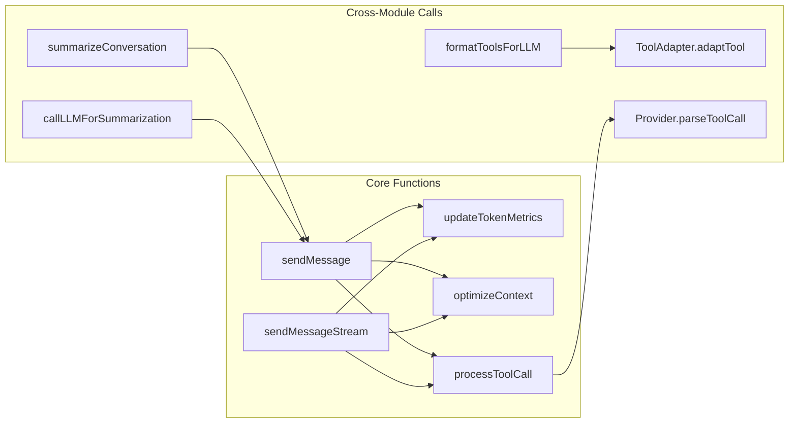
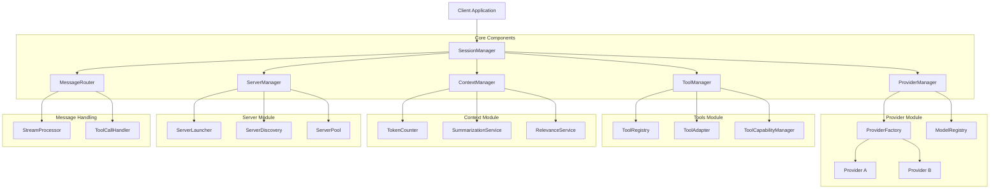

# LLM Package Refactoring Summary

This document provides an overview of the proposed refactoring plan for the LLM package. The goal is to transform the monolithic SessionManager into a more modular, maintainable, and testable architecture.

## Current Architecture Issues

The current implementation has a monolithic SessionManager class (~3,000 lines) that handles multiple responsibilities:

1. Session lifecycle management
2. Provider interactions
3. Tool execution and management
4. Context window optimization
5. Token usage tracking
6. Server management

This design leads to issues with:

- Maintainability
- Testability
- Extensibility
- Code reuse
- Separation of concerns

## Function-Level Dependencies

A detailed analysis of the SessionManager reveals complex function-level dependencies that create a "spiderweb" of connections between components. Here are the key observations:

### Critical Cross-Module Dependencies

1. **Circular Dependencies**:

   - Summarization functions (from context_management) call back to SessionManager's sendMessage to generate summaries
   - Context management depends on token counting which depends on session metrics
   - Provider adapters and tool adapters reference each other

2. **Central Hub Pattern**:

   - SessionManager acts as a hub with methods directly calling into all other modules
   - Many utility functions from other modules directly reference the SessionManager

3. **Function-Level Coupling**:

   ```
   sendMessage
     ├── countTokens (tokens)
     ├── updateTokenMetrics (tokens)
     ├── optimizeContext (context_management)
     ├── formatToolsForLLM (tools)
     ├── Provider.sendMessage (provider)
     └── processToolCall (tools)
   ```

4. **Shared State**:
   - Chat session objects are passed between components and modified by multiple modules
   - Provider-specific data is stored within the session object

### Key Function Dependencies



These intricate dependencies make refactoring challenging and require careful planning to avoid breaking existing functionality.

## Proposed Architecture



## Refactoring Components

### 1. Provider Management

**Key Classes:**

- `ProviderManager`: Central manager for LLM providers
- `ProviderFactory`: Creates provider instances
- `ModelRegistry`: Tracks available models and capabilities

**Main Responsibilities:**

- Provider selection and initialization
- Model capability management
- Message format conversion between providers
- Cost estimation

### 2. Tool Management

**Key Classes:**

- `ToolManager`: Central manager for tools
- `ToolRegistry`: Registers and manages available tools
- `ToolAdapter`: Converts tools between provider formats
- `ToolCapabilityManager`: Manages provider-specific tool capabilities

**Main Responsibilities:**

- Tool registration and discovery
- Tool format adaptation for different providers
- Tool execution and result handling
- Tool capability validation

### 3. Context Management

**Key Classes:**

- `ContextManager`: Central manager for context window
- `SummarizationService`: Handles conversation summarization
- `RelevanceService`: Implements relevance-based pruning

**Main Responsibilities:**

- Context window optimization
- Token counting and tracking
- Implementing truncation strategies
- Message summarization

### 4. Server Management

**Key Classes:**

- `ServerManager`: Central manager for MCP servers
- `ServerPool`: Manages shared servers
- `ServerLauncher`: Handles server process creation
- `ServerDiscovery`: Locates running servers

**Main Responsibilities:**

- Server lifecycle management
- Client connection management
- Session-server association
- Resource cleanup

### 5. Message Routing

**Key Classes:**

- `MessageRouter`: Routes messages between components
- `StreamProcessor`: Handles streaming responses
- `ToolCallHandler`: Processes tool calls in messages

**Main Responsibilities:**

- Message routing to appropriate providers
- Stream processing and chunking
- Tool call detection and handling

### 6. Refined SessionManager

**Main Responsibilities:**

- Session creation and initialization
- Session retrieval and storage
- Public API exposure
- Component coordination
- Configuration management

## Refactoring Approach

The refactoring will be implemented in phases:

1. **Phase 1: Define Interfaces**

   - Create clear interfaces for all components
   - Document all methods with JSDoc
   - Set up dependency injection framework

2. **Phase 2: Extract Core Managers**

   - Implement ProviderManager
   - Implement ToolManager
   - Implement ContextManager
   - Implement ServerManager
   - Implement MessageRouter

3. **Phase 3: Update SessionManager**

   - Refactor SessionManager to use new components
   - Maintain backward compatibility
   - Add comprehensive tests

4. **Phase 4: Enhance Components**
   - Add new features to each component
   - Implement advanced optimizations
   - Create specialized implementations

## Implementation Plan Timeline

| Phase | Description             | Estimated Time |
| ----- | ----------------------- | -------------- |
| 1     | Interface Definition    | 1 week         |
| 2     | Core Manager Extraction | 2-3 weeks      |
| 3     | SessionManager Update   | 1-2 weeks      |
| 4     | Testing & Refinement    | 1-2 weeks      |

## Benefits of Refactoring

1. **Improved Maintainability**

   - Clear separation of concerns
   - Smaller, focused components
   - Better code organization

2. **Enhanced Testability**

   - Isolated component testing
   - Easier mocking of dependencies
   - Clear boundaries for unit tests

3. **Better Extensibility**

   - Easily add new providers
   - Implement new tools without changing core code
   - Create specialized context strategies

4. **Code Reuse**

   - Components can be used independently
   - Shared utilities across implementations
   - Cleaner abstractions

5. **Performance Optimization**
   - Target optimizations to specific components
   - Implement advanced strategies incrementally
   - Better resource management

## Breaking Dependency Cycles

A key challenge in the refactoring will be breaking the circular dependencies identified in the function-level analysis:

1. **Context Management Cycle**:

   - Current: Context Management → SessionManager → Context Management
   - Solution: Extract a dedicated SummarizationService that doesn't directly depend on SessionManager

2. **Provider-Tool Cycle**:

   - Current: Tool processing needs Provider adapters, Provider responses need Tool parsing
   - Solution: Create a common message format and decouple tools from provider details

3. **Session State Coupling**:
   - Current: Multiple modules directly modify session state
   - Solution: Implement an event-based model where components request state changes

## Backward Compatibility

To ensure backward compatibility:

1. The public API of SessionManager will remain largely unchanged
2. Internal refactoring will be transparent to consumers
3. A facade pattern will be used if needed
4. Comprehensive tests will verify behavior

## Success Metrics

The refactoring will be considered successful when:

1. The SessionManager is reduced to <500 lines of code
2. Each component has a clear, single responsibility
3. All tests pass with the new architecture
4. Code maintainability metrics improve
5. No regression in functionality or performance

## Next Steps

1. Review and finalize the proposed architecture
2. Create detailed task breakdown for each component
3. Begin with interface definitions
4. Implement components incrementally with tests
5. Gradually update SessionManager to use new components
