# Proposed LLM Architecture - Detailed Analysis

This document provides a detailed function-level analysis of the proposed LLM package architecture, showing how components would interact and how current issues would be resolved.

## Original Proposal - Component-Based Architecture

### Function-Level Component Design

### 1. Session Manager

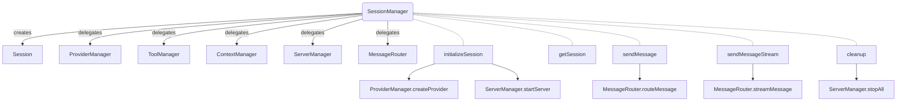

**Key Functions:**

- `initializeSession(config)`: Creates a new session with the specified configuration
- `getSession(sessionId)`: Retrieves a session by ID
- `sendMessage(sessionId, message)`: Delegates to MessageRouter, returns completed response
- `sendMessageStream(sessionId, message)`: Delegates to MessageRouter, yields streaming response
- `cleanup()`: Releases resources and terminates sessions

### 2. Message Router

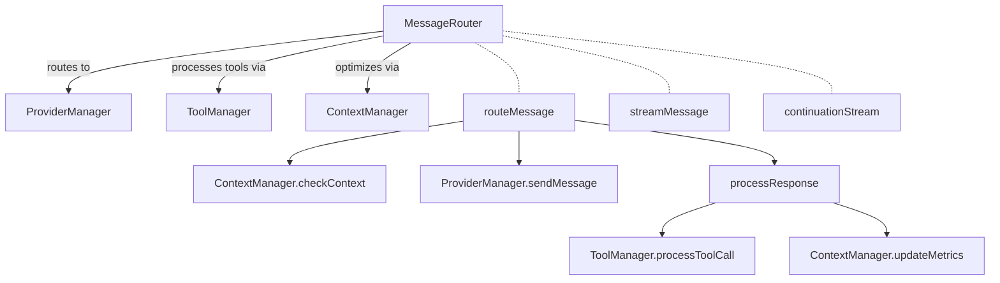

**Key Functions:**

- `routeMessage(session, message)`: Routes message to appropriate provider, handles context and tools
- `streamMessage(session, message)`: Streaming version of routeMessage
- `continuationStream(session)`: Creates a continuation stream for the session
- `processResponse(session, response)`: Processes response including tool calls, updates context

### 3. Provider Manager

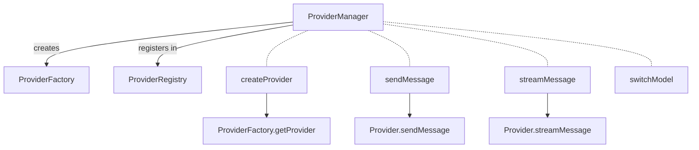

**Key Functions:**

- `createProvider(providerType, config)`: Creates a provider instance
- `sendMessage(session, message, options)`: Sends message to the provider
- `streamMessage(session, message, options)`: Streams message to the provider
- `switchModel(session, newProviderType, newModelId)`: Switches provider/model for a session
- `getAvailableProviders()`: Lists available providers
- `getProviderModels(providerType)`: Lists models for a provider

### 4. Tool Manager

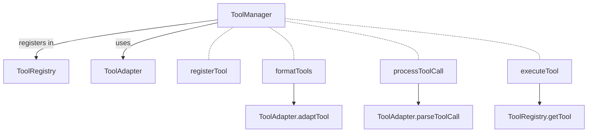

**Key Functions:**

- `registerTool(tool)`: Registers a tool with the system
- `formatTools(tools, providerType)`: Formats tools for specific provider
- `processToolCall(session, message)`: Processes tool call in message
- `executeTool(session, toolName, parameters)`: Executes a specific tool
- `isToolCallLimitReached(session)`: Checks if tool call limit reached

### 5. Context Manager

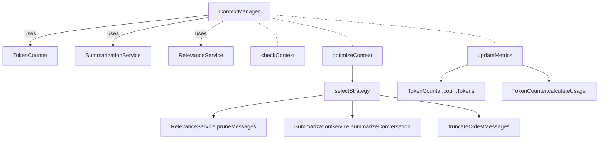

**Key Functions:**

- `checkContext(session)`: Checks if context optimization is needed
- `updateMetrics(session)`: Updates token metrics for a session
- `optimizeContext(session)`: Optimizes context using selected strategy
- `selectStrategy(session)`: Selects appropriate strategy based on session state
- `getTokenUsage(session)`: Gets token usage metrics for a session

### 6. Server Manager

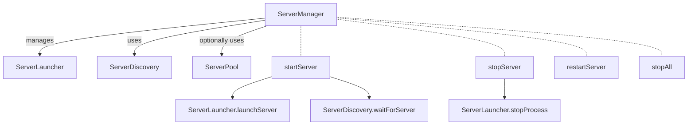

**Key Functions:**

- `startServer(serverName, config)`: Starts a server with specified config
- `stopServer(serverName)`: Stops a specific server
- `restartServer(serverName)`: Restarts a specific server
- `stopAll()`: Stops all servers
- `registerSessionServers(sessionId, serverNames)`: Associates servers with a session

### Breaking Circular Dependencies

The proposed architecture resolves the circular dependencies identified in the current implementation:

### 1. Summarization Service Redesign

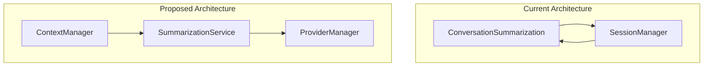

**Key Changes:**

- SummarizationService directly uses ProviderManager instead of SessionManager
- ContextManager delegates to SummarizationService rather than embedding its logic
- LLM interactions for summarization use a dedicated interface, not the full SessionManager

### 2. Tool-Provider Decoupling

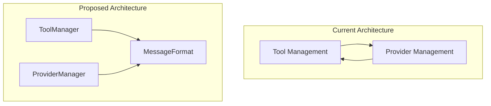

**Key Changes:**

- Define a common canonical message format for communication
- ToolManager adapts tools to canonical format
- ProviderManager adapts canonical format to provider-specific format
- Remove direct dependencies between tool and provider implementations

### 3. Event-Based State Management

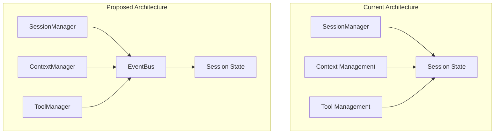

**Key Changes:**

- Session state is owned by SessionManager
- Components request changes via events/commands
- SessionManager applies changes, maintaining consistency
- Components observe state changes via events

### Detailed Function Call Flow

#### Example: Send Message Flow

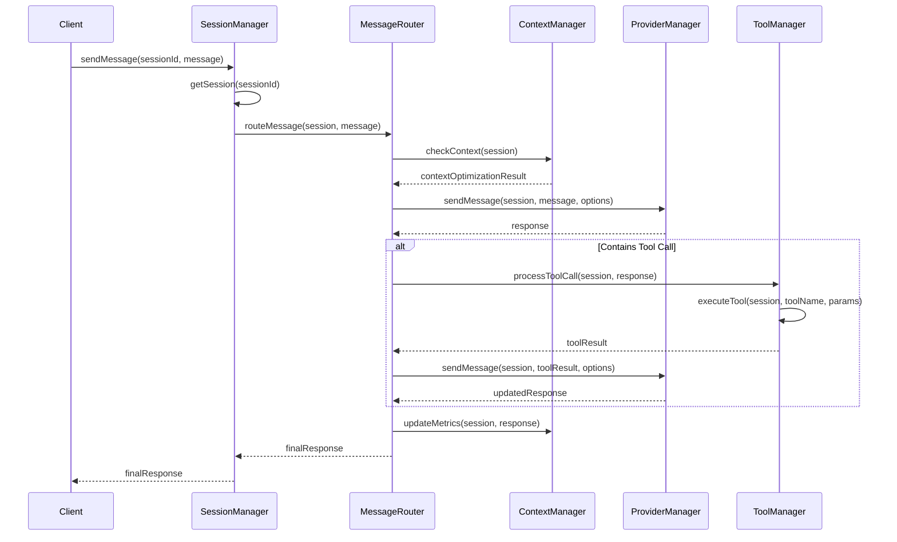

#### Example: Context Optimization Flow

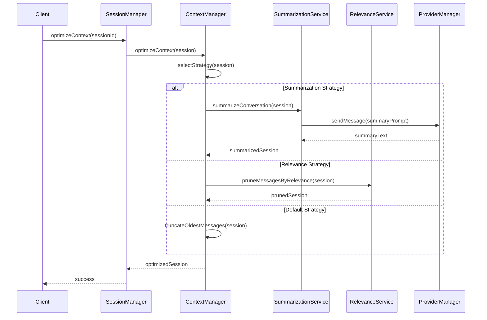

### Original Architecture Overview

```mermaid
graph TD
    %% Main entry point and core components
    Client[Client Application] --> SessionManager
    SessionManager --> EventBus[Event Bus]

    %% Core Managers
    SessionManager --> ProviderManager
    SessionManager --> ToolManager
    SessionManager --> ContextManager
    SessionManager --> ServerManager
    SessionManager --> MessageRouter

    %% Provider Module
    ProviderManager --> ProviderFactory
    ProviderManager --> ProviderRegistry
    ProviderFactory --> ModelRegistry
    ProviderFactory --> ProviderInterface[LLMProviderInterface]

    ProviderRegistry --> Anthropic[AnthropicProvider]
    ProviderRegistry --> OpenAI[OpenAIProvider]
    ProviderRegistry --> Grok[GrokProvider]
    ProviderRegistry --> Custom[CustomProviders]

    ProviderManager --> ProviderConverters
    ProviderConverters --> MessageFormat

    %% Tool Module
    ToolManager --> ToolRegistry
    ToolManager --> ToolAdapter
    ToolManager --> ToolCapabilityManager

    ToolRegistry --> CoreTools[Core Tools]
    ToolRegistry --> CustomTools[Custom Tools]
    ToolRegistry --> SystemTools[System Tools]

    ToolAdapter --> MessageFormat

    %% Context Management Module
    ContextManager --> TokenCounter
    ContextManager --> TokenMetrics
    ContextManager --> ContextStrategy[Context Strategy Selector]

    ContextStrategy --> SummarizationService
    ContextStrategy --> RelevanceService
    ContextStrategy --> TruncationService

    SummarizationService --> ProviderManager
    RelevanceService --> TokenCounter

    %% Server Management Module
    ServerManager --> ServerLauncher
    ServerManager --> ServerDiscovery
    ServerManager --> ServerPool

    ServerPool --> SharedServers[Shared Server Instances]

    %% Message Router Module
    MessageRouter --> StreamProcessor
    MessageRouter --> ToolCallHandler
    MessageRouter --> MessageProcessor
    MessageRouter --> ContinuationManager

    %% Session Management
    SessionManager --> SessionStorage
    SessionManager --> SessionRegistry[Session Registry]
    SessionStorage --> FileStorage[File Storage]
    SessionStorage --> DatabaseStorage[Database Storage]
    SessionStorage --> MemoryStorage[Memory Storage]

    %% Direct component interactions - showing the coupling issue
    MessageRouter --> ProviderManager
    MessageRouter --> ToolManager
    MessageRouter --> ContextManager

    %% Styling
    classDef core fill:#f96,stroke:#333,stroke-width:2px
    classDef interfaces fill:#bbf,stroke:#333,stroke-width:1px
    classDef services fill:#bfb,stroke:#333,stroke-width:1px

    %% Apply classes
    class SessionManager core
    class MessageRouter,ProviderManager,ToolManager,ContextManager,ServerManager interfaces
    class ProviderFactory,ProviderRegistry,ToolRegistry,TokenCounter,ServerLauncher services
```

## Refined Proposal - Domain-Driven Architecture

After reviewing the original component-based architecture, we identified some remaining coupling concerns, particularly:

1. The SessionManager still acts as a bottleneck for most operations
2. The MessageRouter has direct dependencies on multiple other components
3. Components directly modify shared session state
4. Cross-component dependencies create potential for circular references

To address these issues, we've developed a refined architecture that applies Domain-Driven Design principles and introduces patterns that significantly reduce coupling while maintaining alignment between components.

### Key Architectural Refinements

#### 1. Domain-Driven Design Boundaries

The refined architecture establishes clear bounded contexts with well-defined interfaces between them:

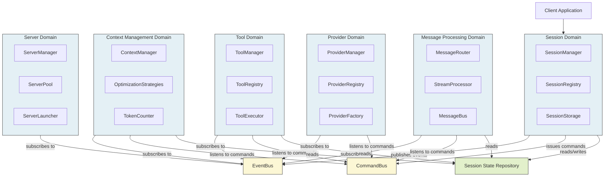

#### 2. Command/Query Responsibility Segregation (CQRS)

Instead of direct method calls between domains, we use command and query patterns:

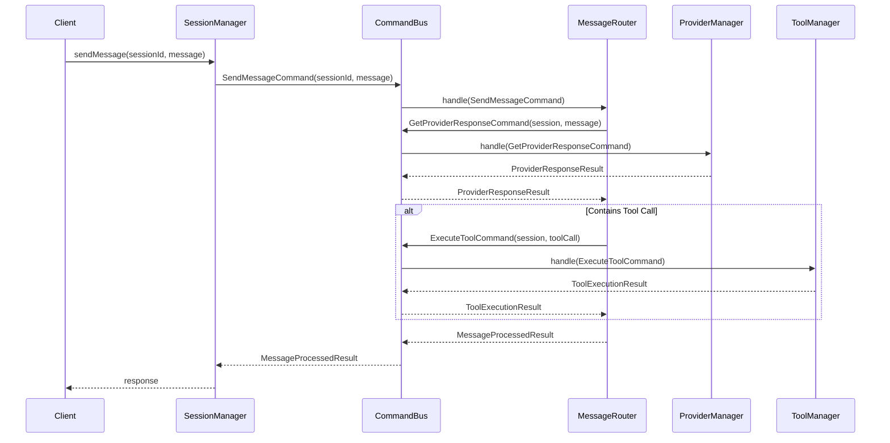

#### 3. Event-Driven Communication

Events are published for state changes, allowing loose coupling between components:

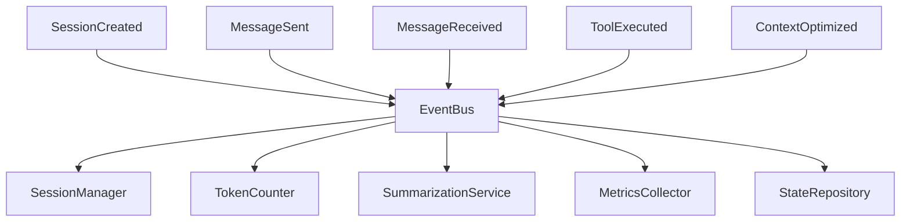

### Detailed Component Redesign

#### 1. SessionManager Refocused

The SessionManager is refocused to handle only session lifecycle concerns:

```typescript
interface SessionManager {
  // Core session lifecycle
  createSession(config: SessionConfig): Promise<string>;
  getSession(sessionId: string): Promise<SessionInfo>;
  deleteSession(sessionId: string): Promise<void>;

  // Session operations (delegated via commands)
  sendMessage(sessionId: string, message: string): Promise<MessageResponse>;
  streamMessage(
    sessionId: string,
    message: string
  ): AsyncGenerator<MessageChunk>;

  // Session metadata
  listSessions(): Promise<SessionInfo[]>;
  getSessionStats(sessionId: string): Promise<SessionStats>;
}
```

#### 2. Command Bus for Operation Flow

A Command Bus decouples the request for an operation from its execution:

```typescript
interface CommandBus {
  dispatch<T extends Command>(command: T): Promise<Result>;
  registerHandler<T extends Command>(
    commandType: Constructor<T>,
    handler: CommandHandler<T>
  ): void;
}

// Example commands
interface SendMessageCommand extends Command {
  sessionId: string;
  message: string;
}

interface ExecuteToolCommand extends Command {
  sessionId: string;
  toolName: string;
  parameters: Record<string, unknown>;
}
```

#### 3. Event Bus for State Changes

An Event Bus enables publish-subscribe patterns for state changes:

```typescript
interface EventBus {
  publish<T extends Event>(event: T): void;
  subscribe<T extends Event>(
    eventType: Constructor<T>,
    handler: EventHandler<T>
  ): Subscription;
}

// Example events
interface MessageSentEvent extends Event {
  sessionId: string;
  message: ChatMessage;
  timestamp: Date;
}

interface ContextOptimizedEvent extends Event {
  sessionId: string;
  strategy: string;
  tokensBefore: number;
  tokensAfter: number;
}
```

#### 4. Shared State Repository

A State Repository provides controlled access to shared state:

```typescript
interface SessionStateRepository {
  getSession(sessionId: string): Promise<Session>;
  updateSession(sessionId: string, updates: Partial<Session>): Promise<void>;
  getMessages(sessionId: string): Promise<ChatMessage[]>;
  addMessage(sessionId: string, message: ChatMessage): Promise<void>;
}
```

### Full Refined Architecture Visualization

```mermaid
graph TD
    %% Client and API layer
    Client[Client Application] --> SessionManager

    %% Infrastructure components
    CommandBus([Command Bus])
    EventBus([Event Bus])
    SessionStateRepo[(Session State Repository)]

    %% Core components/domains with their internal structure
    subgraph SessionDomain[Session Domain]
        SessionManager --> SessionFactory
        SessionManager --> SessionRegistry
        SessionManager --> SessionValidator
    end

    subgraph MessageDomain[Message Processing]
        MessageRouter --> StreamProcessor
        MessageRouter --> ResponseFormatter
        MessageRouter --> MessageTransformer
    end

    subgraph ProviderDomain[Provider Management]
        ProviderManager --> ProviderFactory
        ProviderManager --> ModelRegistry
        ProviderFactory --> ProviderAdapters

        ProviderAdapters --> AnthropicAdapter
        ProviderAdapters --> OpenAIAdapter
        ProviderAdapters --> GrokAdapter
        ProviderAdapters --> CustomAdapters[Custom Adapters]
    end

    subgraph ToolDomain[Tool Management]
        ToolManager --> ToolRegistry
        ToolManager --> ToolExecutionEngine
        ToolManager --> ToolValidation

        ToolRegistry --> SystemTools
        ToolRegistry --> UserTools
        ToolRegistry --> ExtensionTools
    end

    subgraph ContextDomain[Context Management]
        ContextManager --> TokenCounter
        ContextManager --> StrategySelector

        StrategySelector --> SummarizationStrategy
        StrategySelector --> PruningStrategy
        StrategySelector --> TruncationStrategy
        StrategySelector --> AdaptiveStrategy

        SummarizationStrategy -.-> SummarizationService
        PruningStrategy -.-> RelevanceService
    end

    subgraph ServerDomain[Server Management]
        ServerManager --> ServerLauncher
        ServerManager --> ServerDiscovery
        ServerManager --> ServerHealthMonitor
        ServerManager --> ServerPool
    end

    %% Command flows - using the command bus
    SessionManager -- issues commands --> CommandBus
    CommandBus -- routes to --> MessageRouter
    CommandBus -- routes to --> ProviderManager
    CommandBus -- routes to --> ToolManager
    CommandBus -- routes to --> ContextManager
    CommandBus -- routes to --> ServerManager

    %% Event publishing and subscription
    SessionManager -- publishes events --> EventBus
    MessageRouter -- publishes events --> EventBus
    ProviderManager -- publishes events --> EventBus
    ToolManager -- publishes events --> EventBus
    ContextManager -- publishes events --> EventBus

    %% Event subscriptions
    EventBus -- notifies --> SessionManager
    EventBus -- notifies --> TokenCounter
    EventBus -- notifies --> MetricsCollector[Metrics Collector]
    EventBus -- notifies --> LoggingService[Logging Service]

    %% State repository access
    SessionDomain -- manages --> SessionStateRepo
    MessageDomain -- reads from --> SessionStateRepo
    ToolDomain -- reads from --> SessionStateRepo
    ContextDomain -- reads from --> SessionStateRepo

    %% Provider-specific communications
    SummarizationService -.-> CommandBus

    %% Cross-cutting concerns
    ErrorHandler[Error Handler] -.- SessionManager
    ErrorHandler -.- MessageRouter
    ErrorHandler -.- ProviderManager
    ErrorHandler -.- ToolManager

    %% Styling
    classDef domain fill:#e4f0f5,stroke:#333,stroke-width:1px
    classDef bus fill:#fcf7d5,stroke:#333,stroke-width:1px
    classDef repo fill:#e2f0cb,stroke:#333,stroke-width:1px
    classDef service fill:#f5e1e2,stroke:#333,stroke-width:1px

    %% Apply styles
    class SessionDomain,MessageDomain,ProviderDomain,ToolDomain,ContextDomain,ServerDomain domain
    class CommandBus,EventBus bus
    class SessionStateRepo repo
    class ErrorHandler,MetricsCollector,LoggingService service
```

## Comparison of Architectural Approaches

### Key Differences

| Aspect                        | Original Component-Based Architecture               | Refined Domain-Driven Architecture                   |
| ----------------------------- | --------------------------------------------------- | ---------------------------------------------------- |
| **Core Organizing Principle** | Components based on functionality                   | Domains based on business concerns                   |
| **Communication Pattern**     | Direct method calls between components              | Command/Event patterns via buses                     |
| **State Management**          | Multiple components modify shared state             | Controlled access via repository                     |
| **Coupling Level**            | Medium-high: Direct dependencies between components | Low: Components interact via buses                   |
| **SessionManager Role**       | Central orchestrator with many responsibilities     | Focused on session lifecycle, delegates via commands |
| **Testability**               | Requires mocking direct dependencies                | Components can be tested in isolation                |
| **Scalability**               | Limited by direct dependencies                      | Domains can scale independently                      |
| **Extensibility**             | Requires modifying multiple components              | Can add new handlers without changing existing code  |

### Communication Patterns Comparison

#### Original Architecture:

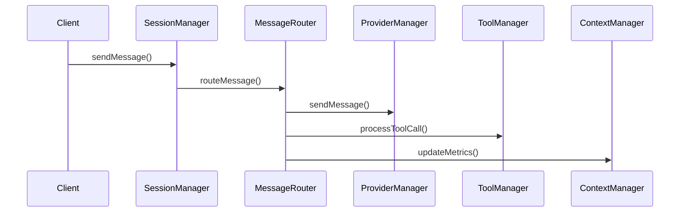

#### Refined Architecture:

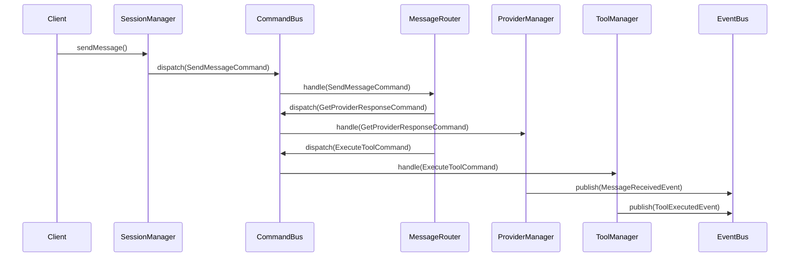

### Coupling and Dependencies

#### Original Architecture:

- MessageRouter directly depends on ProviderManager, ToolManager, ContextManager
- SessionManager directly depends on all other managers
- SummarizationService directly depends on ProviderManager

#### Refined Architecture:

- Components depend only on CommandBus and EventBus interfaces
- No direct dependencies between domains
- All cross-domain operations go through Command/Query patterns
- State changes are communicated via events

## Alternative Architectural Approaches

Let's explore other architectural patterns that could be relevant for this LLM application:

### 1. Microservices Architecture

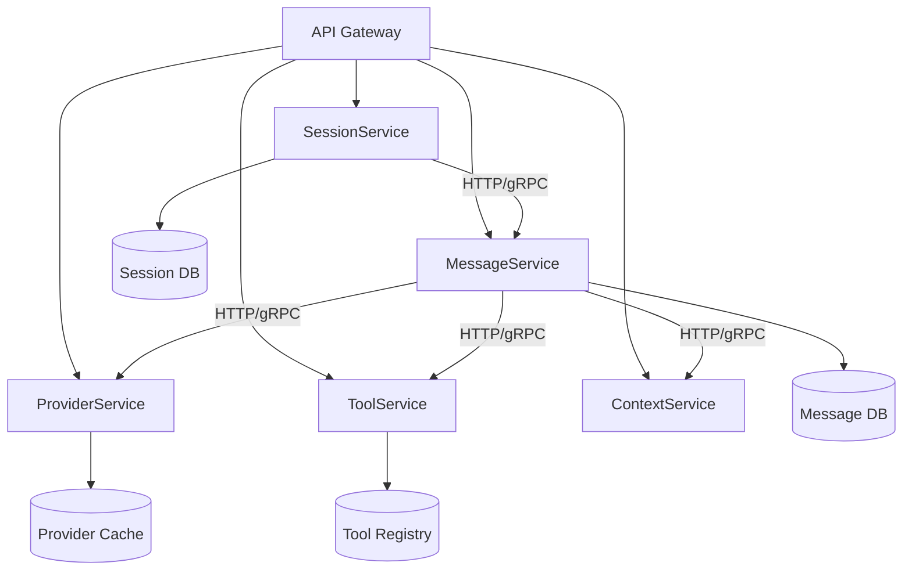

**Pros:**

- Each service can be developed, deployed, and scaled independently
- Can use different technologies per service as needed
- Strong isolation of concerns

**Cons:**

- Increased operational complexity
- Network latency impacts performance
- More complex error handling across service boundaries
- Potentially higher resource usage

### 2. Hexagonal (Ports and Adapters) Architecture

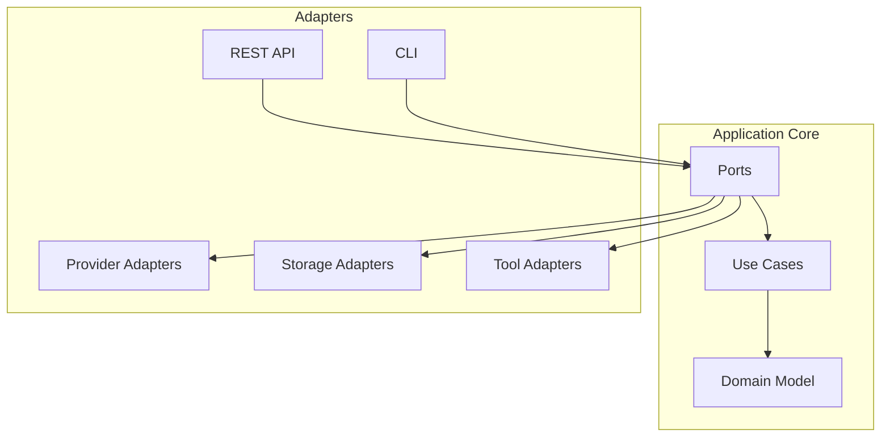

**Pros:**

- Clear separation between business logic and external systems
- Highly testable domain core
- Can swap out infrastructure components without changing business logic
- Focused on business use cases rather than technical concerns

**Cons:**

- Can lead to more boilerplate code for ports and adapters
- Might be overkill for simpler applications
- Can be challenging to define the right boundaries

### 3. Actor Model Architecture

```mermaid
graph TD
    Client --> Supervisor

    Supervisor --> SessionActor
    Supervisor --> MessageActor
    Supervisor --> ProviderActor
    Supervisor --> ToolActor
    Supervisor --> ContextActor

    SessionActor -- messages --> MessageActor
    MessageActor -- messages --> ProviderActor
    MessageActor -- messages --> ToolActor
    MessageActor -- messages --> ContextActor

    ToolActor -- messages --> ToolExecutorActor
    ProviderActor -- messages --> ProviderInstanceActor
```

**Pros:**

- Highly concurrent and distributed by design
- Message-passing model naturally prevents shared state issues
- Great for systems with dynamic scaling requirements
- Natural fit for streaming responses from LLMs

**Cons:**

- Requires specialized frameworks/libraries (Akka, Orleans, etc.)
- Different programming model that can be challenging to adopt
- Can be complex to debug and monitor
- May not align with TypeScript/JavaScript ecosystem well

## Conclusion and Recommendations

After comparing different architectural approaches, the **refined domain-driven architecture** with command/event patterns offers the best balance for this application:

1. It addresses the coupling concerns in the original design
2. It provides clear domain boundaries while maintaining coordination
3. It enables incremental adoption without a complete rewrite
4. It fits well with TypeScript's type system
5. It's well-suited for the event-driven nature of LLM interactions

Additionally, it takes inspiration from other architectures:

- From microservices: clear boundaries between domains
- From hexagonal: adapters for different providers
- From actor model: message-passing patterns for coordination

### Implementation Priority

1. Start with the CommandBus and EventBus infrastructure
2. Implement the SessionStateRepository for controlled state access
3. Refactor SessionManager to use commands for operations
4. Gradually move functionality into appropriate domains
5. Replace direct dependencies with command/event interactions
