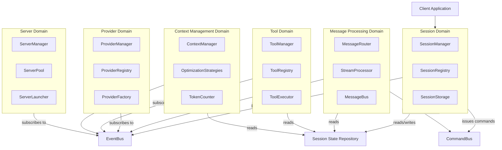
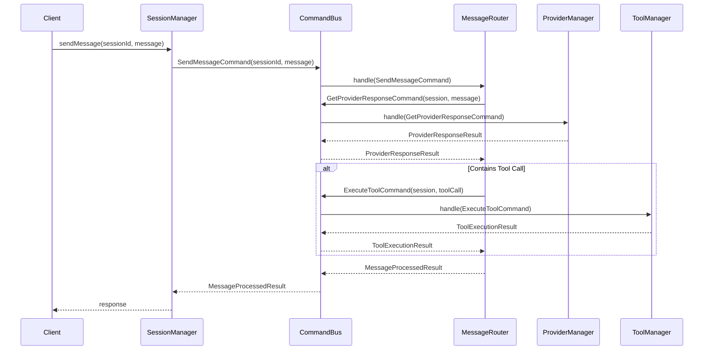
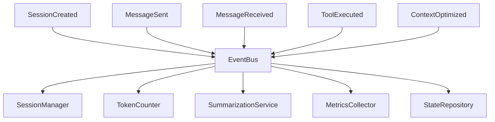

# Refined LLM Architecture: Reducing Coupling

This document outlines a further refinement of the proposed LLM architecture, addressing coupling concerns and applying Domain-Driven Design principles to ensure components are "highly aligned but loosely coupled."

## Key Architectural Refinements

### 1. Domain-Driven Design Boundaries

The refined architecture establishes clear bounded contexts with well-defined interfaces between them:



### 2. Command/Query Responsibility Segregation (CQRS)

Instead of direct method calls between domains, we use command and query patterns:



### 3. Event-Driven Communication

Events are published for state changes, allowing loose coupling between components:



## Detailed Component Redesign

### 1. SessionManager Refocused

The SessionManager is refocused to handle only session lifecycle concerns:

```typescript
interface SessionManager {
  // Core session lifecycle
  createSession(config: SessionConfig): Promise<string>;
  getSession(sessionId: string): Promise<SessionInfo>;
  deleteSession(sessionId: string): Promise<void>;

  // Session operations (delegated via commands)
  sendMessage(sessionId: string, message: string): Promise<MessageResponse>;
  streamMessage(
    sessionId: string,
    message: string
  ): AsyncGenerator<MessageChunk>;

  // Session metadata
  listSessions(): Promise<SessionInfo[]>;
  getSessionStats(sessionId: string): Promise<SessionStats>;
}
```

### 2. Command Bus for Operation Flow

A Command Bus decouples the request for an operation from its execution:

```typescript
interface CommandBus {
  dispatch<T extends Command>(command: T): Promise<Result>;
  registerHandler<T extends Command>(
    commandType: Constructor<T>,
    handler: CommandHandler<T>
  ): void;
}

// Example commands
interface SendMessageCommand extends Command {
  sessionId: string;
  message: string;
}

interface ExecuteToolCommand extends Command {
  sessionId: string;
  toolName: string;
  parameters: Record<string, unknown>;
}
```

### 3. Event Bus for State Changes

An Event Bus enables publish-subscribe patterns for state changes:

```typescript
interface EventBus {
  publish<T extends Event>(event: T): void;
  subscribe<T extends Event>(
    eventType: Constructor<T>,
    handler: EventHandler<T>
  ): Subscription;
}

// Example events
interface MessageSentEvent extends Event {
  sessionId: string;
  message: ChatMessage;
  timestamp: Date;
}

interface ContextOptimizedEvent extends Event {
  sessionId: string;
  strategy: string;
  tokensBefore: number;
  tokensAfter: number;
}
```

### 4. Shared State Repository

A State Repository provides controlled access to shared state:

```typescript
interface SessionStateRepository {
  getSession(sessionId: string): Promise<Session>;
  updateSession(sessionId: string, updates: Partial<Session>): Promise<void>;
  getMessages(sessionId: string): Promise<ChatMessage[]>;
  addMessage(sessionId: string, message: ChatMessage): Promise<void>;
}
```

## Key Benefits of the Refined Architecture

### 1. Reduced Coupling

Components no longer directly reference each other, instead:

- Commands coordinate operations
- Events notify of state changes
- Repositories provide controlled data access

### 2. Clear Responsibilities

- **SessionManager**: Session lifecycle only
- **MessageRouter**: Coordinates the message processing flow
- **ToolManager**: Tool execution and registration
- **ProviderManager**: Provider selection and communication
- **ContextManager**: Context window optimization

### 3. Flexible Communication Patterns

- **Command Pattern**: For operation requests
- **Event Pattern**: For state change notifications
- **Repository Pattern**: For shared data access

### 4. Scalability and Extensibility

- Domains can evolve independently
- New components can be added without modifying existing ones
- Easier to implement new features in isolation

## Implementation Approach

### 1. Infrastructure First

Build the core infrastructure components:

- Command bus implementation
- Event bus implementation
- State repository implementation

### 2. Domain by Domain Implementation

Implement domains in order of dependency:

1. Session Domain (core abstractions)
2. Provider Domain (communication with LLMs)
3. Tool Domain (tool execution)
4. Context Domain (context optimization)
5. Message Domain (message processing flow)

### 3. Incremental Migration

For each domain:

1. Define interfaces and commands/events
2. Implement core functionality
3. Wire to existing SessionManager
4. Move functionality from old to new implementation

## Sample Implementation of Command Pattern

```typescript
// Command definition
interface Command {
  type: string;
}

interface CommandResult {
  success: boolean;
  data?: any;
  error?: string;
}

interface CommandHandler<T extends Command> {
  handle(command: T): Promise<CommandResult>;
}

// Simple implementation
class SimpleCommandBus implements CommandBus {
  private handlers = new Map<string, CommandHandler<any>>();

  registerHandler<T extends Command>(
    commandType: Constructor<T>,
    handler: CommandHandler<T>
  ): void {
    const type = new commandType().type;
    this.handlers.set(type, handler);
  }

  async dispatch<T extends Command>(command: T): Promise<CommandResult> {
    const handler = this.handlers.get(command.type);
    if (!handler) {
      return {
        success: false,
        error: `No handler registered for command type: ${command.type}`,
      };
    }

    try {
      return await handler.handle(command);
    } catch (error) {
      return {
        success: false,
        error: error instanceof Error ? error.message : String(error),
      };
    }
  }
}
```

## Conclusion

This refined architecture addresses the coupling concerns while maintaining alignment between components. By using command/query patterns, event-driven communication, and clear domain boundaries, we create a system that is:

1. **Highly Aligned**: Components work together towards common goals
2. **Loosely Coupled**: Components interact through well-defined interfaces
3. **Independently Evolvable**: Domains can change without affecting others
4. **Easier to Test**: Clear boundaries facilitate isolated testing
5. **More Maintainable**: Responsibilities are clearly defined and separated
